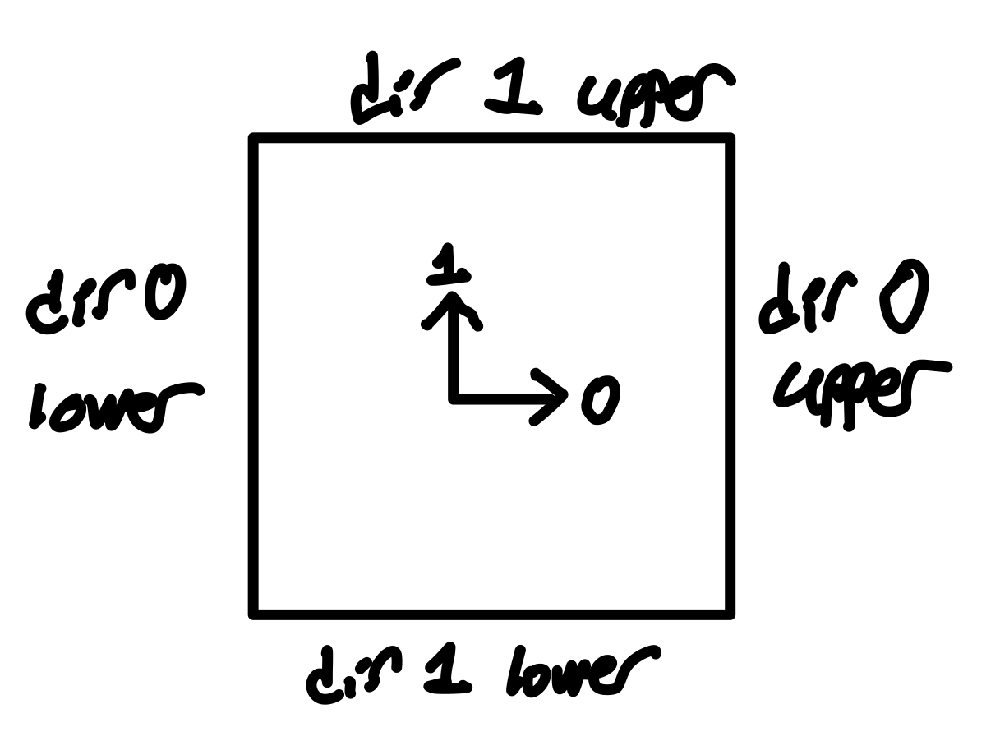
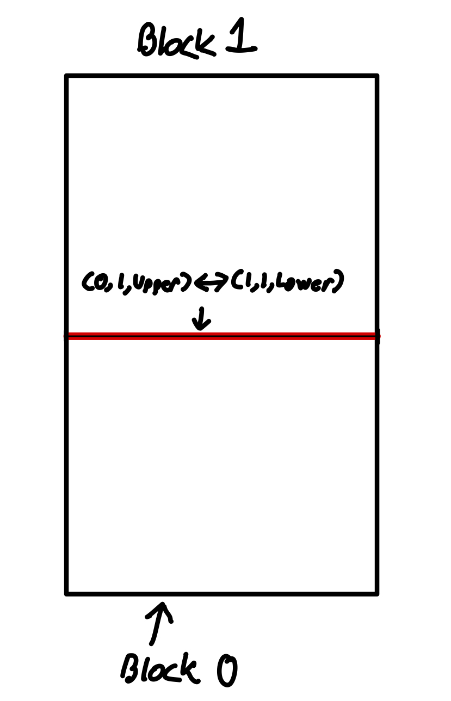
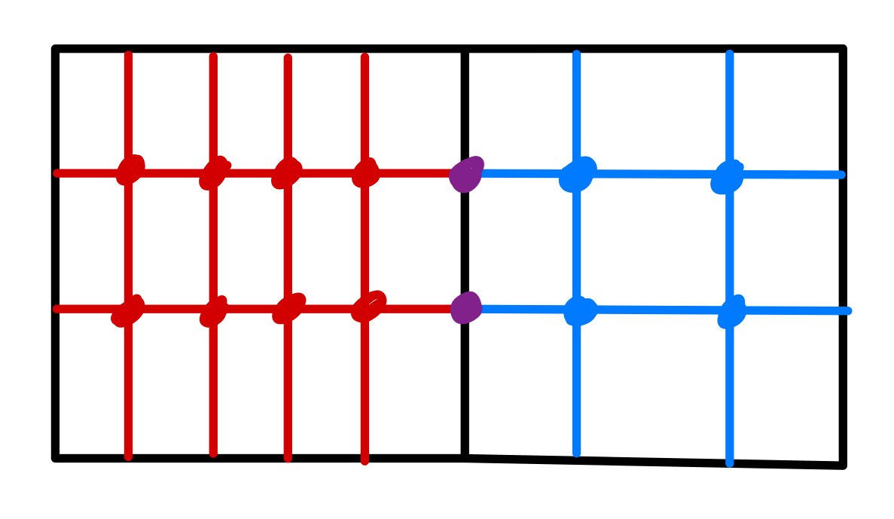
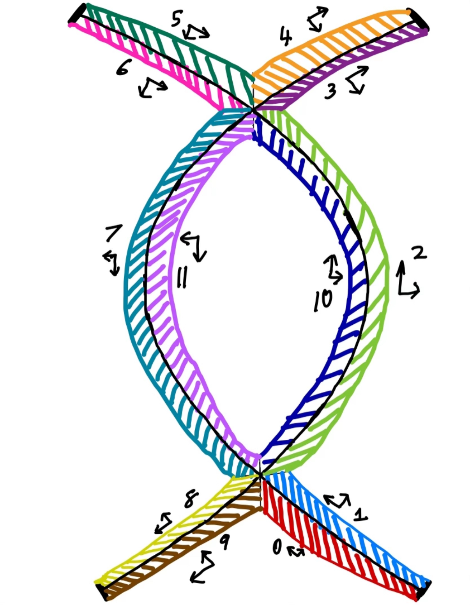

.. _devTokamakTopology:

Tokamak Topology
================

The construction of a field aligned grid for running gyrokinetic simulations within a tokamak requires first splitting the 
domain into different topological blocks and defining the proper connections between the blocks. 

Defining topological blocks and connections
-------------------------------------------

The internal geometry of each block is defined with a coordinate system which follows the right-hand convention such that the upper and 
lower bounds of each direction define an edge (or face in 3D geometries) of the block. There are two directions in the topological blocks 
for tokamaks: direction 0 dictates moving left to right and direction 1 dictates moving down to up. Each edge in a topological scheme can
then be identified with the following convention: ``(block ID, direction ID, bound)``. 

For example: 

- ``(2,1,Upper)`` corresponds to the “top” edge of block 2  
- ``(0,0,Lower)`` corresponds to the “left” edge of block 0  

   
   Figure 1: Directions and edges in a block showing the coordinate system convention

The conciseness of the naming scheme described above is particularly useful for mapping all of the connections between blocks in a large
topological scheme. For example:

- To say that the top edge of block 0 and the bottom edge of block 1 are connected we can write::

      (0,1,Upper) <-> (1,1,Lower)

  Where the double arrow indicates the reciprocal nature of the connection.  

- To say that the right edge of block 1 connects to a physical boundary we can write::

      (1,0,Upper) -> Physical Boundary

   
   Figure 2: Example of block connections using the naming convention

Defining cells
--------------

   
   Figure 3: Mesh cells within a block showing continuity requirements

A mesh is created by splitting the block into multiple cells along each direction. The mesh must be continuous from one block to another 
which means that for a connection, the number of cells running along the direction parallel to the shared edge must be equal for both blocks. 

For example, in the case of ``(0,1,Upper) <-> (1,1,Lower)``, the shared edge runs along the 0 direction for both blocks, which means that 
both blocks must have the same number of cells in the 0 direction. 

Double Null Tokamak Topology
----------------------------

   
   Figure 4: Double null tokamak topology with 12 blocks (0-11) and directional vectors

The general block layout for any double null Tokamak configuration is shown above. Each block is numbered with the convention that the 
outermost block on the bottom is numbered zero and subsequent blocks are numbered by going counter-clockwise and then inwards around the geometry. The scheme consists of 12 blocks labeled from 0 to 11 and various arrows are 
included throughout the image to help identify where the directional vectors of each block point. 

A general rule of thumb for this configuration is that the directions can be constructed using the right hand rule and following the separatrix:  

- For the outer half: direction 0 goes outwards perpendicular to the separatrix and direction 1 goes upwards parallel to the separatrix.  
- For the inner half: direction 0 goes inwards perpendicular to the separatrix and direction 1 goes downwards parallel to the separatrix. 

In a physical context, direction 0 for the blocks corresponds to changes in psi and direction 1 corresponds to changes in a theta arc length parameter.  

All block connections are as shown below:

- (0,0,Upper) <-> (1,0,Lower)
- (0,1,Upper) <-> (9,1,Lower)
- (1,1,Upper) <-> (2,1,Lower)
- (2,0,Lowee) <-> (10,0,Upper)
- (2,1,Upper) <-> (3,1,Lower)
- (3,0,Lower) <-> (4,0,Upper)
- (4,1,Lower) <-> (5,1,Upper)
- (5,0,Upper) <-> (6,0,Lower)
- (6,1,Upper) <-> (7,1,Lower)
- (7,0,Lower) <-> (11,0,Upper)
- (7,1,Upper) <-> (8,1,Lower)
- (8,0,Lower) <-> (9,0,Upper)
- (10,1,Upper) <-> (11,1,Lower)
- (11,1,Upper) <-> (10,1,Lower)

Additionally, due to the continuity clause between blocks the degrees of freedom in choosing the number of cells for each block is as shown below:

- Block 0: 2
- Blocks 1 - 8: 1
- Block 9: 0
- Block 10: 1
- Block 11: 0

Building a Double Null Tokamak Topology
---------------------------------------

The construction of a double null tokamak topology can be automated to require only a few user inputs:  

- Diverter plate geometry  
- Number of cells along blocks  
- Desired psi widths  
- Minimum and maximum bounds of Z and R for the tokamak  

This can be simplified even further by having default configurations for the number of cells and psi widths, making the specification of these inputs optional.  
By using the same numbers of cells for blocks of similar sizes and mirroring the lower and upper sections of the tokamak the number of required inputs can be
reduced from 11 to 6. 