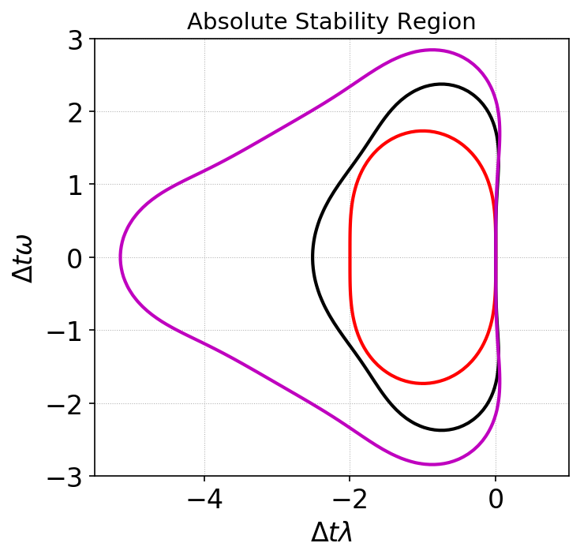

Strong-Stability preserving Runge-Kutta time-steppers
+++++++++++++++++++++++++++++++++++++++++++++++++++++

The Gkyl DG solvers use SSP-RK time-steppers. Three steppers are
implemented: SSP-RK2, SSP-RK3 and a four-stage SSP-RK3 that allows
twice the CFL (for the cost of additional memory) as the other
schemes. See [DurranBook]_ page 56. The schemes are described
below. Here, the symbol :math:`\mathcal{F}` is used to indicate a
first-order Euler update:

.. math::

   \mathcal{F}[f,t] = f + \Delta t \mathcal{L}[f,t]

where :math:`\mathcal{L}[f]` is the RHS operator from the spatial
discretization of the DG scheme.

.. contents::

SSP-RK2
-------

.. math::

   f^{(1)} &= \mathcal{F}[f^{n},t^n] \\
   f^{n+1} &= \frac{1}{2} f^{n} + \frac{1}{2}\mathcal{F}[f^{(1)},t^n+\Delta t]

with :math:`CFL \le 1`.

SSP-RK3
-------

.. math::

   f^{(1)} &= \mathcal{F}[f^{n},t^n] \\
   f^{(2)} &= \frac{3}{4} f^{n} + \frac{1}{4}\mathcal{F}[f^{(1)},t^n+\Delta t ] \\
   f^{n+1} &= \frac{1}{3} f^{n} + \frac{2}{3}\mathcal{F}[f^{(2)},t^n+\Delta t/2]

with :math:`CFL \le 1`. As this scheme has three stages instead of
two, it will take about :math:`1.5X` longer to run than the SSP-RK2
scheme.

Four stage SSP-RK3
------------------

.. math::

   f^{(1)} &= \frac{1}{2} f^{n} + \frac{1}{2} \mathcal{F}[f^{n},t^n] \\
   f^{(2)} &= \frac{1}{2} f^{(1)} + \frac{1}{2} \mathcal{F}[f^{(1)},t^n+\Delta t/2] \\
   f^{(3)} &= \frac{2}{3} f^{n} + \frac{1}{6} f^{(2)} + \frac{1}{6} \mathcal{F}[f^{(2)},t^n+\Delta t] \\
   f^{n+1} &= \frac{1}{2} f^{(3)} + \frac{1}{2} \mathcal{F}[f^{(3)},t^n+\Delta t/2]

with :math:`CFL\le 2`. Note that this scheme has four stages, but
allows twice the time-step that SSP-RK2 and SSP-RK3, hence will result
in a speed up of :math:`1.5X` compared to the three-stage SSP-RK3
scheme.

Region of absolute stability
----------------------------

For each of the above schemes, I have plotted below the region of
absolute stability. Note that only the RK3 schemes are stable when
there is no diffusion in the system, and hence should be prefered.

  Absolute stability regions for a equation :math:`\dot{y} =
  (\lambda+i\omega)y` for SSP-RK2 (red), SSP-RK3 (black) and
  four stage SSP-RK3 (magenta). When there is no diffusion
  (:math:`\lambda=0`) the SSP-RK2 scheme is slightly unstable as it
  has no intercept on the imaginary axis. Hence, the third order
  schemes should be preferred.

References
----------

.. [DurranBook] Dale E. Durran, "Numerical Methods for Fluid
   Dynamics", Springer. Second Edition.
