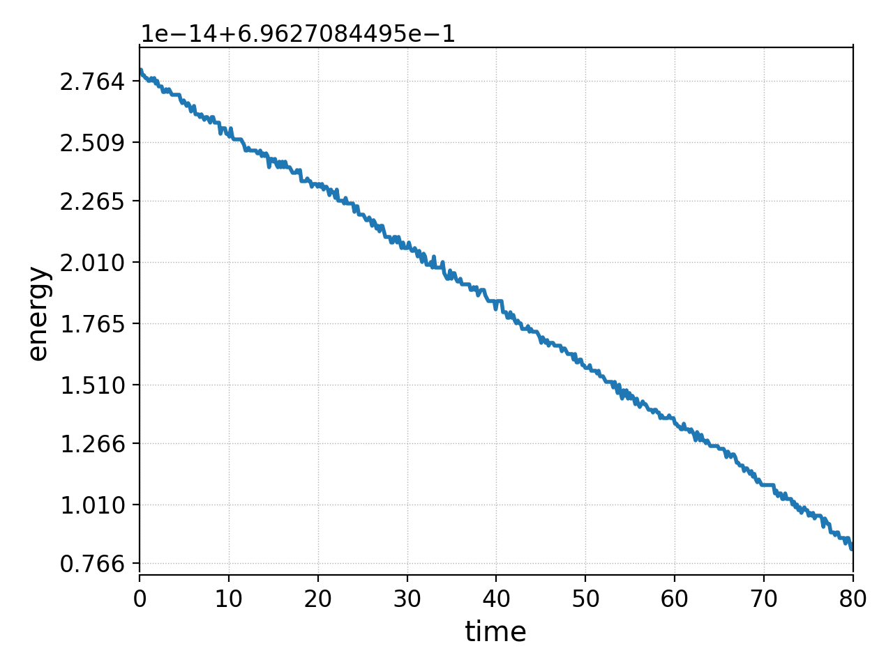
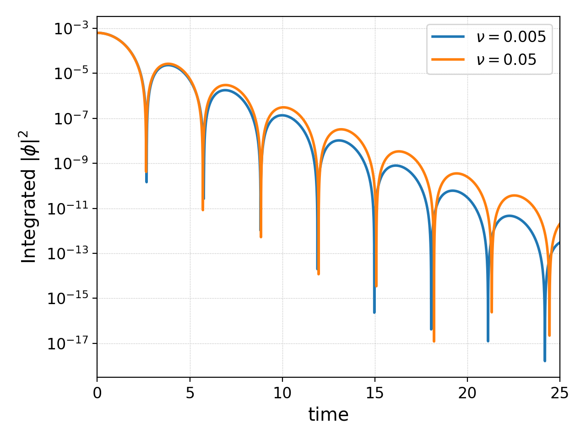

.. _app_coll:

Collision models in Gkeyll
++++++++++++++++++++++++++

In Gkeyll we currently have two different collision operators for use
in kinetic models: the Bhatnagar–Gross–Krook (BGK) and the Dougherty
operators. We referred to the latter as the LBO for the legacy
of Lenard-Bernstein. Its implementation in Gkeyll is detailed
in [Hakim2020]_ [Francisquez2020]_. 

.. contents::

BGK collisions
--------------

The BGK operator [Gross1956]_ for the effect of collisions on the
distribution of species :math:`f_s` is

.. math::

  \left(\frac{\partial f_s}{\partial t}\right)_c = \sum_r\nu_{sr}
  \left(f_{Msr} - f_s\right)

where the sum is over all the species. The distribution functon
:math:`f_{Msr}` is the Maxwellian

.. math::

  f_{Msr} = \frac{n_s}{\left(2\pi v_{tsr}^2\right)^{d_v/2}}
  \exp\left[-\frac{\left(\mathbf{v}-\mathbf{u}_{sr}\right)^2}{2v_{tsr}^2}\right] 

with the primitive moments :math:`\mathbf{u}_{sr}` and :math:`v_{tsr}^2`
properly defined to preserve some properties (such as conservation),
and :math:`d_v` is the number of velocity-space dimensions.
For self-species collisions :math:`\mathbf{u}_{sr}=\mathbf{u}_s` and
:math:`v_{tsr}^2=v_{ts}^2`. For multi-species collisions we follow
an approach similar to [Greene1973]_ and define the cross-species
primitive moments as

.. math::

  \mathbf{u}_{sr} &= \mathbf{u}_s - \frac{\alpha_{E}}{2}
  \frac{m_s+m_r}{m_sn_{s}\nu_{sr}}\left(\mathbf{u}_s-\mathbf{u}_r\right) \\
  v_{tsr}^2 &= v_{ts}^2 - \frac{1}{d_v}\frac{\alpha_E}{m_sn_{s}\nu_{sr}}
  \left[d_v\left(m_sv_{ts}^2-m_rv_{tr}^2\right)-m_r\left(\mathbf{u}_s-\mathbf{u}_r\right)^2
  +4\frac{\alpha_E}{m_sn_{s}\nu_{sr}}\left(m_s+m_r\right)^2\left(\mathbf{u}_s-\mathbf{u}_r\right)^2\right]

but contrary to Greene's definition of :math:`\alpha_E`, we currently
use in Gkeyll the following expression

.. math::

  \alpha_E = m_sn_{s}\nu_{sr}\delta_s\frac{1+\beta}{m_s+m_r}.

Little guidance is provided by Greene as to how to choose :math:`\beta`,
although it seems clear that :math:`-1<\beta`. In Gkeyll the default
value is :math:`\beta=0`, but the user can specify it in the input file
(explained below). We have introduced the additional quantity :math:`\delta_s`
(which Greene indirectly assumed to equal 1) defined as

.. math::

  \delta_s = \frac{2m_sn_s\nu_{sr}}{m_sn_s\nu_{sr}+m_rn_r\nu_{rs}}

The BGK operator can be used with both the Vlasov-Maxwell solver and
the gyrokinetic solver.

Dougherty collisions
--------------------

The Doughery (LBO) model for collisions [Dougherty1964]_ in Gkeyll is given by

.. math::
  :label: doughertyOp

  \left(\frac{\partial f_s}{\partial t}\right)_c = \sum_r\nu_{sr}
  \frac{\partial}{\partial\mathbf{v}}\cdot\left[\left(\mathbf{v}-\mathbf{u}_{sr}\right)f_s
  +v_{tsr}^2\frac{\partial f_s}{\partial\mathbf{v}}\right].
 
In this case we compute the cross-primitive moments by a process analogous
to Greene's with the BGK operator, yielding the following formulas for the
cross flow velocity and thermal speed:

.. math::

  \mathbf{u}_{sr} &= \mathbf{u}_s + \frac{\alpha_{E}}{2}
  \frac{m_s+m_r}{m_sn_{s}\nu_{sr}}\left(\mathbf{u}_r-\mathbf{u}_s\right) \\
  v_{tsr}^2 &= v_{ts}^2+\frac{\alpha_{E}}{2}\frac{m_s+m_r}{m_sn_{s}\nu_{sr}}
  \frac{1}{1+\frac{m_s}{m_r}}\left[v_{tr}^2-\frac{m_s}{m_r}v_{ts}^2
  +\frac{1}{d_v}\left(\mathbf{u}_s-\mathbf{u}_r\right)^2\right]

with :math:`\alpha_E` defined in the BGK section above. The LBO used by
the gyrokinetic solver is

.. math::

  \left(\frac{\partial f_s}{\partial t}\right)_c = \sum_r\nu_{sr}\left\lbrace
  \frac{\partial}{\partial v_{\parallel}}\left[\left(v_\parallel-u_{\parallel sr}\right)f_s
  +v_{tsr}^2\frac{\partial f_s}{\partial v_\parallel}\right]+\frac{\partial}{\partial\mu}
  \left[2\mu f_s+2\frac{m_sv_{tsr}^2}{B}\mu\frac{\partial f_s}{\partial\mu}\right]\right\rbrace
  

Collisions in Gkeyll input files
--------------------------------

Users can specify collisions in input files by adding an additional Lua table
within each species one wishes to add collisions to. The collision frequency
can be constant, varying in space and time, or it can also have a user-defined
profile.

Constant collisionality
```````````````````````

An example of adding 
LBO collisions (for BGK collisions simply replace ``LBOcollisions`` with
``BGKCollisions``) to a species named 'elc' is

.. code-block:: lua

  elc = Plasma.Species {
     charge = q_e, mass = m_e,
     -- Velocity space grid.
     ...
     -- Initial conditions.
     ...
     evolve = true,
     -- Collisions.
     coll = Plasma.LBOCollisions {
        collideWith = { "elc" },
        frequencies = { nu_ee },
     },
  },

If there were another species, say one named 'ion', this 'elc' species could
be made to collide with 'ion' by adding 'ion' to the ``collideWidth``
table:

.. code-block:: lua

  coll = Plasma.LBOCollisions {
     collideWith = { "elc", "ion" },
     frequencies = { nu_ee, nu_ei },
  },

The constant collision frequencies ``nu_ee`` and ``nu_ei`` need to be previously
computed/specified in the input file. The user can specify the value of :math:`\beta`
in the above formulas for the cross-species primitive moments (:math:`\mathbf{u}_{sr}`
and :math:`v_{tsr}^2`) by specifying the variable ``betaGreene`` in the collisions
table (if the user does not specify it, ``betaGreene=0.0`` is assumed) like

.. code-block:: lua

  coll = Plasma.LBOCollisions {
     collideWith = { "elc", "ion" },
     frequencies = { nu_ee, nu_ei },
     betaGreene  = 0.9
  },

In some cases the user may be interested in colliding species 'elc' with species 'ion',
but not collide species 'ion' with species 'elc'. Gkeyll supports this combination, but
since the formulas for cross-species primitive moments involve both :math:`\nu_{ei}`
and :math:`\nu_{ie}`, the code will default to assuming :math:`\nu_{ie}=m_e\nu_{ei}/m_i`.
Note however that this scenario is not energy conserving: for exact energy conservation,
one must include the effect of binary collisions on both species.

It is also possible to specify both LBO and BGK collisions between different
binary pairs in a single input file. For example, if there are three species
'elc', 'ion' and 'neut', the 'elc' species could be made collide with both
'ion' and 'neut' as follows:

.. code-block:: lua

  cColl = Plasma.LBOCollisions {
     collideWith = { "elc", "ion" },
     frequencies = { nu_ee, nu_ei },
  },
  nColl = Plasma.BGKCollisions {
     collideWith = { "neut" },
     frequencies = { nu_en },
  },

If no collisionality is specified in the input file, it is assumed that the user
desires Gkeyll to build a spatially-varying collisionality from scratch using
a Spitzer-like formula for :math:`\nu_{sr}` (explained below).

Spatially varying collisionality
````````````````````````````````

Currently there are three ways to run simulations with a spatially varying collisionality.
All of these options lead to a spatially varying, cell-wise constant collisionality.
We will be adding support for variation of the collisionality within a cell in the future.

Option A
^^^^^^^^

The simplest way to run with spatially varying collisionality is to not specify
the table ``frequencies``. In this case the code computes :math:`\nu_{sr}`
according to

.. math::

  \nu_{sr} = \nu_{\mathrm{frac}}\frac{n_r}{m_s}\left(\frac{1}{m_s}+\frac{1}{m_r}\right)
  \frac{q_s^2q_r^2\log\Lambda_{sr}}{3(2\pi)^{3/2}\epsilon_0^2}
  \frac{1}{\left(v_{ts}^2+v_{tr}^2\right)^{3/2}}

where :math:`\nu_{\mathrm{frac}}` is a scaling factor, the Coulomb logarithm is
defined as

.. math::

  \log\Lambda_{sr} = \frac{1}{2}\ln\left\lbrace1+\left(\sum_\alpha\frac{\omega_{p\alpha}^2+\omega_{c\alpha}^2}
  {\frac{T_\alpha}{m_\alpha}+3\frac{T_s}{m_s}}\right)^{-1}
  \left[\max\left(\frac{|q_sq_r|}{4\pi\epsilon_0m_{sr}u^2},\frac{\hbar}{2e^{1/2}m_{sr}u}\right)\right]^{-2}\right\rbrace

and the :math:`\alpha`-sum is over all the species. For Vlasov-Maxwell simulations
we do not add the correction due to gyromotion (:math:`\omega_{c\alpha}=0` here). 
The relative velocity here is computed as :math:`u^2=3v_{tr}^2+3v_{ts}^2`, the
reduced mass is :math:`m_{sr} = m_sm_r/\left(m_s+m_r\right)`, and :math:`\omega_{p\alpha}`
is the plasma frequency computed with the density and mass of species :math:`\alpha`.
Simpler formulas for the Coulomb logarithm can be easily generated by developers if necessary.

The formulas above assume all the plasma quantities and universal constants are in
SI units. The user can provide a different value for these variables by passing them
to the collisions table in the input files, as shown here:

.. code-block:: lua

  coll = Plasma.LBOCollisions {
     collideWith = { "elc", "ion" },
     epsilon0    = 1.0,    -- Vacuum permitivity.
     elemCharge  = 1.0,    -- Elementary charge value.
     hBar        = 1.0,    -- Planck's constant h/2pi.
  },

Additionally the user can pass the scaling factor :math:`\nu_{\mathrm{frac}}` by
specifying ``nuFrac`` in the collisions table.

Option B
^^^^^^^^

Another way to use a spatially varying collisionality is to pass a reference
collisionality normalized to a combination of the density and thermal speed of the
colliding species. This normalized collisionality, is defined as
:math:`\nu_{srN}=\nu_{sr0}\left(v_{ts0}^2+v_{tr0}^2\right)^{3/2}/n_{r0}` and one
provides through ``normNu`` in the collisions table as shown below:

.. code-block:: lua

  elc = Plasma.Species {
     ...
     coll = Plasma.LBOCollisions {
        collideWith = { "ion" },
        normNu      = { nu_ei*((vte^2+vti^2)^(3/2))/n_i0 }
     },
  },

where ``nu_ei``, ``vte``, ``vti``, ``n_e0`` are computed in the Preamble of the
input file and it is up to the user to ensure that these all have consistent units.
Then, in each time step, the collisions will be applied with the following collisionality

.. math::

  \nu_{sr}(x) = \nu_{\mathrm{frac}}\nu_{srN} \frac{n_r(x,t)}{\left(v_{ts}^2(x,t)+v_{tr}^2(x,t)\right)^{3/2}}.

Note that if one is using the ``normNu`` feature for self-species collisions, one must
still use these formulas. In this case one would specify electron-electron collisions like

.. code-block:: lua

  elc = Plasma.Species {
     ...
     coll = Plasma.LBOCollisions {
        collideWith = { "elc" },
        normNu      = { nu_ee*((2*(vte^2))^(3/2))/n_e0 }
     },
  },

Option C
^^^^^^^^

The user may also wish to specify their own collisionality profile, so for this purpose
one can pass functions into the ``frequencies`` table in the collisions table.

For example, suppose that one would like to run a simulation with a collisionality that
decays exponentially in x. In this case we could create a exponentially decaying function
in the preamble and pass it as the collision frequency as follows:

.. code-block:: lua

  local Plasma    = require("App.PlasmaOnCartGrid").VlasovMaxwell
  local Constants = require "Lib.Constants"

  eps0 = Constants.EPSILON0
  eV   = Constants.ELEMENTARY_CHARGE
  me   = Constants.ELECTRON_MASS
  
  n0  = 7e19     -- Number density [1/m^3].
  Te0 = 100*eV   -- Electron temperature [J].
  
  -- Reference electron collision frequency (at x=0).
  logLambdaElc = 24.0 - 0.5*math.log(n0/1e6) + math.log(Te0/eV)
  nu_ee        = logLambdaElc*(eV^4)*n0
                /(12*math.sqrt(2)*(math.pi^(3/2))*(eps0^2)*math.sqrt(me)*(Te0^(3/2)))

  local function nu_eeProfile(t, xn)
     local x = xn[1]
     return nu_ee*math.exp(-x)
  end

  vlasovApp = Plasma.App {
     ...
     elc = Plasma.Species {
        ...
        -- Collisions.
        coll = Plasma.LBOCollisions {
           collideWith = { "elc" },
           frequencies = { nu_eeProfile },
        }
     }
     ...
  }
  -- Run application.
  vlasovApp:run()

At present all the ``frequencies`` must either be constant numbers or functions. We do not
yet support having a combination of the two in the same collisions table.

Comments on stability
---------------------

The are known issues with the implementation of the collision operators in Gkeyll.
One of them, for example, is that we do not have a positivy preseving algorithm for
the LBO. Positivity issues are often accompanied by large flows or negative temperatures
and/or densities. For this reason we have taken three precautions:
  1. Calculation of primitive moments :math:`\mathbf{u}_{sr}` and :math:`v_{tsr}^2`
     is carried out using cell-average values if the number density is non-positive at
     one of the corners of that cell.
  2. The collision term is turned off locally if the flow velocity :math:`\mathbf{u}_{sr}`
     is greater than the velocity limits of the domain, or if :math:`v_{tsr}^2` is
     negative.
  3. The collision frequency :math:`\nu_{sr}` is locally set to zero if the cell-average
     values of :math:`n_r` or :math:`v_{tsr}^2` are negative.

We track the number of cells in which precaution 2 is used, and for stable simulations
this is typically small (a few percent or less). Further discussion of why these
precautions are necessary appears in [Hakim2020]_.

Examples
--------

We offer two full examples of the use of collisions. One in Vlasov-Maxwell and
one in Gyrokinetics.

Example 1: 1x1v collisional relaxation
``````````````````````````````````````

Consider an initial distribution function in 1x1v phase space given by a Maxwellian
and a large bump in its tail

.. math::
  :label: bumpDist

  f(x,v,t=0) = \frac{n_0}{\left(2\pi v_{t0}^2\right)^{1/2}}
  \exp\left[-\frac{\left(v-u_0\right)^2}{2v_{t0}^2}\right]
  +\frac{n_b}{\left(2\pi v_{tb}^2\right)^{1/2}}
  \exp\left[-\frac{\left(v-u_b\right)^2}{2v_{tb}^2}\right]
  \frac{1}{\left(v-u_l\right)^2+s_b^2}

Suppose we wish to collisionally relax this initial state, without the influence of
collisionless terms. That is, we wish to evolve this distribution function according
to equation :eq:`doughertyOp`. In this case our :doc:`input file <inputFiles/lboRelax>`
will use the VlasovMaxwell App (for 1x1v it would be equivalent to use the Gyrokinetic
App), and we define the distribution in equation :eq:`bumpDist` in the Preamble via the
function

.. code-block:: lua

   -- Maxwellian with a Maxwellian bump in the tail.
   local function bumpMaxwell(x,vx,n,u,vth,bN,bU,bVth,bL,bS)
      local vSq  = ((vx-u)/(math.sqrt(2.0)*vth))^2
      local vbSq = ((vx-bU)/(math.sqrt(2.0)*bVth))^2
      return (n/math.sqrt(2.0*math.pi*vth))*math.exp(-vSq)
            +(bN/math.sqrt(2.0*math.pi*bVth))*math.exp(-vbSq)/((vx-bL)^2+bS^2)
   end

In this case we chose constants for all densities, flow speed and temperatures. We
also set the charge to 0. Under these conditions the collisionless terms have no effect,
but we can explicitly turn them off with the ``evolveCollisionless`` flag. We will also
request the total integrated bulk flow energy (``intM2Flow``) and the total thermal
energy (``intM2Thermal``) as diagnostics.


.. code-block:: lua

  plasmaApp = Plasma.App {
     tEnd         = 80,      -- End time.
     nFrame       = 80,      -- Number of frames to write.
     lower        = {0.0},   -- Configuration space lower coordinate.
     upper        = {1.0},   -- Configuration space upper coordinate.
     cells        = {8},     -- Configuration space cells.
     polyOrder    = 2,       -- Polynomial order.
     periodicDirs = {1},     -- Periodic directions.
     -- Neutral species with a bump in the tail.
     bump = Plasma.Species {
        charge = 0.0, mass = 1.0,
        -- Velocity space grid.
        lower = {-8.0*vt0}, upper = { 8.0*vt0},
        cells = {32},
        -- Initial conditions.
        init = function (t, xn)
           local x, v = xn[1], xn[2]
           return bumpMaxwell(x,v,n0,u0,vt0,nb,ub,vtb,uL,sb)
        end,
        evolve = true,                 -- Evolve species?
        evolveCollisionless = false,   -- Evolve collisionless terms?
        diagnosticIntegratedMoments = { "intM2Flow", "intM2Thermal" },
        -- Collisions.
        coll = Plasma.LBOCollisions {
           collideWith = {'bump'},
           frequencies = {nu},
        },
     },
  }

We run this :doc:`input file <inputFiles/lboRelax>` with the call

.. code-block:: lua

  gkyl lboRelax.lua

On a 2015 MacBookPro this ran in 1.5 seconds and produced
:doc:`a screen output like this one <inputFiles/lboRelaxLog>`.

We can start looking at the data by first, for example, making a movie
of the distribution function as function of time with ``pgkyl``:

.. code-block:: bash

  pgkyl -f "lboRelax_bump_[0-9]*.bp" interp sel --z0 0. anim -x '$v$' -y '$f(x=0,v,t)$'

This command produces the movie given below. We can see that from the
initial, bump-in-tail state the distribution relaxes to a Maxwellian.
The Maxwellian by the way is the analytic steady state of this operator.

.. raw:: html

  <center>
  <video controls height="300" width="450">
    <source src="../../../_static/lboRelax.mp4" type="video/mp4">
  </video>
  </center>

Such relaxation should also take place without breaking momentum or
energy conservation. We can examine the evolution of the total energy
in the system by adding ``intM2Flow`` and ``intM2Thermal`` and plotting
it as a function of time. This is achieved in ``pgkyl`` via:

.. code-block:: bash

  pgkyl -f lboRelax_bump_intM2Flow.bp -f lboRelax_bump_intM2Thermal.bp ev 'f0 f1 +' pl -x 'time' -y 'energy'

As we can see in the figure below, and in particular in the :math:`10^{-14}`
scale of it, the total particle energy is conserved very well. The changes
in energy over a collisional period are of the order of machine precision.



  Normalized particle energy vs. time as an initial bump-in-tail distribution
  is relaxed to a Maxwellian by the Dougherty collision operator.

Example 2: 1x2v collisional Landau damping
``````````````````````````````````````````

We now explore the modification of Landau damping by inclusion of Dougherty
collisions. Specifically, we will consider ion acoustic waves with adiabatic
electrons. This means that the electron number density simply follows

.. math::
  :label: adiabaticElc

  n_e(x,t) = n_0\left(1+\frac{e\phi}{T_{e0}}\right)

and our gyrokinetic Poisson equation is simply replaced by the quasineutrality

.. math::

  n_0\left(1+\frac{e\phi}{T_{e0}}\right) = n_i(x,t)
  = 2\pi B\int\mathrm{d}v_{\parallel}\,\mathrm{d}\mu~f_{i}(x,v_{\parallel},\mu,t).

So there is no need to evolve the electron distribution function. In the Gyrokinetic
App we can specify an adiabatic species using ``Plasma.AdiabaticSpecies``:

.. code:: lua

  plasmaApp = Plasma.App {
     ...
     adiabaticElectron = Plasma.AdiabaticSpecies {
        charge = -1.0, mass = mElc,
        temp   = Te,
        -- Initial conditions.. use ion background so that background is exactly neutral.
        init = function (t, xn)
           return nElc
        end,
        evolve = false, -- Evolve species?
     },
     ...
   }

This simulation then only needs to solve the electrostatic gyrokinetic equations
for ions

.. math::
  :label: ionGK 

  \frac{\partial Bf_i}{\partial t} + \nabla\cdot\left(Bf_i\mathbf{\dot{R}}\right)
  +\frac{\partial}{\partial v_{\parallel}}\left(Bf_i\dot{v_{\parallel}}\right)
  = \left(\frac{\partial B f_i}{\partial t}\right)_c

and we do so with an initial condition that contains a sinusoidal perturbation
(wavenumber :math:`k=0.5`) in the ion density:

.. math::

  f_i(x,v_{\parallel},\mu,t=0)=\frac{n_{i0}\left[1+\alpha\cos(kx)\right]}{\sqrt{2\pi v_{ti0}^2}}
  \exp\left[-\frac{v_{\parallel}^2+2\mu B/m_i}{2v_{ti0}^2}\right]

If the right side of this equation :eq:`ionGK` were zero, this ion acoustic wave
would damp at the collisionless rate calculated by Landau (well he did electron
Langmuir waves). But collisions will change the picture and we wish to numerically
find out how.

This simulation is setup in the :doc:`ionSound.lua <inputFiles/ionSound>` input file.
This input file calls for discretizing the ion phase space
:math:`[-\pi/k,\pi/k]\times[-6v_t,6v_t]\times[0,m_i(5v_t^2)/(2B_0)]` using 
:math:`64\times128\times16` cells and a piecewise linear basis. With a
collisionality of :math:`\nu_=0.005`, the simulation ran on a 2015 MacbookPro
in 41 minutes, while a collisionality of :math:`\nu=0.05` required 1.35 hours. They
were run the command 

.. code:: bash

  gkyl ionSound.lua

and produced :doc:`this screen output <inputFiles/ionSoundLog.rst>`.

Note that this is really a linear problem, that is, one can sufficiently model it
with a linearized version of equation :eq:`ionGK`, using :math:`f_i=f_{i0}+f_{i1}`,
where the fluctuation :math:`f_{i1}` is small compared to the equilibrium
(Maxwellian) :math:`f_{i0}`. Users may wish to output this fluctuation in time: in
order to to this specify the background with the ``initBackground`` table:

.. code:: lua

  ion = Plasma.Species {
     ...
     -- Specify background so that we can plot perturbed distribution and moments.
     initBackground = {"maxwellian",
        density = function (t, xn)
           return nIon
        end,
        temperature = function (t, xn)
           return Ti
        end,
     },
     ...
  },

This will output the fluctuation to a file with the name format
``<simulation>_<species>_f1_#.bp``, where ``#`` stands for the frame number. So for
example, in this ``ionSound.lua`` case it creates files named ``ionSound_ion_f1_#.bp``.
We can plot this fluctuation along :math:`v_\parallel` at :math:`$t=5$` with 

.. code:: bash

  pgkyl -f "ionSound_ion_f1_10.bp" interp sel --z0 0.0 --z2 0.0 pl -x '$v_\parallel$' -y '$f_{i1}(x=0,v_\parallel,\mu=0,t=5)$'

(note that :ref:`postgkyl <pg_usage>` allows abbreviations,
so ``interp`` = :ref:`pg_cmd_interpolate`, ``sel`` = :ref:`pg_cmd_select`,
``pl`` = :ref:`pg_cmd_plot`) which produces the following image

.. figure:: figures/ionSound_ion_f1_10.png
  :scale: 40 %
  :align: center

  Fluctuation in the ion distribution function :math:`f_{i1}` along :math:`v_\parallel`
  at time :math:`t=5`. The fluctuation is defined as the instantaneous :math:`f_i`
  minust the equilibrium :math:`f_{i0}` defined in the input file (a Maxwellian).

Perhaps most valuable to the physics of this simulation is to see a signature of the
decay of the ion acoustic wave. This simulation produced the integrated squared
electrostatic potential, :math:`\int\mathrm{d}x\,|\phi|^2`, which we take as a measure
of the wave energy. It is stored in a file with the name format ``<simulation>_phiSq.bp``.
If we had run two simulations, :doc:`ionSound.lua <inputFiles/ionSound>` with :math:`\nu=0.005`
and :doc:`ionSoundH.lua <inputFiles/ionSoundH>` with :math:`\nu=0.05`, we could plot both electrostatic
energies in time with the following ``pgkyl`` command:

.. code:: bash

  pgkyl -f ionSound_phi2.bp -l '$\nu=0.005$' -f ionSoundH_phi2.bp -l '$\nu=0.05$' pl --logy -f0 -x 'time' -y 'Integrated $|\phi|^2$'

Notice that we are giving each file a label to use in the plot with the ``-l`` flag. Postgkyl
then produces the following figure



  Electrostatic field energy as a function of time for two collisionalities in
  1x2v ion-sound wave damping simulation with gyrokinetics.

We thus see that the wave energy is decaying as a function of time (the envelope of the curve
is going down), and that the rate at which this happens decreases with collisionality. That is,
for this case increasing collisionality decreased the damping rate. From this curve we can also
read the period of the wave, using the spacing between the dips.

References
----------

.. [Gross1956] E. P. Gross & M. Krook. Model for collision precesses
   in gases: small-amplitude oscillations of charged two-component systems.
   *Physical Review*, 102(3), 593–604 (1956).

.. [Greene1973] J. M. Greene. Improved Bhatnagar-Gross-Krook model
   of electron-ion collisions. *Physics of Fluids*, 16(11), 2022–2023 (1973).

.. [Dougherty1964] J. P. Dougherty. Model Fokker-Planck Equation for
   a Plasma and Its Solution. *Physics of Fluids*, 7(11), 1788–1799 (1964).

.. [Hakim2020] A. Hakim, et al. (2020). Conservative Discontinuous Galerkin
   Schemes for Nonlinear Fokker-Planck Collision Operators. `Journal of Plasma
   Physics Vol 86 No. 4, 905860403 (2020) <https://www.cambridge.org/core/journals/journal-of-plasma-physics/article/conservative-discontinuous-galerkin-schemes-for-nonlinear-doughertyfokkerplanck-collision-operators/507A0D7E01813721CAADC2A4A85DF8F7/share/60d25eb2d490647b782b440d9a0316f063360082>`_, `arXiv:1903.08062 <https://arxiv.org/abs/1903.08062>`_.

.. [Francisquez2020] M. Francisquez, et al. (2020). Conservative discontinuous
   Galerkin scheme of a gyro-averaged Dougherty collision operator. `Nuclear
   Fusion 60 No. 9, 096021 (2020) <https://iopscience.iop.org/article/10.1088/1741-4326/aba0c9>`_,
   `arxiv:2009.06660 <https://arxiv.org/abs/2009.06660>`_.
