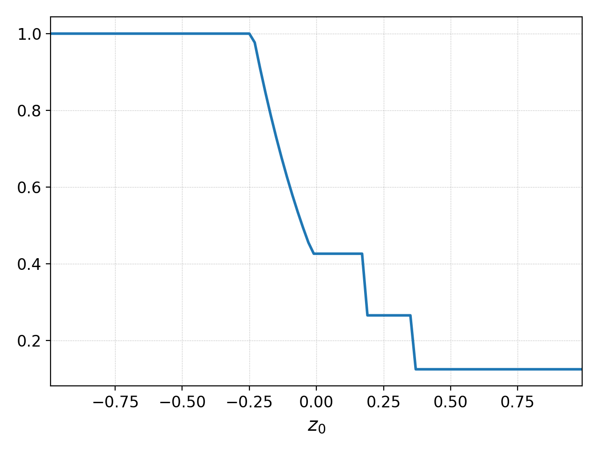

Gkeyll Tools
++++++++++++

Tools are pre-packaged programs that are often useful but not part of
the main App system. For example, there are tools to run and query the
the regression test system and its output, solve the exact Reimann
problem for the Euler equations and compute linear dispersion solvers
for multi-moment multifluid equations, and coming soon, linear
dispersion solvers for kinetic equations.

To get a list of all the supported tools do::

  gkyl -t

This will give the list of tools and provide a one-line description of
what the tool does. Each tool comes with its own embedded help
system. For example, to see how to run the exact Euler Reimann solver
tool do::

  gkyl exacteulerrp -h

This will print the help and the command options for the tool to the
terminal.

On this page the main tools are document.

Solving the exact Reimann problem for Euler equations: ``exacteulerrp``
-----------------------------------------------------------------------

The Reimann problem is a fundamental problem in the theory of
hyperbolic PDEs (like Euler and ideal MHD equations) which brings out
the essential nonlinear structure of the underlying physics. In
particular, the solution to the Reimann problem shows the shocks,
contact discontinuities and rarefactions waves supported by a system
of hyperbolic equations. The ``exacteulerrp`` solves the Reimann
problem exactly for the 1D Euler equations

.. math::
  :label: eq:euler-eqn

  \frac{\partial}{\partial{t}}
  \left[
    \begin{matrix}
      \rho \\
      \rho u \\
      \rho v \\
      \rho w \\
      E
    \end{matrix}
  \right]
  +
  \frac{\partial}{\partial{x}}
  \left[
    \begin{matrix}
      \rho u \\
      \rho u^2 + p \\
      \rho uv \\
      \rho uw \\
      (E+p)u
    \end{matrix}
  \right]
  =
  0

where 

.. math::

  E = \frac{p}{\gamma - 1} + \frac{1}{2}\rho (u^2 + v^2 + w^2)

is the total energy contained in the fluid. To get help for this tool
do::

  gkyl exacteulerrp -h  

Note that the ``exacteulerrp`` tool itself can print an example input
file to shell that you can then redirect to a file ::

  gkyl exacteulerrp -e > sod-shock.lua
  
To run this tool make an input file (or modify the one produced by the
`-e` option) with the left and right initial states, the time to
compute the solution at and a grid resolution. (The grid is used to
determine where the solution is computed. The solution at each grid
location is **exact** and does not depend on the resolution).

.. code-block:: lua

   lower = -1.0 -- left-edge of domain
   upper = 1.0 -- right-edge of domain
   location = 0.0 -- location of shock
   ncell = 100 -- Number of cells to use
   tEnd = 0.2 -- Time at which to compute RP
   gasGamma = 1.4 -- Gas adiabatic index

   -- left/right states { density, velocity, pressure }
   leftState = { 1.0, 0.0, 1.0 }
   rightState = { 0.125, 0.0, 0.1 }

If this file was saved as "sod-shock.lua" you can run the tool::

  gkyl exacteulerrp -i sod-shock.lua

This will produce a set of BP files with the solution to the
Riemann problem::

  sod-shock_density.bp		sod-shock_pressure.bp
  sod-shock_internalenergy.bp	sod-shock_velocity.bp
  
You can now use postgkyl to plot the solution. For example, to plot
the internal density do::

  pgkyl -f sod-shock_density.bp pl

to produce the following plot.

  Density from the exact solution to the sod-shock Riemann problem
  computed using the ``exacteulerrp`` tool.
  
For a comprehensive set of 1D Riemann problems used to benchmark two
finite-volume schemes see `this note
<http://ammar-hakim.org/sj/je/je2/je2-euler-shock.html>`_
