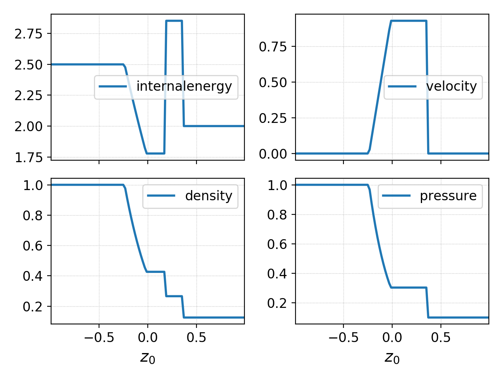
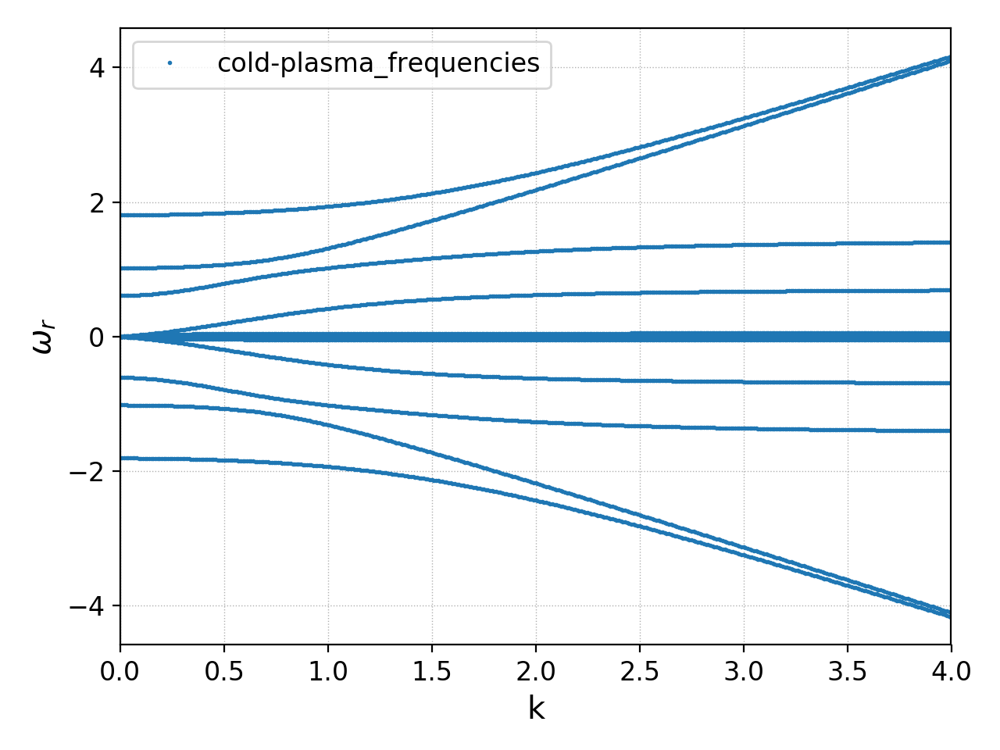

.. _gkyl_tools:

gkyl Tools
++++++++++

.. contents::

Tools are pre-packaged programs that are often useful but not part of
the main App system. For example, there are tools to run and query the
the regression test system and its output, solve the exact Reimann
problem for the Euler equations and compute linear dispersion solvers
for multi-moment multifluid equations, and coming soon, linear
dispersion solvers for kinetic equations.

To get a list of all the supported tools do::

  gkyl -t

This will give the list of tools and provide a one-line description of
what the tool does. Each tool comes with its own embedded help
system. For example, to see how to run the exact Euler Reimann solver
tool do::

  gkyl exacteulerrp -h

This will print the help and the command options for the tool to the
terminal.

On this page the main tools are documented.

Solving the exact Reimann problem for Euler equations: ``exacteulerrp``
-----------------------------------------------------------------------

The Reimann problem is a fundamental problem in the theory of
hyperbolic PDEs (like Euler and ideal MHD equations) which brings out
the essential nonlinear structure of the underlying physics. In
particular, the solution to the Reimann problem shows the shocks,
contact discontinuities and rarefactions waves supported by a system
of hyperbolic equations. The ``exacteulerrp`` solves the Reimann
problem exactly for the 1D Euler equations

.. math::

  \frac{\partial}{\partial{t}}
  \left[
    \begin{matrix}
      \rho \\
      \rho u \\
      \rho v \\
      \rho w \\
      E
    \end{matrix}
  \right]
  +
  \frac{\partial}{\partial{x}}
  \left[
    \begin{matrix}
      \rho u \\
      \rho u^2 + p \\
      \rho uv \\
      \rho uw \\
      (E+p)u
    \end{matrix}
  \right]
  =
  0

where 

.. math::

  E = \frac{p}{\gamma - 1} + \frac{1}{2}\rho (u^2 + v^2 + w^2)

is the total energy contained in the fluid. To get help for this tool
do::

  gkyl exacteulerrp -h  

Note that the ``exacteulerrp`` tool itself can print an example input
file to shell that you can then redirect to a file ::

  gkyl exacteulerrp -e > sod-shock.lua
  
To run this tool make an input file (or modify the one produced by the
`-e` option) with the left and right initial states, the time to
compute the solution at and a grid resolution. (The grid is used to
determine where the solution is computed. The solution at each grid
location is **exact** and does not depend on the resolution).

.. code-block:: lua

   lower = -1.0 -- left-edge of domain
   upper = 1.0 -- right-edge of domain
   location = 0.0 -- location of shock
   ncell = 100 -- Number of cells to use
   tEnd = 0.2 -- Time at which to compute RP
   gasGamma = 1.4 -- Gas adiabatic index

   -- left/right states { density, velocity, pressure }
   leftState = { 1.0, 0.0, 1.0 }
   rightState = { 0.125, 0.0, 0.1 }

If this file was saved as "sod-shock.lua" you can run the tool::

  gkyl exacteulerrp -i sod-shock.lua

This will produce a set of BP files with the solution to the
Riemann problem::

  sod-shock_density.bp		sod-shock_pressure.bp
  sod-shock_internalenergy.bp	sod-shock_velocity.bp
  
You can now use postgkyl to plot the solution. For example, to plot
all the files in a single figure do::

  pgkyl -f "sod-shock_*.bp" pl  -b

to produce the following plot.

  The exact solution to the sod-shock Riemann problem computed using
  the ``exacteulerrp`` tool.
  
For a comprehensive set of 1D Riemann problems used to benchmark two
finite-volume schemes see `this note
<http://ammar-hakim.org/sj/je/je2/je2-euler-shock.html>`_

Linear dispersion relation solver: ``multimomlinear``
-----------------------------------------------------

The ``multimomlinear`` allows solving linear dispersion equations for
multi-moment multifluid equations and will eventually be extended to
full kinetic equations. This tool allows arbitrary number of species,
each of which can be either an isothermal fluid, a five-moment fluid
or a ten-moment fluid. The fields can be computed from Maxwell
equations or Poisson equations, with the option of some species
"ignoring" the background fields. Certain forms of closures, including
non-local Hammett-Perkins Landau fluid closures, can be used.

For the list of equations and a brief overview of the algorithm used,
please see `this technical note
<../_static/gkyl-mom-lin.pdf>`_. Essentially, the key idea of this
algorithm is to convert the problem of finding the dispersion relation
to an *eigenvalue problem* and then use a standard linear algebra
package (`Eigen
<http://eigen.tuxfamily.org/index.php?title=Main_Page>`_ in this case)
to compute the eigensystem. This allows great flexibility as there is
no need to directly find complex nonlinear polynomial roots or even
formulate the dispersion relation explicitly.

To run this tool prepare an input file with the species you wish to
include, the field and the set of wave-numbers at which the dispersion
relation should be computed. An example input file for cold electron
and ions is given below.

.. code-block:: lua

   local Species = require "Tool.LinearSpecies"

   -- Electrons
   elc = Species.Isothermal {
      mass = 1.0, -- mass
      charge = -1.0, -- charge
      density = 1.0, -- number density
      velocity = {0.0, 0.0, 0.0}, -- velocity vector
      temperature = 0.0, -- temperature
   }

   -- Ions
   ion = Species.Isothermal {
      mass = 25.0, -- mass
      charge = 1.0, -- charge
      density = 1.0, -- number density
      velocity = {0.0, 0.0, 0.0}, -- velocity vector
      temperature = 0.0, -- temperature
   }

   -- EM field
   field = Species.Maxwell {
      epsilon0 = 1.0, mu0 = 1.0,

      electricField = {0.0, 0.0, 0.0}, -- background electric field
      magneticField = {1.0, 0.0, 0.75}, -- background magnetic field
   }

   -- list of species to include in dispersion relation
   speciesList = { elc, ion }

   -- List of wave-vectors for which to compute dispersion relation
   kvectors = {}

   local kcurr, kmax, NK = 0.0, 4.0, 401
   dk = (kmax-kcurr)/(NK-1)
   for i = 1, NK do
      kvectors[i] = {kcurr, 0.0, 0.0} -- each k-vector is 3D
      kcurr = kcurr + dk
   end  

Any number of species can be specified and the ``field`` can be either
``Species.Maxwell`` or ``Species.Poisson``. The wave-vectors at which
to compute the dispersion are specified in the ``kvector`` table,
which is a list of three element tables (with components :math:`k_x,
k_y, k_z`).

To run this input file (say it is saved in `cold-plasma.lua`)::

  gkyl multimomlinear -i cold-plasma.lua

This will create a output file named `cold-plasma_frequencies.bp`,
with the eigenvalues stored in a Gkeyll "DynVector" object.

For each element in the dynvector, the first three components are the
components of the wave-vector and the rest the corresponding
:math:`\omega_n(\mathbf{k})` with real and imaginary parts stored
separately (next to each other). You can plot the real part of the
frequencies as function of wave-vector (say :math:`k_x`) as::

  pgkyl -f cold-plasma_frequencies.bp val2coord -x0 -y 3::2 pl -s -f0 --xlabel "k" --ylabel '$\omega_r$' --markersize=2

And the imaginary parts as::

  pgkyl -f cold-plasma_frequencies.bp val2coord -x0 -y 4::2 pl -s -f0 --xlabel "k" --ylabel '$\omega_r$' --markersize=2  

Often, it is useful to plot the eigenvalues in the complex plane (real
part on X-axis and imaginary part on the Y-axis). For this do::

  pgkyl -f cold-plasma_frequencies.bp val2coord -x3::2 -y 4::2 pl -s -f0 --xlabel '$\omega_r$' --ylabel '$\omega_i$' --markersize=2  

Note that the frequencies are not outputed in any particular
order. Hence it is not possible to easily extract a single "branch" of
the dispersion relation from the output. Please see pgkyl help to
understand what the ``val2coord`` and ``pl`` (short for ``plot``) do
and how to use them.

Example of the real freuqency for the cold plasma waves is shown below

  Cold plasma dispersion computed using ``multimomlinear`` tool. Seen
  are the L-mode branch, the two branches of the R-mode, and the
  low-frequency ion-scale waves.

The species objects can be one of ``Species.Isothermal``,
``Species.Euler`` or ``Species.Tenmoment``. The input parameters
accepted by each of these objects are given below. Note that the input
parameters can either be dimensional or dimensionless. The tool itself
does not use any non-dimensionalization.

The ``Species.Isothermal`` takes the following parameters:

.. list-table:: Parameters for ``Species.Isothermal``
   :widths: 20, 60, 20
   :header-rows: 1

   * - Parameter
     - Description
     - Default
   * - mass
     - Mass of particle
     - 
   * - charge
     - Charge on particle
     - 
   * - density
     - Number density
     - 
   * - velocity
     - Velocity vector {:math:`v_x`, :math:`v_y`, :math:`v_z`}
     -
   * - temperature
     - Fluid temperature (set to zero for cold fluid)
     -
   * - ignoreBackgroundField
     - Do not consider background electromagnetic field on species.
     - false

The ``Species.Euler`` takes the following parameters:
     
.. list-table:: Parameters for ``Species.Euler``
   :widths: 20, 60, 20
   :header-rows: 1

   * - Parameter
     - Description
     - Default
   * - mass
     - Mass of particle
     - 
   * - charge
     - Charge on particle
     - 
   * - density
     - Number density
     - 
   * - velocity
     - Velocity vector {:math:`v_x`, :math:`v_y`, :math:`v_z`}
     -
   * - pressure
     - Fluid pressure
     -      
   * - gasGamma
     - Gas adiabatic index
     - 5/3
   * - ignoreBackgroundField
     - Do not consider background electromagnetic field on species.
     - false       

The ``Species.Tenmoment`` takes the following parameters:
     
.. list-table:: Parameters for ``Species.TenMoment``
   :widths: 20, 60, 20
   :header-rows: 1

   * - Parameter
     - Description
     - Default
   * - mass
     - Mass of particle
     - 
   * - charge
     - Charge on particle
     - 
   * - density
     - Number density
     - 
   * - velocity
     - Velocity vector {:math:`v_x`, :math:`v_y`, :math:`v_z`}
     -
   * - pressureTensor
     - Pressure in the fluid frame as a table {:math:`P_{xx}`,
       :math:`P_{xy}`, :math:`P_{xz}`, :math:`P_{yy}`, :math:`P_{yz}`,
       :math:`P_{zz}`}
     -      
   * - useClosure
     - Flag to turn on various collisionless closures
     - ``false``
   * - chi
     - Multiplicative factor in closure.
     - :math:`\sqrt{4/9\pi}`.
   * - ignoreBackgroundField
     - Do not consider background electromagnetic field on species.
     - false

.. note::

   - Presently, a unmagnetized Hammett-Perkins closure is
     implemented. See tech-note linked above and [Ng2017]_. This is
     not always very useful and accurate, specially for strongly
     magnetized problems. We hope to implement better closures soon.

   - The ``ignoreBackgroundField`` allows a species to "ignore" the
     applied background electromagnetic fields. This is often useful
     when one species is unmagnetized.
       
References
----------

.. [Ng2017] J. Ng, A. Hakim, A. Bhattacharjee, A. Stanier, &
   W. Daughton "Simulations of anti-parallel reconnection using a
   nonlocal heat flux closure". *Physics of Plasmas*, **24** (8),
   082112–5. (2017) http://doi.org/10.1063/1.4993195
