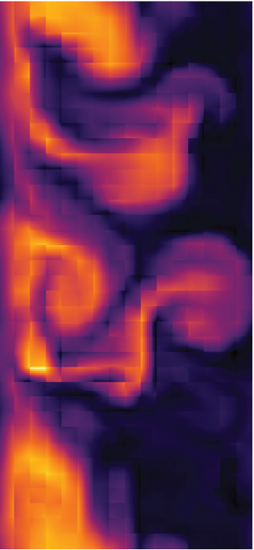

The  Gkeyll 2.0 Code: Documentation Home
++++++++++++++++++++++++++++++++++++++++

.. epigraph::

   "Magic Chicken Software Framework"
   -- 'Artificial' Intelligence view on Gkeyll

.. epigraph::

   "Don't Panic"
   -- The Hitchhiker's Guide to the Galaxy

Gkeyll v2.0 (pronounced as in the book `"The Strange Case of
Dr. Jekyll and Mr. Hyde"
<https://www.gutenberg.org/files/43/43-h/43-h.htm>`_) is a
computational plasma physics code mostly written in C/C++ and `LuaJIT
<http://luajit.org>`_. Gkeyll contains solvers for gyrokinetic
equations, Vlasov-Maxwell equations, and multi-fluid equations. Gkeyll
*contains ab-initio and novel implementations* of a number of
algorithms, and perhaps is unique in using a JIT compiled typeless
dynamic language for as its main implementation language.

The Gkeyll package contains two major parts: the :ref:`gkyl <gkyl_main>`
simulation framework and the the :ref:`postgkyl <pg_main>` post-processing
package. Here you will find documentation for the full Gkeyll package.

For license and authors see :doc:`License and Authors
<aboutAndLicense>`.

.. toctree::
   :maxdepth: 2

   install
   quickstart/main
   gkyl/main
   postgkyl/main
   gkyl/pubs	     
   gkyl/presentations
   dev/main

