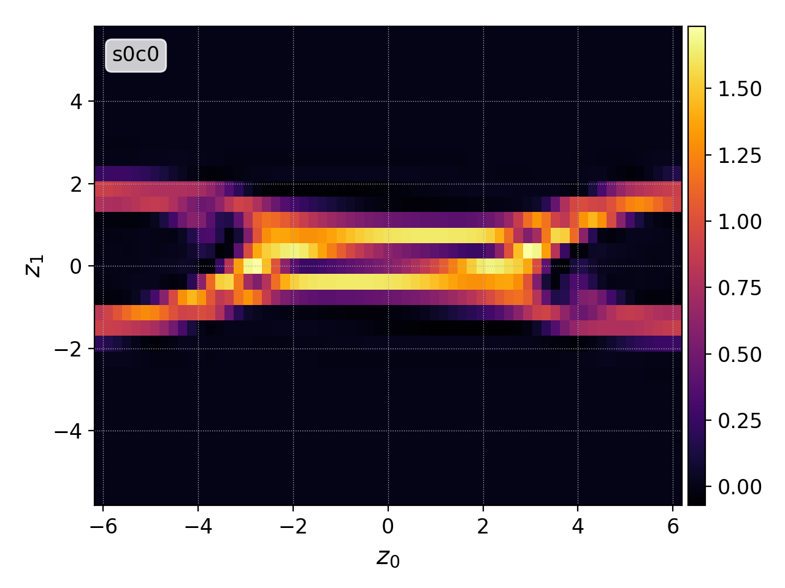
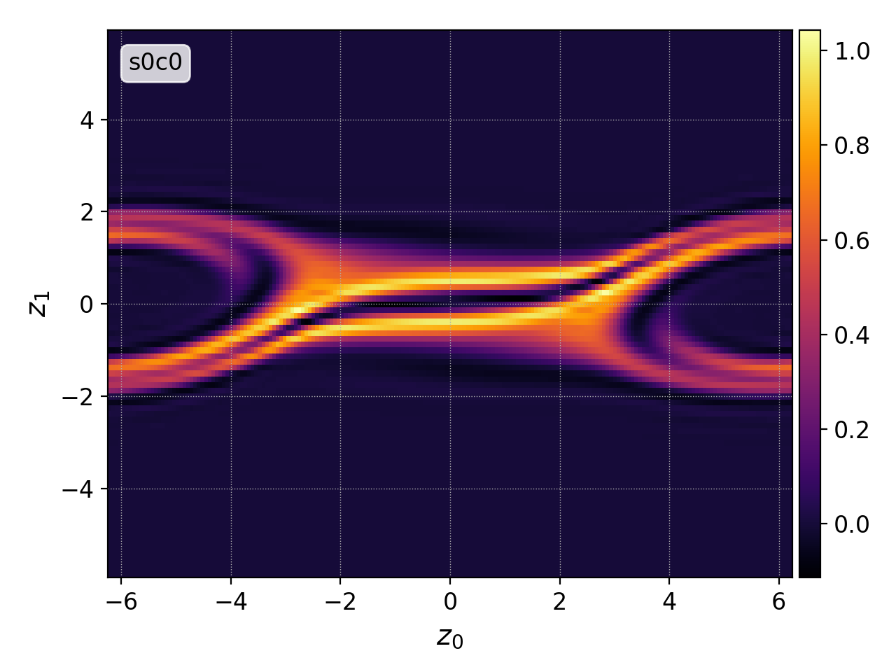

.. _pg_cmd-interpolate:

interpolate
+++++++++++

Command Line Mode
^^^^^^^^^^^^^^^^^

.. code-block:: bash

   $ pgkyl interpolate --help
   Usage: pgkyl interpolate [OPTIONS]

     Interpolate DG data on a uniform mesh

   Options:
     -b, --basis [ns|ms|mo]   Specify DG basis
     -p, --polyorder INTEGER  Specify polynomial order
     -i, --interp INTEGER     Interpolation onto a general mesh of specified
		              amount
     -r, --read BOOLEAN       Read from general interpolation file
     --help                   Show this message and exit.

``interpolate`` evaluates the `Gkyl` modal or nodal data on a uniform
mesh with higher resolution, which is important for plotting. For
example, applying ``interpolate`` on 2D data with the polynomial order
2 will poduce finer results with rippled resoluion (3x3 mesh inside
each cell).

The inputs for interpolation are the polynomial order ``-p`` and basis
``-b`` (must be one of nodal serendipity ``ns``, modal serendipity
``ms``, or maximal order ``mo``).

Following is the example comparison of the value proportional to the
cell average (component 0) and the interpolated data.

   Chain: ``pgkyl -f two-stream_elc_0.bp select --component 0 plot``

   Chain: ``pgkyl -f two-stream_elc_0.bp interpolate -p2 -b ms plot``

------

Script Mode
^^^^^^^^^^^

``interpolate`` uses the  ``GInterpModal`` and ``GInterpNodal``
classes based on the DG mode.

.. list-table:: Initialization parameters for ``GInterpModal`` and ``GInterpNodal``
   :widths: 20, 60, 20
   :header-rows: 1

   * - Parameter
     - Description
     - Default
   * - gdata (GData)
     - A GData object to be used.
     - 
   * - polyOrder (int)
     - The polynomial order of the discontinuous Galerkin
       discretization.
     -
   * - basis (str)
     - The polynomial basis. Currently supported options are ``'ns'`` for
       nodal Serendipity, ``'ms'`` for modal Serendipity, and ``'mo'``
       for the maximal order basis.
     -

After the initialization, both ``GInterpModal`` and ``GInterpNodal``
can be used to interpolate data on a uniform grid and to calculate
derivatives

.. list-table:: Members of ``GInterpModal`` and ``GInterpNodal``
   :widths: 40, 60
   :header-rows: 1

   * - Member
     - Description
   * - interpolate(int component, bool stack) -> narray, narray
     - Interpolates the selected component (default is 0) of the DG
       data on a uniform grid
   * - derivative(int component, bool stack) -> narray, narray
     - Calculates the derivative of the DG data

When the ``stack`` parameter is set to ``true`` (it is ``false`` by
default), the grid and values are pushed to the ``GData`` stack rather
than returned.

An example of the usage:

.. code-block:: Python

   import postgkyl as pg
   data = pg.data.GData('bgk_neut_0.bp')
   interp = pg.data.GInterpModal(data, 2, 'ms')
   iGrid, iValues = interp.interpolate()
