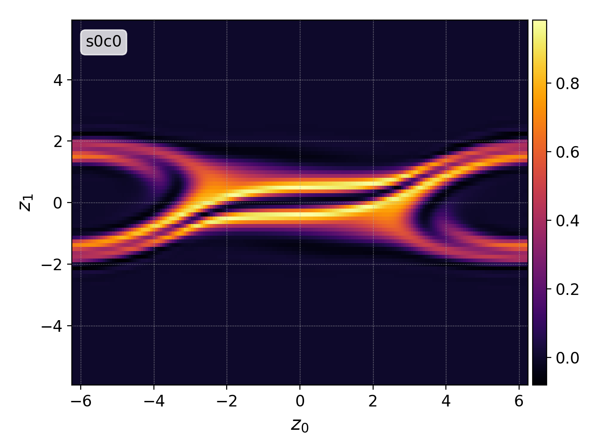
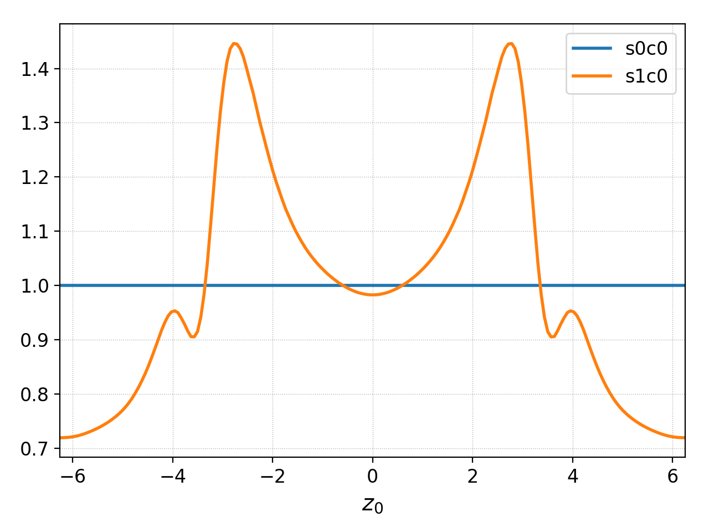
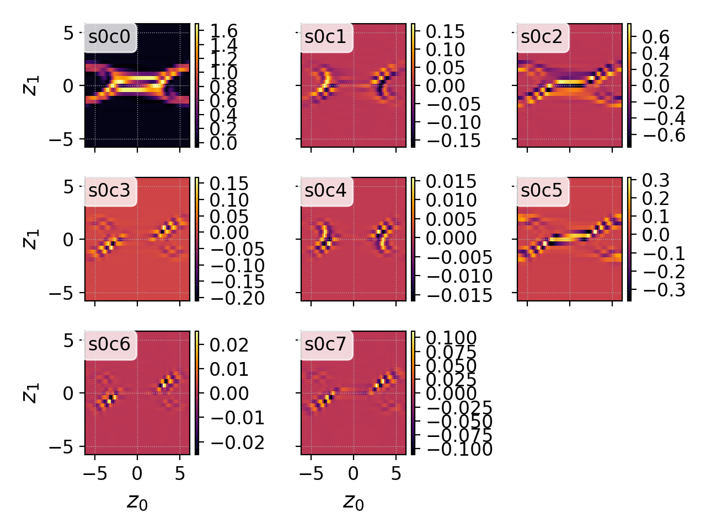
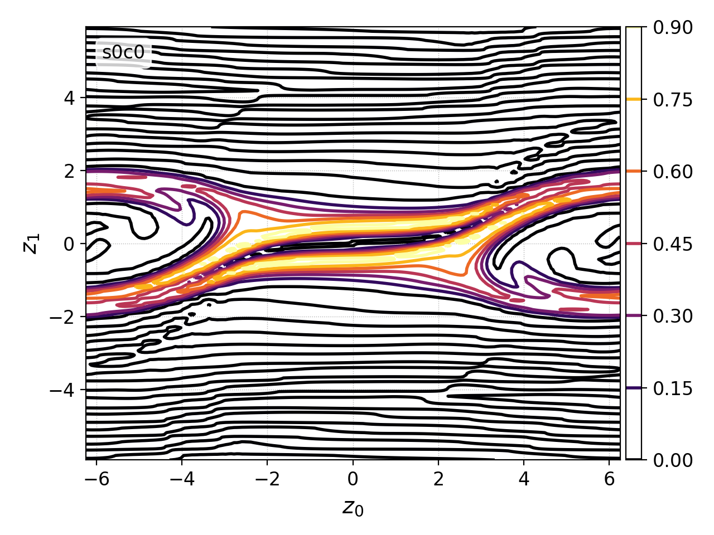
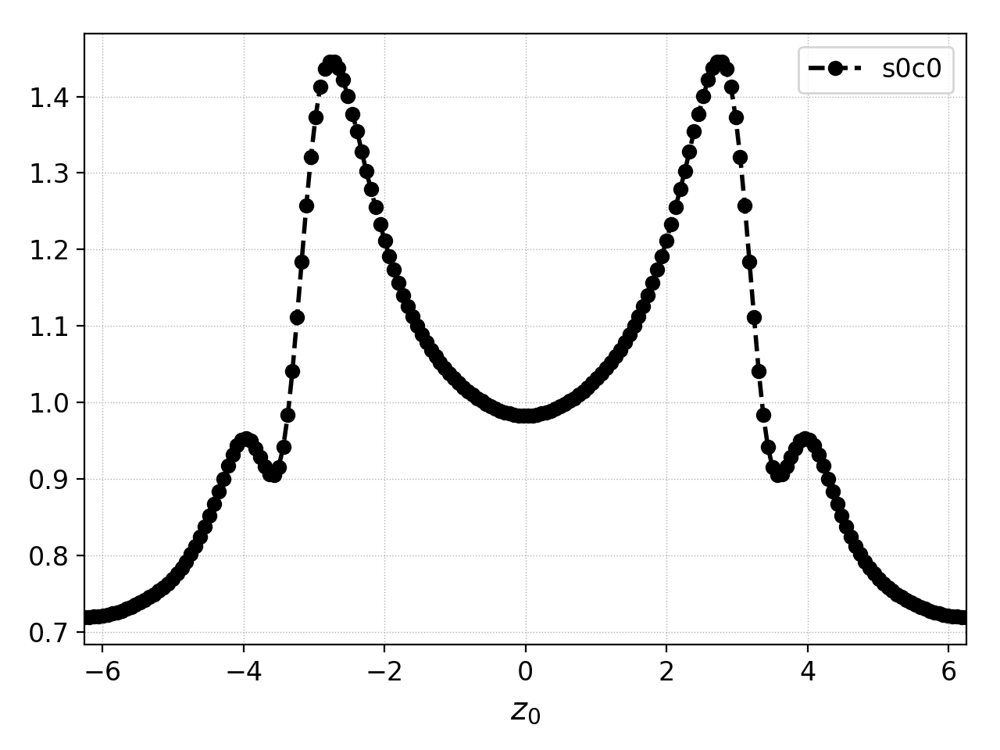

plot: data visualization
------------------------

Plotting -- visualization -- is one of the main purposes of Postgkyl.
For this, Postgkyl has the ``plot`` command which works with both 1D
and 2D data, supports special type of plots like contour or quiver,
and deals with the basic formatting.

A simple example of plotting electron distribution function from a
two-stream instability simulation:

.. code-block:: bash

   pgkyl -f two-stream_elc_2.bp plot

   Electron distribution function from a two-stream
   instability simulation.

Multiple Figures and Subplots
^^^^^^^^^^^^^^^^^^^^^^^^^^^^^

.. list-table:: Plot parameters: figures and subplots
   :widths: 10, 30, 60
   :header-rows: 1

   * - Abbreviation
     - Parameter
     - Description
   * - ``-f``
     - ``--figure``
     - Specify figure to plot in
   * - ``-s``
     - ``--squeeze``
     - Squeeze all the components into one subplot

By default, Postgkyl creates a single figure for each data set (file
loaded).  However, it is often useful to to plot different data sets
on top of each other, e.g., number densities at the beginning and the
end of the simulation. This could be done with the ``-f``
(``--figure``) flag:

.. code-block:: bash

   pgkyl -f two-stream_elc_M0_0.bp -f two-stream_elc_M0_10.bp plot -f 0

   Electron number densities at the beginning and the end of
   simulation both forced to plot into Figure 0 with the ``-f 0`` flag.

Gkyl data can contain multiple components which represent various
things like nodal or modal values for discontinuous Galerkin data or
components of a vector field.  By default, each component is plotted
into a separate subplots:

   Modes of electron distribution function from a two-stream
   instability simulation. Each mode is plotted into a separate
   subplot by default.

The motivation behind this is, that unless the user specifies a
component, he/she wants to get an overview on all of them and not
clutter the whole desktop with figures.  However, this could be
overcome with the ``--squeeze`` flag which puts all the components
into just a single subplot (useful, for example, for comparing different
components of an electromagnetic field).
   
Special Plots
^^^^^^^^^^^^^

.. list-table:: Plot parameters: special plots
   :widths: 10, 30, 60
   :header-rows: 1

   * - Abbreviation
     - Parameter
     - Description
   * - ``-c``
     - ``--contour``
     - Switch to contour mode
   * - ``-q``
     - ``--quiver``
     - Switch to quiver mode
   * - ``-l``
     - ``--streamline``
     - Switch to streamline mode

   Electron distribution function from a two-stream
   instability simulation with plot in the contour mode (``-c``).

Basic Formatting
^^^^^^^^^^^^^^^

.. list-table:: Plot parameters: basic formatting
   :widths: 10, 30, 60
   :header-rows: 1

   * - Abbreviation
     - Parameter
     - Description
   * - ``-a``
     - ``--arg``
     - Pass additional arguments, e.g. ``*--``, to the plot
   * -
     - ``--style``
     - Set Matplotlib style
   * -
     - ``--fixed-axis``
     - Enforce the same scaling on both axes
   * -
     - ``--logx``
     - Set the x-axis to logarithmic scale
   * -
     - ``--logy``
     - Set the y-axis to logarithmic scale
   * -
     - ``--no-legend``
     - Turn off the legend
   * - ``-x``
     - ``--xlabel``
     - Set the x-axis label
   * - ``-y``
     - ``--ylabel``
     - Set the y-axis label
   * - ``-t``
     - ``--title``
     - Set the figure title

The ``--arg`` flag allows for passing additional arguments to the
Matplotlib plot which is called internally. For example, slightly
modifying the density plot with ``-a 'o--k'`` turns on circular
markers (``o``), switches line style to dashed (``--``), and sets
color to black (``k``).

.. code-block:: bash

   pgkyl -f two-stream_elc_M0_0.bp plot -a 'o--k'

   Electron number density from a two-stream simulation with the ``-a
   'o--k'`` parameter.

Custom axis labels can be added with ``--xlabel`` and ``--ylabel``. If
they are not specified, neutral *z_i* labels are added (*z* is
customary for a general phase-space coordinate).  Note that the
*z*-labels are retained through the postprocessing chain (see
:ref:`pg_chain` for more information on chaining the commands).  For
example, in a 1X2V Vlasov simulation *z_0* will be *x*, *z_1* will be
*v_x*, and *z_2* will be *v_y* even if some dimension gets integrated
out.

Python Mode Plotting
^^^^^^^^^^^^^^^^^^^^

The ``plot`` command internally calls the ``output.plot()`` function.

.. code-block:: python

  import postgkyl as pg
  import matplotlib.pyplot as plt
  
  data = pg.data.GData('bgk_neut_0.bp')
  pg.output.plot(data)
  plt.show()

Note that, similarly to the Matplotlib ``plt.plot()``, ``plt.show()``
is required to see the figure.

Most of the command line parameters are passed into the function as keyword
arguments. For example:

.. code-block:: python

  pg.output.plot(data, 'o--k', logx=True, xlabel='$v_x$')
