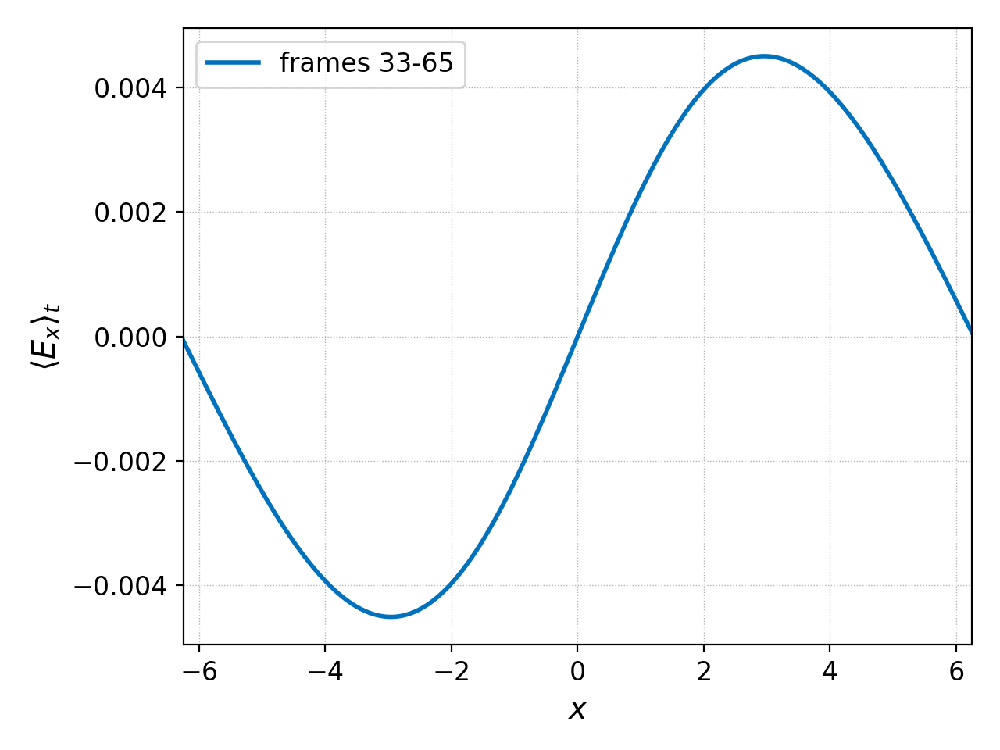

.. _pg_cmd_collect:

collect
-------

Assemble multiple active datasets into a new, single dataset.

It is also possible to collect datasets into chunks (multiple
datasets) of a specified size rather than into a single dataset.

Command line
^^^^^^^^^^^^

.. code-block:: bash
  :emphasize-lines: 1

  pgkyl collect --help
    Usage: pgkyl collect [OPTIONS]

      Collect data from the active datasets and create a new combined dataset.
        The time-stamp in each of the active datasets is collected and used as the
        new X-axis. Data can be collected in chunks, in which case several
        datasets are created, each with the chunk-sized pieces collected into each
        new dataset.
      
      Options:
        -s, --sumdata        Sum data in the collected datasets (retain components)
        -p, --period FLOAT   Specify a period to create epoch data instead of time
                             data
      
        --offset FLOAT       Specify an offset to create epoch data instead of time
                             data  [default: 0.0]
      
        -c, --chunk INTEGER  Collect into chunks with specified length rather than
                             into a single dataset
      
        -u, --use TEXT       Specify a 'tag' to apply to (default all tags).
        -t, --tag TEXT       Specify a 'tag' for the result.
        -l, --label TEXT     Specify the custom label for the result.
        -h, --help           Show this message and exit.

There are many uses of the ``collect`` command. One such use, for
example, is to plot quantities over time. If we consider the
:doc:`two stream instability Vlasov-Maxwell simulation<../input/two-stream>`
we can gather the :math:`x`-component of the electric field from
all frames and plot it as a function of time and space with

.. code-block:: bash

  pgkyl "two-stream_field_[0-9]*.bp" interp sel -c0 collect pl -x 'time' -y 'x'

.. figure:: ../fig/collect/two-stream_field_c0.png
  :align: center

The field is very small at first but is exponentially growing,
so in the above figure we mostly see the saturated electric
field at later times.

The collect command is also able to collect datasets into chunks
of a specified length with the ``-c`` flag. So suppose we wish to
compute a time average of the electric field over three separate
periods in the two stream instability simulation (we will set
``nFrame=98`` in the gkyl input file for this example so there are
a total of 99 frames), we can collect the field data into three
separate datasets with 33 frames each and use the :ref:`pg_cmd_ev`
command to average in time (0th dimension) as follows:

.. code-block:: bash

  pgkyl "two-stream_field_[0-9]*.bp" interp sel -c0 collect -c 33 ev -l 'frames 0-32' 'f[99] 0 avg' \
    ev -l 'frames 33-65' 'f[100] 0 avg' ev -l 'frames 66-98' 'f[101] 0 avg' activ -i102:105 \
    pl -x '$x$' -y '$\langle E_x\rangle_t$'

producing the following three plots

.. figure:: ../fig/collect/two-stream_field_fr0-32_tAv.png
  :figwidth: 29%
  :align: left

.. figure:: ../fig/collect/two-stream_field_fr66-98_tAv.png
  :figwidth: 29%
  :align: left

Clearly the field amplitude averaged over 30 frame intervals is
increasing as the instability develops.

Finally, ``collect`` allows a transformation of the time dimension
so that instead of time ``t`` it instead becomes ``(t-offset)/period``
via the ``--offset`` and ``--period flags``. This is used,
for example, in astronomy for variable stars and in creating
Poincare plots (see `<http://ammar-hakim.org/sj/je/je32/je32-vlasov-test-ptcl.html>`_).
