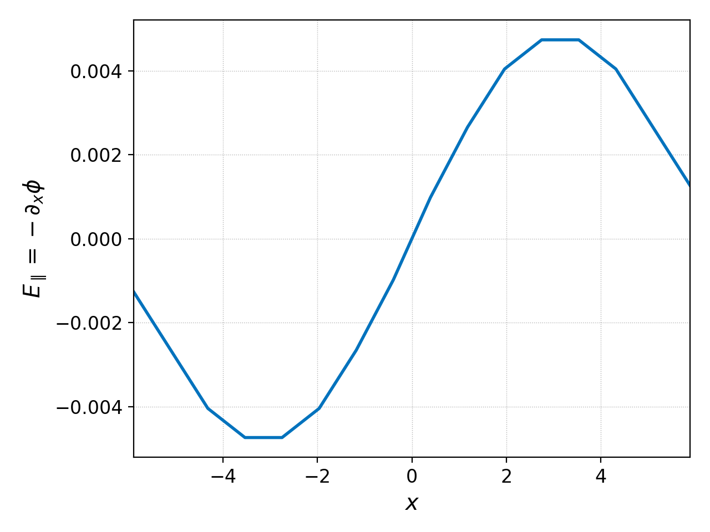

.. _pg_cmd_ev:

ev
===

``ev`` is a special command that enables simple operations like adding
or multiplying datasets directly in a terminal. As these operations
are generally simple to do in a script mode, ``ev`` is available only
in the command line interface.

.. raw:: html

   

   
<a>Command Docstrings</a>

   <iframe src="../../_static/postgkyl/commands/ev.html"></iframe>
   

    

.. contents::

Reverse Polish notation
-----------------------

``ev`` uses reverse Polish notation (RPN; also know as postfix
notation) to input operations. Unlike in the more common infix
notation, in RPN, the operators follow operands. For example ``4 - 2``
is written in RPN as ``4 2 -``; ``4 - (2 / 5)`` is ``4 2 5 / -``. This
can be further demonstrated on the sequence that processes this
expression.

1. ``4`` >>> ``4`` (Add 4 to the stack)
2. ``4 2`` >>> ``4 2`` (Add 2 to the stack)
3. ``4 2 5`` >>> ``4 2 5`` (Add 5 to the stack)
4. ``4 2 5 /`` >>> ``4 0.4`` (Divide the last two elements with each other)
5. ``4 2 5 / -`` >>> ``3.6`` (Subtract the last two elements from each other)

More information about RPN can be found, for example, on
`Wikipedia <https://en.wikipedia.org/wiki/Reverse_Polish_notation>`_.

Using ``ev`` on simple datasets
-------------------------------

The ``ev`` command has one required argument, which is the operation
sequence. Datasets are specified in the sequence with
``f[set_index][component]``. Note that Python indexing conventions are
used. Specifically, when no indices are specified, everything is used,
i.e., ``f[0][:]`` and ``f[0]`` are treated as identical calls. The
indices need to be integers unless a global indexing mode ``-g`` is
used, which ignores active and inactive sets. Then, Python
slice syntax can be used as well including negative indices and
strides. For example, ``f[2:-1:2]`` will select every other dataset,
starting with the third one (zero-indexed), and ending with one before
the last (by Python conventions, the upper bound is not included; in
this example it might end with the third element from the end because
of the stride).

.. note::
  Dataset selection in ``ev`` internally uses the same code as the
  :ref:`pg_cmd_activate`/:ref:`pg_cmd_deactivate` commands, so the
  following commands produce similar results (``ev`` actually copies
  the datasets instead of just activating some).

  .. code-block:: bash

     pgkyl two-stream_elc_?.bp activate -i '2:-1:2'
     pgkyl two-stream_elc_?.bp ev -g 'f[2:-1:2]'

  However, this is probably a fringe application of ``ev``.

The simplest example of ``ev`` is a numerical operation performed on
a dataset, e.g., dividing the values by the insidious factor of 2:

.. code-block:: bash

   pgkyl two-stream_elc_0.bp ev 'f[0] 2 /'

This can be also combined with the fact that ``ev`` can access dataset
metadata as long as they are included (which is a new feature in
Gkeyll introduced in January 2021). An example of this can be plotting
number density from a fluid simulation (Gkeyll outputs mass density).

.. code-block:: bash

   pgkyl 5m_fluid_elc_0.bp ev 'f[0][0] f[0].mass /' plot

Note that on top of dividing by mass, only the first component, which
corresponds to density, was selected. This can be easily extended to
apply on multiple datasets and create an animation using the
:ref:`pg_cmd_animate` command

.. code-block:: bash

   pgkyl '5m_fluid_elc_[0-9]*.bp' ev -g 'f[:][0] f[:].mass /' animate

The capabilities are not limited to operations with float factors. As
an example, ``ev`` can be used to visualize differences
(``--diverging`` mode of the :ref:`pg_cmd_plot` command is well suited
for this)

.. code-block:: bash

  pgkyl two-stream_elc_0.bp two-stream_elc_80.bp interpolate ev 'f[1] f[0] -' plot --diverging

  
.. figure:: ../fig/plot/diverging.png
  :align: center
        
  Visualizing the difference between two datasets

.. note::
   :ref:`pg_cmd_info` command, especially with the ``--compact``
   ``-c`` flag can be useful to print indices for available datasets.

The same concept can be used to calculate bulk velocity from the first
two moments:

.. code-block:: bash

  pgkyl two-stream_elc_M0_0.bp two-stream_elc_M1i_0.bp interpolate ev 'f[1] f[0] /' plot

Finally, it is worth noting that this syntax cannot be used when there
are datasets with more than one tag active.

Using ``ev`` on datasets with tags
----------------------------------

The ``ev`` command is tag-aware. Tagged datasets use the following
notation ``tag_name[set_index][component]``. Using this, the
previous example can be reproduced:

.. code-block:: bash

  pgkyl two-stream_elc_M0_0.bp -t dens two-stream_elc_M1i_0.bp -t mom interp ev 'mom dens /' plot

This can be naturally extended
for batch loading and :ref:`pg_cmd_animate`:

.. code-block:: bash

  pgkyl 'two-stream_elc_M0_[0-9]*.bp' -t dens 'two-stream_elc_M1i_[0-9]*.bp' -t mom interp ev 'mom dens /' animate

  
Examples of specific ``ev`` operations
--------------------------------------

In this section we provide examples of some ``ev`` operations that
are less trivial or intuitive.

grad
^^^^

This operation differentiates a along a direction given by the second
operand. So, for example, given the data from an
:doc:`ion sound wave gyrokinetic simulation<../input/gk-ionSound-1x2v-p1>`
we can plot the initial electrostatic potential with

.. code-block:: bash

  pgkyl gk-ionSound-1x2v-p1_phi_0.bp interp pl -x '$x$' -y '$\phi$'

and compute the parallel electric field by differentiating the potential
along :math:`x` as follows:

.. code-block:: bash

  pgkyl gk-ionSound-1x2v-p1_phi_0.bp interp ev 'f[0] 0 grad -1 *' pl -x '$x$' -y '$\phi$'

These produce the following plots:

.. figure:: ../fig/ev/gk-ionSound-1x2v-p1_phi_0.png
  :align: left
  :figwidth: 46%

int
^^^

Integrate a dataset along a direction specified by the second operand,
or along multiple directions specified by a comma-separated list. If we
once again take the 
:doc:`ion sound wave gyrokinetic simulation<../input/gk-ionSound-1x2v-p1>`
data, we can examine the number of particles in the simulation (should be
conserved) by taking the time trace of the integrated ion number density
(``intM0``) and taking its mean:

.. code-block:: bash

  pgkyl gk-ionSound-1x2v-p1_ion_intM0.bp ev 'f[0] mean' pr

which prints out

.. code-block:: bash

  12.566370614358858

If we instead use ``ev`` to integrate the initial and/or the final number
density ``GkM0``, we should get roughly the same answer. We can check that
this is the case by typing

.. code-block:: bash

  pgkyl gk-ionSound-1x2v-p1_ion_GkM0_10.bp interp ev 'f[0] 0 int' pr

which produces

.. code-block:: bash

  12.566370614358522

and we have shown that the number of particles at the end is roughly the
same as the mean number of particles throughout the simulation.

avg
^^^

Average a dataset along a direction specified by the second operand,
or along multiple directions specified by a comma-separated list.

