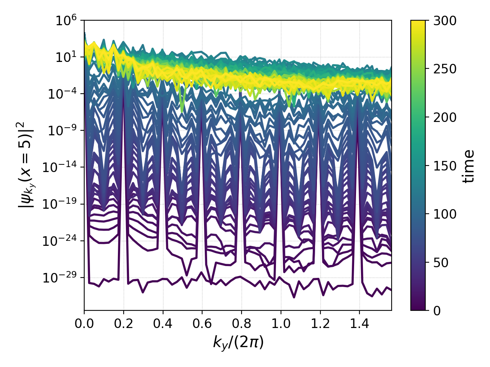

.. _pg_cmd-fft:

fft
===

.. raw:: html

   

   
<a>Command Docstrings</a>

   <iframe src="../../_static/postgkyl/commands/fft.html"></iframe>
   

    

.. _pg_cmd-fft_commandLine:

Command line
^^^^^^^^^^^^

.. raw:: html

  

  
<a>Command help</a>

.. code-block:: bash
  :emphasize-lines: 1

  pgkyl fft --help
    Usage: pgkyl fft [OPTIONS]
    
      Calculate the Fourier Transform or the power-spectral density of input
      data. Only works on 1D data at present.
    
    Options:
      -p, --psd         Limits output to positive frequencies and returns the power
                        spectral density |FT|^2.
      -i, --iso         Bins power spectral density |FT|^2, making 1D power
                        spectra from multi-dimensional data.
      -u, --use TEXT    Specify a 'tag' to apply to (default all tags).
      -t, --tag TEXT    Optional tag for the resulting array
      -l, --label TEXT  Custom label for the result
      -h, --help        Show this message and exit.

.. raw:: html

  

   

Fourier analysis on one-dimensional data is available in `pgkyl`. This does not mean
that the simulation has to be 1D, but for higher-D simulations one must first reduce
the dimensionaly of the data before doing an FFT.

For example, we take a simple :doc:`incompressible Euler 2D simulation of a velocity shear instability (Kelvin Helmholtz)<../input/incompEuler-KH-2x-p1>`. Using the `pgkyl` command

.. code-block:: bash

  pgkyl "incompEuler-KH-2x-p1_fluid_[0-9]*.bp" interp anim -a -x 'x' -y 'y' --clabel '$\psi(x,y)$'

we obtain the following velocity potential

.. raw:: html

  

  <video controls height="450" width="450" loop autoplay muted>
    <source src="../../_static/incompEuler-KH-2x-p1_fluid.mp4" type="video/mp4">
  </video>
  

This simulation was initialized with a slow variation in `x` and a small but more
oscillatory perturbation in `y`:

.. math::

  \psi(x,y,t=0) = \alpha\sin(k_y y)+\cos(k_x x)

where :math:`\alpha=0.05`, :math:`k_x=2\pi/L_x`, :math:`k_y=16\pi/L_y`, and
:math:`L_y=4L_x=40`. If we were to examine the Fourier transform of this
initial condition at :math:`x=5` with

.. code-block:: bash

  pgkyl incompEuler-KH-2x-p1_fluid_0.bp interp sel --z0 5. fft ev 'f[0] abs' pl -x '$k_y$' -y '$\psi_{k_y}(x=5)$' --logy --xscale 6.283185

where we scaled the :math:`x`-axis by :math:`2\pi` because of SciPy's `fftfreq`
convention, we would obtain

.. figure:: ../fig/fft/incompEuler-KH-2x-p1_fluid_z0eq5p0_fft_0.png
  :scale: 40 %
  :align: center

or most commonly one looks at the power spectrum of a signal, which we can obtain
with the ``-p`` flag:

.. code-block:: bash

   pgkyl incompEuler-KH-2x-p1_fluid_0.bp interp sel --z0 5. fft -p pl -x '$k_y$' -y '$|\psi_{k_y}(x=5)|^2$' --xscale 6.283185 --logy

This plot has the peak we would expect at :math:`k_y=16\pi/L_y=1.2566`, but it also
has two other peaks we did not expect. This is because we are FFT-ing interpolated
DG data which introduces modes if the transform is not done weakly (not covered here).

.. figure:: ../fig/fft/incompEuler-KH-2x-p1_fluid_z0eq5p0_fftPower_0.png
  :scale: 40 %
  :align: center

We could also look at how this spectrum changes in time with the following command

.. code-block:: bash

   pgkyl "incompEuler-KH-2x-p1_fluid_[0-9]*.bp" interp sel --z0 5. fft -p collect pl --group 1 --logy -x '$k_y/(2\pi)$' -y '$\left|\psi_{k_y}(x=5)\right|^2$' --clabel 'time'

showing how the spectrum goes from being peaked at specific :math:`k_y`'s to being
a fully filled spectrum when turbulence sets in.

Script mode
^^^^^^^^^^^

Although it is possible to call `postgkyl`'s fft command from a script, we recommend
that you instead use SciPy's fft package directly (or alternatively NumPy's fft package).
Here's an example of how to perform the same FFT described in the
:ref:`command line section above<pg_cmd-fft_commandLine>_` 

.. code-block:: python

  import postgkyl as pg
  from scipy.fft import fft, fftfreq
  import matplotlib.pyplot as plt
  import numpy as np

  fileName = 'incompEuler-KH-2x-p1_fluid_0.bp'
  polyOrder, basisType = 1, 'ms'

  pgData   = pg.GData(fileName)
  pgInterp = pg.GInterpModal(pgData, polyOrder, basisType)
  pgInterp.interpolate(overwrite=True)
  yInt, psi_z0eq5p0 = pg.data.select(pgData, z0=5.0)

  y = 0.5*(yInt[1][:-1]+yInt[1][1:])

  ky, psi_z0eq5p0_ky = 2.*np.pi*fftfreq(np.size(y)), fft(np.squeeze(psi_z0eq5p0))

  plt.semilogy(ky, np.abs(psi_z0eq5p0_ky))
  plt.show()

where we used the :ref:`select<pg_cmd_select>_` command to pick the data at :math:`x=5`,
transformed the :math:`y` coordinates from nodal to cell-center coordinates, and squeezed
the data to remove redundant dimensions.
