.. _pg_cmd_plot:

plot
====

``postgkyl.output.plot`` plots 1D and 2D data using `Matplotlib
<https://matplotlib.org/>`_.

.. raw:: html
         
   

   
<a>Arguments and parameters</a>

   
.. list-table:: ``plot`` arguments and parameters
  :widths: 10 70
  :header-rows: 1

  * - Parameter
    - Description
  * - ``data``
    - Gkeyll ``Data`` object to be plotted
  * - ``args``
    - An optional tuple of additional Matplotlib parameters, .e.g.,
      ``--`` for dashed lines
  * - ``scatter``
    - (1D mode) Only shows points without lines
  * - ``streamline``
    - (2D mode) Shows streamlines of vector data
  * - ``quiver``
    - (2D mode) Shows vector arrows
  * - ``countour``
    - (2D mode) Shows contours instead of area
  * - ``diverging``
    - (2D mode) Changes colormap to diverging (red to blue) and
      centers value range around 0
  * - ``group``
    - (2D mode) Splits 2D data into 1D lines and plots them on top of
      each other
  * - ``xscale``
    - Multiply x-axis by the set number (default: 1.0)
  * - ``yscale``
    - Multiply y-axis by the set number (default: 1.0)
  * - ``logx``
    - Changes x-axis to logaritmic
  * - ``logy``
    - Changes y-axis to logaritmic
  * - ``logz``
    - Changes 2D value axis to logaritmic
  * - ``style``
    - Chages the Matplotlib style file
  * - ``legend``
    - Turns the legend on and off (default: on)
  * - ``labelPrefix``
    - Allows to pass a prefix for the automated label
  * - ``xlabel``
    - Sets the lable for the x-axis (accepts LaTeX)
  * - ``ylabel``
    - Sets the label for the y-axis (accepts LaTeX)
  * - ``title``
    - Sets the plot title (accepts LaTeX)
  * - ``fixaspect``
    - Fixes the aspect ratio between the x and y axies
  * - ``vmin``
    - Sets the minimum value for a 2D plot
  * - ``vmax``
    - Sets the maximum value for a 2D plot
  * - ``xlim``
    - Manually sets the x-axis limits
  * - ``ylim``
    - Manually sets the y-axis limits
  * - ``showgrid``
    - Turns the grid on and off (default: on)
  * - ``hashtag``
    - Adds a little ``#pgkyl`` label to the bottom right corner
  * - ``xkcd``
    - Turns on the *xkcd* mode
  * - ``color``
    - Manually sets the color for 1D plots
  * - ``markersize``
    - Overwrites the marker size value
      
.. raw:: html
         
   

    

The Python function is wrapped into the ``plot`` command.
   
.. raw:: html
         
   

   
<a>Command help</a>

.. code-block:: bash
  :emphasize-lines: 1

  $ pgkyl plot -h
    Usage: pgkyl plot [OPTIONS]

      Plot active datasets, optionally displaying the plot and/or saving it to
      PNG files. Plot labels can use a sub-set of LaTeX math commands placed
      between dollar ($) signs.

    Options:
      -f, --figure TEXT           Specify figure (integer) to plot in.
      -s, --squeeze               Squeeze the components into one panel.
      -b, --subplots              Make subplots from multiple datasets.
      --arg TEXT                  Additional plotting arguments like '*--'.
      -c, --contour               Draw contour plot.
      -q, --quiver                Draw quiver plot.
      -l, --streamline            Make streamline plot.
      -s, --scatter               Plot data in scatter-plot mode.
      --markersize FLOAT          Set marker size for scatter plots.
      -d, --diverging             Switch to inverted color mode.
      -g, --group [0|1]           Switch to group mode.
      --style TEXT                Specify Matplotlib style file (default:
                                  Postgkyl).
      -a, --fix-aspect            Enforce the same scaling on both axes.
      --logx                      Set x-axis to log scale.
      --logy                      Set y-axis to log scale.
      --logz                      Set values of 2D plot to log scale.
      --xscale FLOAT              Value to scale the x-axis (default: 1.0).
      --yscale FLOAT              Value to scale the y-axis (default: 1.0).
      --vmax FLOAT                Set maximal value of data for plots.
      --vmin FLOAT                Set minimal value of data for plots.
      --xlim TEXT                 Set limits for the x-coordinate (lower,upper)
      --ylim TEXT                 Set limits for the y-coordinate (lower,upper).
      --legend / --no-legend      Show legend.
      --force-legend              Force legend even when plotting a single
                                  dataset.
      --show / --no-show          Turn showing of the plot ON and OFF (default:
                                  ON).
      --color TEXT                Set color when available.
      -x, --xlabel TEXT           Specify a x-axis label.
      -y, --ylabel TEXT           Specify a y-axis label.
      -t, --title TEXT            Specify a title.
      --save                      Save figure as PNG file.
      --saveas TEXT               Name of figure file.
      --dpi INTEGER               DPI (resolution) for output
      -e, --edgecolors TEXT       Set color for cell edges to show grid outline
                                  (default: None)
      --showgrid / --no-showgrid  Show grid-lines (default: True)
      --xkcd                      Turns on the xkcd style!
      --hashtag                   Turns on the pgkyl hashtag!
      -h, --help                  Show this message and exit.
      
.. raw:: html
         
   

    

.. contents::

Default plotting
----------------

``plot`` automatically regnizes the dimensions of data and creates
either 1D line plot or 2D ``pcolormesh`` plot using the Postgkyl
style file (Inferno color map).

Here is an example of 2D particle distribution function from the
two-stream instability simulation.

.. code-block:: python
   :emphasize-lines: 5
   :caption: Script

   import postgkyl as pg
   data = pg.Data('two-stream_elc_80.bp')
   dg = pg.GInterpModal(data)
   dg.interpolate(stack=True)
   pg.output.plot(data)

.. code-block:: bash
   :caption: Command line
             
   pgkyl two-stream_elc_80.bp interpolate plot

Note that in this case the data does not contain the values of the
distribution function directly but rather the expansion components of
the basis functions. Therefore, :ref:`pg_cmd_interpolate` was added to
the flow to show the distribution function itself.
  
.. figure:: ../fig/plot/default2D.png
  :align: center
        
  The default behavior of ``plot`` for 2D data

1D plots are created in a similar manner. For example, here is the
electron density correfponding to the figure above.

.. code-block:: python
   :emphasize-lines: 5
   :caption: Script
                
   import postgkyl as pg
   data = pg.Data('two-stream_elc_M0_80.bp')
   dg = pg.GInterpModal(data)
   dg.interpolate(stack=True)
   pg.output.plot(data)

.. code-block:: bash
   :caption: Command line

   pgkyl two-stream_elc_M0_80.bp interpolate plot
  
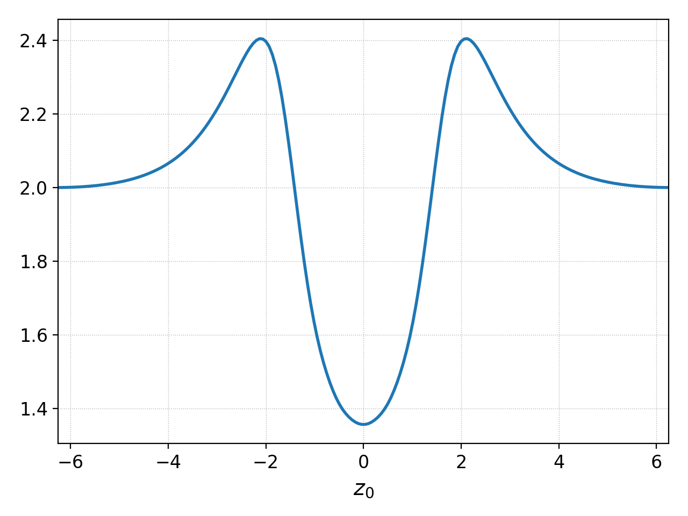
        
   The default behavior of ``plot`` for 1D data

Plotting data with multiple components
--------------------------------------

Gkeyll data can contain multiple components. Typically, these are
basis function expansion coefficients but can also correspond to
components of a vector array like electromagnetic field or
momentum. By default, Postgkyl plots each component into a separate
subplot.

This can be seen if we do not use the interpolation from the previous
example and let Postgkyl plot the expansion coefficients.

.. code-block:: python
   :emphasize-lines: 5
   :caption: Script

   import postgkyl as pg
   data = pg.Data('two-stream_elc_M0_80.bp')
   pg.output.plot(data)

.. code-block:: bash
   :caption: Command line

   pgkyl two-stream_elc_M0_80.bp plot
  
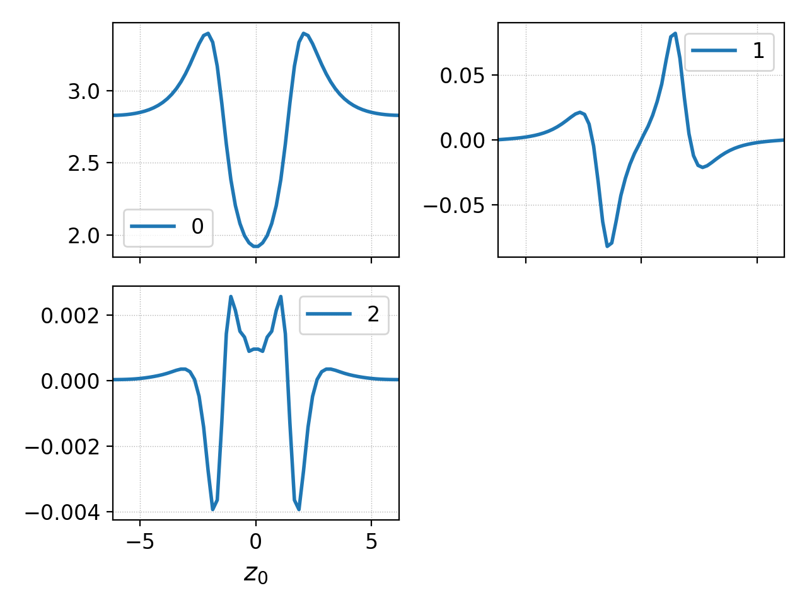
        
   Plotting data with multiple components

Postgkyl automatically adds labels with component indices to each
subplot. If there are some labels already (either custom or when
working with multiple data sets), the component indices are
appended. Postgkyl also automatically calculates the numbers of rows
and columns (it tries to make a square). This can be overridden with
``nSubplotRow`` or ``nSubplotCol``.

The default behavior of putting each component to an individual
subplot can be supressed with the ``squeeze`` parameter. This is
useful, for example, for comparing magnitudes.  Note that the
magnitues of the expansion coefficients are quite different so this is
not the best example of the functionality.

.. code-block:: python
   :emphasize-lines: 5
   :caption: Script

   import postgkyl as pg
   data = pg.Data('two-stream_elc_M0_80.bp')
   pg.output.plot(data, squeeze=True)
  
.. code-block:: bash
   :caption: Command line
             
   pgkyl two-stream_elc_M0_80.bp plot --squeeze
  
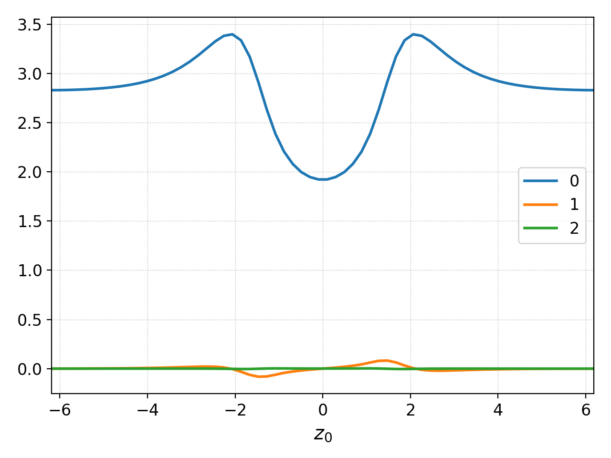
        
   Plotting data with multiple components with ``squeeze=True``

Plotting multiple datasets
--------------------------

Postgkyl in a terminal can easily load multiple files (see
:ref:`pg_loading` for more details). By default, each data set
creates its own figure.
   
.. code-block:: bash
   :caption: Command line

   pgkyl two-stream_elc_70.bp two-stream_elc_80.bp interp plot

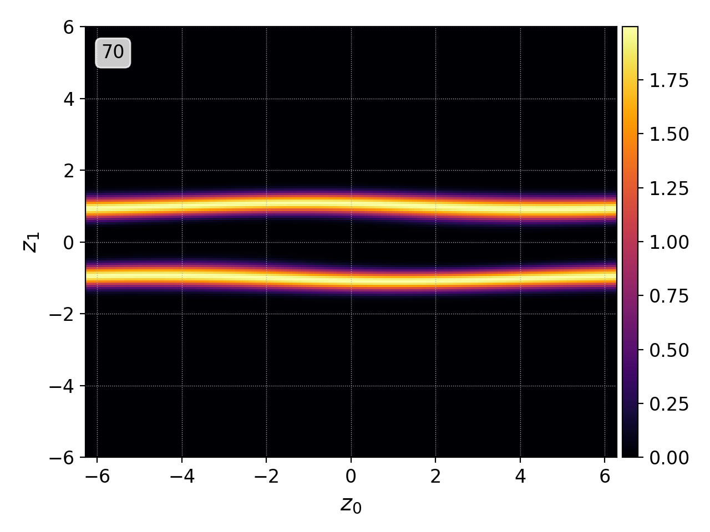
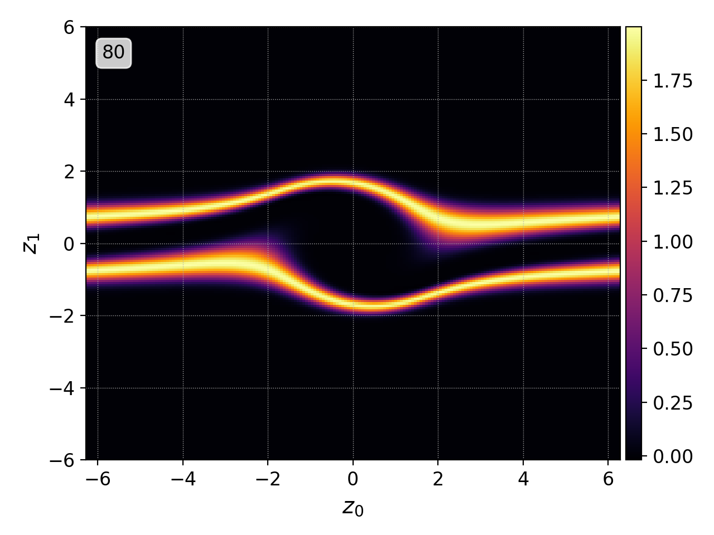
          
Postgkyl automatically parses the names of the files and creates
labels from the unique part of each one. Note that the labels can
specified manually during :ref:`pg_loading`.

This behavior can be supressed by specifying the figure to plot
in. When the same figure is specified, data sets are plotted on top of
each other.

.. code-block:: python
   :emphasize-lines: 8, 9
   :caption: Script
                    
   import postgkyl as pg
   data1 = pg.Data('two-stream_elc_M0_70.bp')
   dg = pg.GInterpModal(data1)
   dg.interpolate(stack=True)
   data2 = pg.Data('two-stream_elc_M0_80.bp')
   dg = pg.GInterpModal(data2)
   dg.interpolate(stack=True)
   pg.output.plot(data1, figure=0)
   pg.output.plot(data2, figure=0)
  
.. code-block:: bash
   :caption: Command line
  
   pgkyl two-stream_elc_M0_70.bp two-stream_elc_M0_80.bp interp plot -f0
  
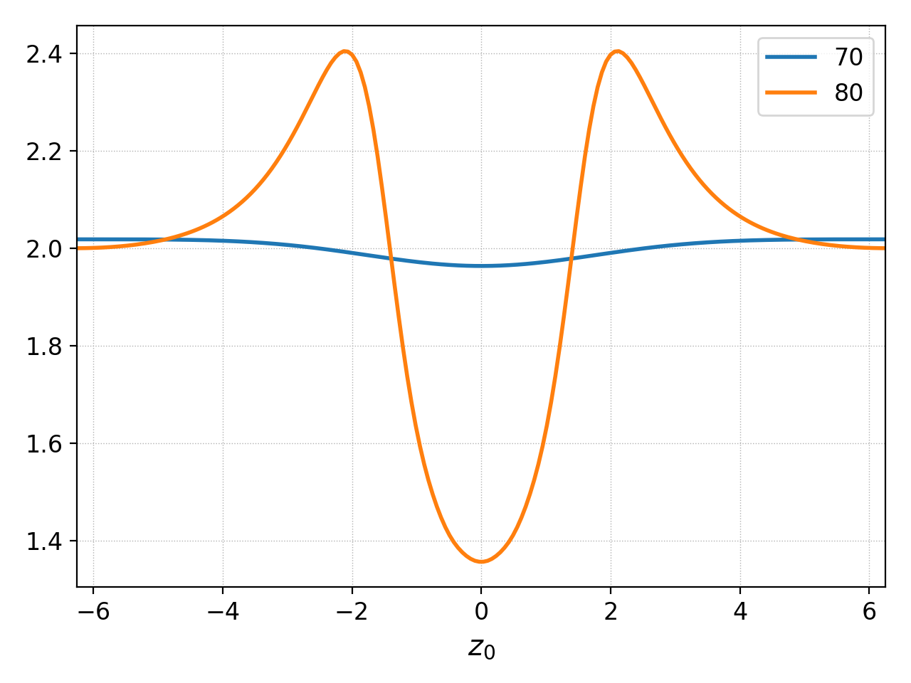
        
   Plotting multiple data set with specifying ``figure=0``

Finally, the data sets can be added into subplots.

.. code-block:: bash
   :caption: Command line
  
   pgkyl two-stream_elc_70.bp two-stream_elc_80.bp interp plot -f0 --subplots
  
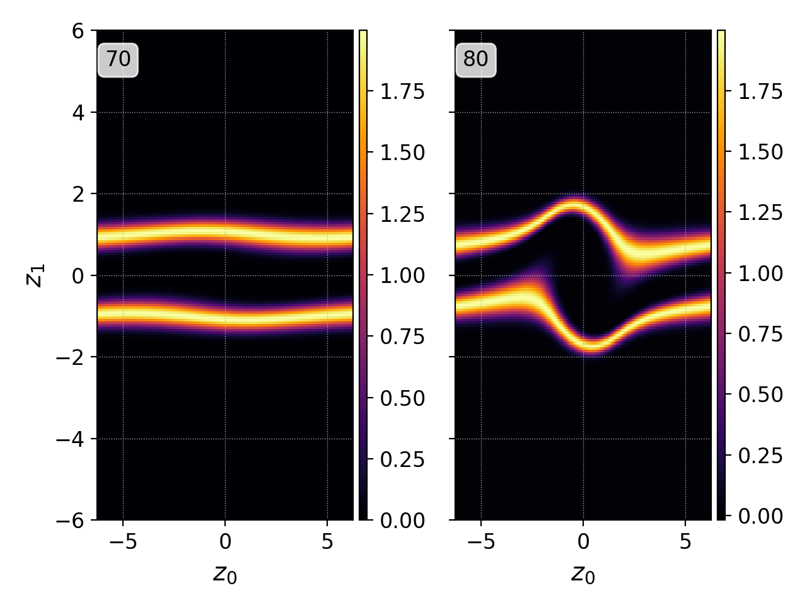
        
   Plotting multiple data set with specifying ``figure=0`` and
   ``subplots``
  
The same behavior can be achieved in a script as well but it requires
slightly more manual control.

.. code-block:: python
   :emphasize-lines: 8, 9
   :caption: Script
                    
   import postgkyl as pg
   data1 = pg.Data('two-stream_elc_M0_70.bp')
   dg = pg.GInterpModal(data1)
   dg.interpolate(stack=True)
   data2 = pg.Data('two-stream_elc_M0_80.bp')
   dg = pg.GInterpModal(data2)
   dg.interpolate(stack=True)
   pg.output.plot(data1, figure=0, numAxes=2)
   pg.output.plot(data2, figure=0, numAxes=2, startAxes=1)

Plotting modes
--------------

Appart from the default line 1D plots and continuous 2D plots,
Postgkyl offers some additional modes.

Countour
^^^^^^^^

.. code-block:: python
   :emphasize-lines: 5
   :caption: Script
                    
   import postgkyl as pg
   data = pg.Data('two-stream_elc_80.bp')
   dg = pg.GInterpModal(data)
   dg.interpolate(stack=True)
   pg.output.plot(data, contour=True)
  
.. code-block:: bash
   :caption: Command line

   pgkyl two-stream_elc_80.bp interpolate plot --contour
  
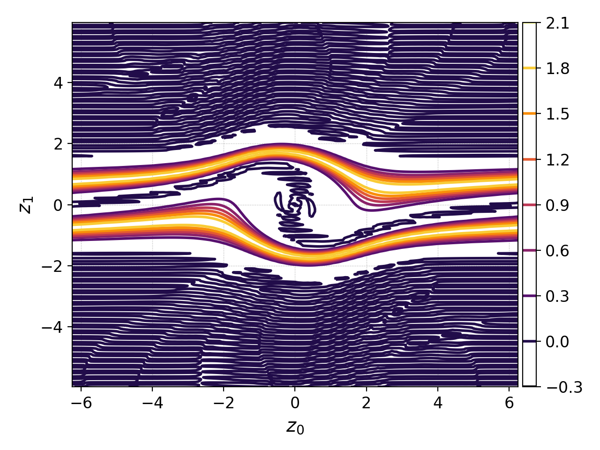
        
   Plotting multiple data set with ``contour=True``

Diverging
^^^^^^^^^

Diverging mode is similar to the default plotting mode but the
colormap is changed to a red-white-blue and the range is set to the
plus-minus maximum absolute value. It is particulary useful for
visualizing changes, both in time and around a mean value.

Here we use the :ref:`pg_cmd_ev` command to visualize the change from
the initial conditions.

.. code-block:: bash
   :caption: Command line

  pgkyl two-stream_elc_0.bp two-stream_elc_80.bp interpolate ev 'f[1] f[0] -' plot --diverging
  
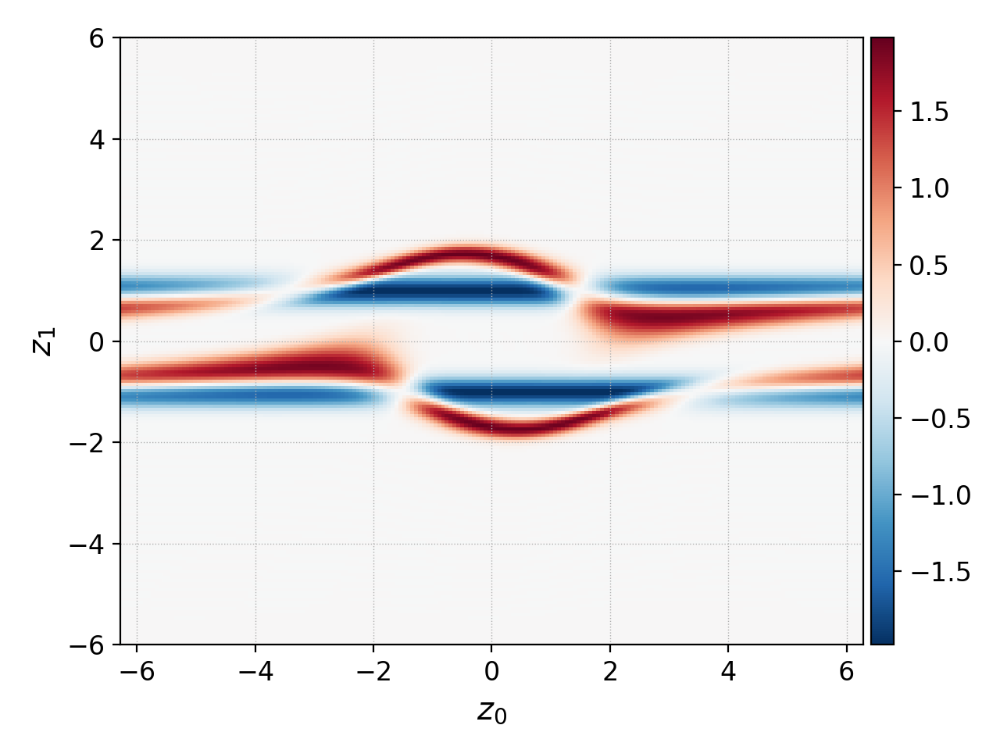
        
   ``diverging`` mode is used to visualize changes from the initial conditions

Group
^^^^^

In the group mode (maybe not the best name :-/), one direction (either
0 or 1) is retained and the other is split into individual lineouts
which are then plot over each other. The lines are color-coded with
the inferno colormap, i.e., from black to yellow as the coordinate
increases. This could provide an additional insight into variation
along one coordinate axis.

In the example, the 2D distribution function is first limited in the
first coordinate, ``z0`` (in this case corresponding to ``x``), from
1.5 to 2.0 using the :ref:`pg_cmd_select` command (otherwise there
would be too many lines). Then the plot with ``group=True`` is used.

.. code-block:: python
   :emphasize-lines: 6
   :caption: Script

   import postgkyl as pg
   data = pg.Data('two-stream_elc_80.bp')
   dg = pg.GInterpModal(data)
   dg.interpolate(stack=True)
   pg.data.select(data, z0='1.5:2.0', stack=True)
   pg.output.plot(data, group=1)

.. code-block:: bash
   :caption: Script

   pgkyl two-stream_elc_80.bp interpolate select --z0 1.5:2.0 plot --group 1
  
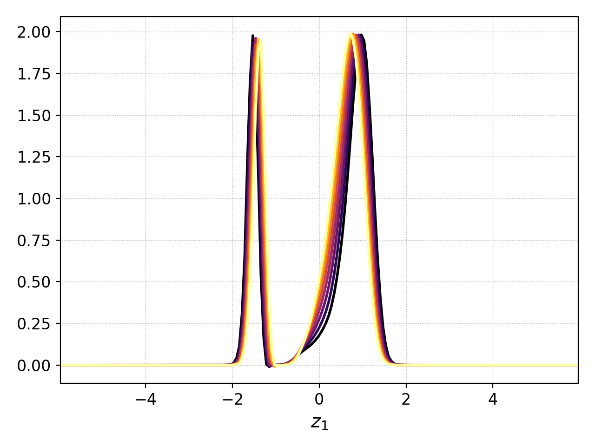
        
   Plotting the distribution function limited to 1.5<x<2.0 with ``group=1``

Formating
---------

While Postgkyl is not necesarily meant for the production level
figures for publications, it includes a decent amount of formating
options.

The majority of a look of each figure, e.g., grid line style and
thickness or colormap, is set in a stule file. Custom matplotlib style
files can be specified with ``style`` keyword. The default  Postgkyl
style is the following:

.. code-block:: bash

   figure.facecolor : white
   lines.linewidth : 2
   font.size : 12
   axes.labelsize : large
   axes.titlesize : 14
   image.interpolation : none
   image.cmap : inferno
   image.origin : lower
   grid.linewidth : 0.5
   grid.linestyle : :

Labels
^^^^^^
                
Postgkyl allows to specify all the axis labels and the plot title.

.. code-block:: python
   :emphasize-lines: 5,6
   :caption: Script

   import postgkyl as pg
   data = pg.Data('two-stream_elc_80.bp')
   dg = pg.GInterpModal(data)
   dg.interpolate(stack=True)
   pg.output.plot(data, xlabel=r'$x$', ylabel=r'$v_x$',
                  title=r'$k=\frac{1}{2}$')                
   
.. code-block:: bash
   :caption: Command line

   pgkyl two-stream_elc_80.bp interpolate \
   plot --xlabel '$x$' --ylabel '$v_x$' \
   --title '$k=\frac{1}{2}$'
  
.. figure:: ../fig/plot/labels.png
   :align: center
        
   Postgkyl allows to specify axis labels and the figure title

Axes and values
^^^^^^^^^^^^^^^
  
Postgkyl supports the logaritmic axes using the keywords ``logx``
and ``logy``. In the example, the electric field energy is plotted
using the logarithmic y-axis to show the region of the linear growth
of the two stream instability.  Note that Gkeyll stores :math:`E_x^2`,
:math:`E_y^2`, :math:`E_z^2`, :math:`B_x^2`, :math:`B_y^2`, and
:math:`B_z^2` into six components of the ``fieldEnergy.bp``
file. Therefore, the :ref:`pg_cmd_select` command is used to plot only
the :math:`E_x^2`, which is the only component growing in this case.

.. code-block:: python
   :emphasize-lines: 5
   :caption: Script

   import postgkyl as pg
   data = pg.Data('two-stream_fieldEnergy.bp')
   pg.data.select(data, comp=0, stack=True)
   pg.output.plot(data, logy=True)                
   
.. code-block:: bash
   :caption: Command line

   pgkyl two-stream_fieldEnergy.bp select -c0 plot --logy

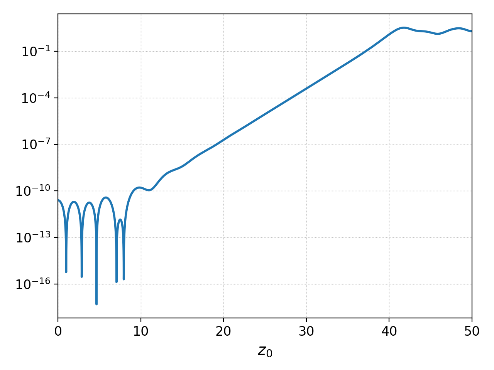
        
   Plotting field energy with ``logy``

Note that Postgkyl also incudes a diagnostic :ref:`pg_cmd_growth`
command that allows to fit the data with an exponential to get the
growth rate.

Storing
-------

Plotting outputs can be save as a ``PNG`` files using the ``save``
parameter which uses the data set name(s) to put together the name of
the image. Alternativelly, ``saveas`` can be used to specify the
custom file name (without the extension, all the files are saved as
``.png``). DPI of the result can be controlled with the ``dpi`` parameter.
