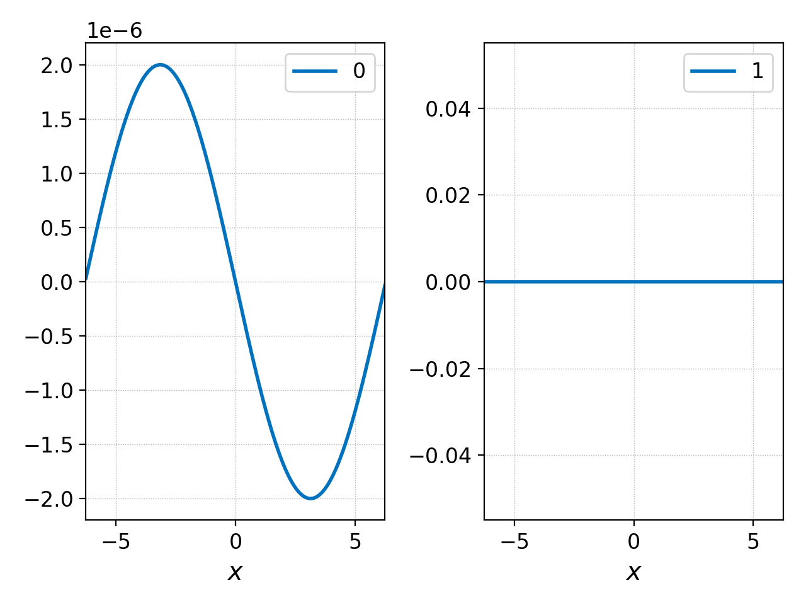

.. _pg_cmd_select:

select
------

Select a subset of one or multiple datasets. This subset can
can be created by 

- Choosing a cell along a direction (``--z#`` with an integer).
- Choosing a range of cells along a direction (``--z#`` with a slice).
- Choosing a specific component (``-c``), which may be an expansion
  coefficient, fluid moment or, if used along with
  :ref:`pg_cmd_interpolate`, a vector component. Multiple components
  can be selected with a slice of floats or with comma-separated values.
- Evaluating the function at a specific coordinate in one direction
  (using :ref:`pg_cmd_interpolate` and ``select --z#`` with a float)
  or segment in one dimension (using :ref:`pg_cmd_interpolate` and
  ``select --z#`` with a slize of floats).

.. note::

  Postgkyl retains the number of dimensions and component index. This
  means that, for example, given a 16x16 2D dataset with 8 components
  per cell fixing the second coordinate and selecting one component
  will produce a dataset with a shape (16, 1, 1). For plotting purposes
  postgkyl treats such data as 1D.

Command line
^^^^^^^^^^^^

.. raw:: html

   

   
<a>Command help</a>

.. code-block:: bash
  :emphasize-lines: 1

  pgkyl select --help
    Usage: pgkyl select [OPTIONS]
    
      Subselect data from the active dataset(s). This command allows, for
      example, to choose a specific component of a multi-component dataset,
      select a index or coordinate range. Index ranges can also be specified
      using python slice notation (start:end:stride).
    
    Options:
      --z0 TEXT        Indices for 0th coord (either int, float, or slice)
      --z1 TEXT        Indices for 1st coord (either int, float, or slice)
      --z2 TEXT        Indices for 2nd coord (either int, float, or slice)
      --z3 TEXT        Indices for 3rd coord (either int, float, or slice)
      --z4 TEXT        Indices for 4th coord (either int, float, or slice)
      --z5 TEXT        Indices for 5th coord (either int, float, or slice)
      -c, --comp TEXT  Indices for components (either int, slice, or coma-
                       separated)
    
      -u, --use TEXT   Specify a 'tag' to apply to (default all tags).
      -t, --tag TEXT   Optional tag for the resulting array
      -h, --help       Show this message and exit.

.. raw:: html

   

    

Perhaps the two most common uses of ``select`` are to choose a vector
component or to evaluate a function at a specific coordinate. Consider
the data produced by a
:doc:`two stream instability Vlasov-Maxwell simulation<../input/two-stream>`.
The file ``two-stream_field_0.bp`` contains 24 components per cell.
That is because it contains 8 vector components (3 components of the
electric and magnetic fields each and 2 correction potentials, see
`<http://ammar-hakim.org/sj/maxwell-eigensystem.html>`_) and 3
degrees of freedom per component (for piecewise linear basis in 1D).
If we wish to only see :math:`E_x` then we can select it and plot it
with

.. code-block:: bash

  pgkyl two-stream_field_0.bp interp select -c0  pl

which yields the following figure

.. figure:: ../fig/select/two-stream_field_0_c0.png
  :align: center

We could also select multiple components with a comma-separated list

.. code-block:: bash

  pgkyl two-stream_field_0.bp interp select -c0,3 pl -x '$x$'

which yields the following plot of :math:`E_x` and :math:`B_x`

  x-component of the electric and magnetic fields.

Or we could select all the components of the magnetic field in all
frames with

.. code-block:: bash

  pgkyl "two-stream_field_[0-9]*.bp" interp select -c3:6 pl -f0 -x '$x$' --no-legend --nsubplotrow 1

.. figure:: ../fig/select/two-stream_field_c3-5.png
  :align: center

  Components of the magnetic field.

to show that this is an electrostatic simulation.

As a demonstration of using ``select`` to evaluate functions at a given
coordinate we could evaluate the above :math:`E_x` at :math:`x=-\pi`, but
that would yield a single number. We could instead load all the field
data files, evaluate the :math:`x`-component of the electric field
at :math:`x=-\pi` in each frame, collect all those points into a single
dataset, and plot them as a function of time. This would be accomplished
with the following command

.. code-block:: bash

  pgkyl "two-stream_field_[0-9]*.bp" interp sel -c0 --z0 -3.14159 collect pl -x 'time' -y '$E_x(x=-\pi,t)$'

.. figure:: ../fig/select/two-stream_field_c0.png
  :align: center

We will sometimes use the abbreviation ``sel`` instead of ``select``
for convenience. The resulting figure (above) shows how the amplitude of
the electric field at this point drastically increases as the instability
develops. There is an oscillatory behavior that is lost in this
exponential growth; if one zoomed into the earlier times of this plot,
such oscillations would become visible.

One can, and must, select coordinates at which to evaluate higher (than
2) dimensional datasets. Take the initial and final distribution functions
of the electrons as an example; we can evaluate them at :math:`x=0` and
plot their variation along :math:`v_x` with

.. code-block:: bash

  pgkyl two-stream_elc_0.bp -l '$t=0$' two-stream_elc_100.bp -l '$t=50$' interp \
    sel --z0 0. pl -x '$v_x$' -y '$f_e(x=0,v_x)$' -f0

producing the following plot:

.. figure:: ../fig/select/two-stream_elc_0_100_z0eq0p0.png
  :align: center

If we were interested in investigating the distribution function in a
specific cell along :math:`x`, say the first (0th in 0-index), we could
use

.. code-block:: bash

  pgkyl two-stream_elc_100.bp sel --z0 0 interp pl -x '$x$' -y '$v_x$'

.. figure:: ../fig/select/two-stream_elc_100_z0eq0.png
  :align: center

Notice that this produces a 2D colorplot because it takes the expansion
coefficients in the 0th cell along :math:`x` and all cells along
:math:`v_x`, interpolates them onto a finer mesh and plots them (so the
:math:`x` extent of this plot is a single cell of the simulation). If we
instead wanted a 1D plot of the distribution function along
:math:`v_x`, we could first interpolate onto a finer mesh and then
evaluate it at the 0th cell of the finer mesh using

.. code-block:: bash

  pgkyl two-stream_elc_100.bp interp sel --z0 0 pl -x '$x$' -y '$f_e(x=-6.25046,v_x)$'

or interpolate it and evaluate it at the lower boundary of the domain
along :math:`x`, which is located at :math:`x=-2\pi`, with

.. code-block:: bash

  pgkyl two-stream_elc_100.bp interp sel --z0 -6.283185 pl -x '$x$' -y '$f_e(x=-2\pi,v_x)$'

These two commands are evaluating the distribution function at slightly
different :math:`x` coordinates (:math:`\Delta x/(p+1)/2` apart to be
precise, where :math:`\Delta x` is the cell length of the simulation,
and :math:`p` the polynomial order of the basis). We can discern the
difference between the two by plotting them together using the following
command:

.. code-block:: bash

  pgkyl two-stream_elc_100.bp -t fe interp sel -t zfl --z0 -6.283185 sel -u fe -t zint --z0 0 \
    pl -u zfl,zint -f0 -x '$v_x$' -y '$f_e$'

This commmand used tags to indicate which dataset to perform the
interpolation on, and to name the interpolated datasets. The result is

.. figure:: ../fig/select/two-stream_elc_100_z0Comp.png
  :align: center

Lastly, we show that the ``select`` command can also be used to restrict
and interpolated dataset to a segement along one direction when the
``--z#`` flag is used with a slice of floats. For example, if one wants
to plot the initial electron distribution function at :math:`x=0` for
positive velocities only, then one could employ

.. code-block:: bash

  pgkyl two-stream_elc_0.bp interp sel --z0 0. --z1 0.: pl -x '$x$' -y '$f_e(x=0,v_x,t=0)$'

.. figure:: ../fig/select/two-stream_elc_0_intz0eq0p0_z1gt0.png
  :align: center

Script mode
^^^^^^^^^^^

.. list-table:: Parameters for ``select``
   :widths: 20, 60, 20
   :header-rows: 1

   * - Parameter
     - Description
     - Default
   * - data (GData)
     - Data to subselect.
     - 
   * - coord0 (int, float, or slice)
     - Index corresponding to the first coordinate for the partial
       load. Either integer, float, or Python slice (e.g., '2:5').
     - None
   * - coord1 (int, float, or slice)
     - Index corresponding to the second coordinate for the partial
       load. Either integer, float, or Python slice (e.g., '2:5').
     - None
   * - coord2 (int, float, or slice)
     - Index corresponding to the third coordinate for the partial
       load. Either integer, float, or Python slice (e.g., '2:5').
     - None
   * - coord3 (int, float, or slice)
     - Index corresponding to the fourth coordinate for the partial
       load. Either integer, float, or Python slice (e.g., '2:5').
     - None
   * - coord4 (int, float, or slice)
     - Index corresponding to the fifth coordinate for the partial
       load. Either integer, float, or Python slice (e.g., '2:5').
     - None
   * - coord5 (int, float, or slice)
     - Index corresponding to the sixth coordinate for the partial
       load. Either integer, float, or Python slice (e.g., '2:5').
     - None
   * - comp (int, slice, or multiple)
     - Index corresponding to the component for the partial
       load. Either integer, Python slice (e.g., '2:5'), or
       multiple.
     - None

Unlike for the partial load parameters (see :ref:), float point numbers can be
specified instead of just integers.  In that case, Postgkyl treats
it as a grid value and automatically finds and index of a grid point
with the closest value.  This works both for the single index and for
specifying a slice.

