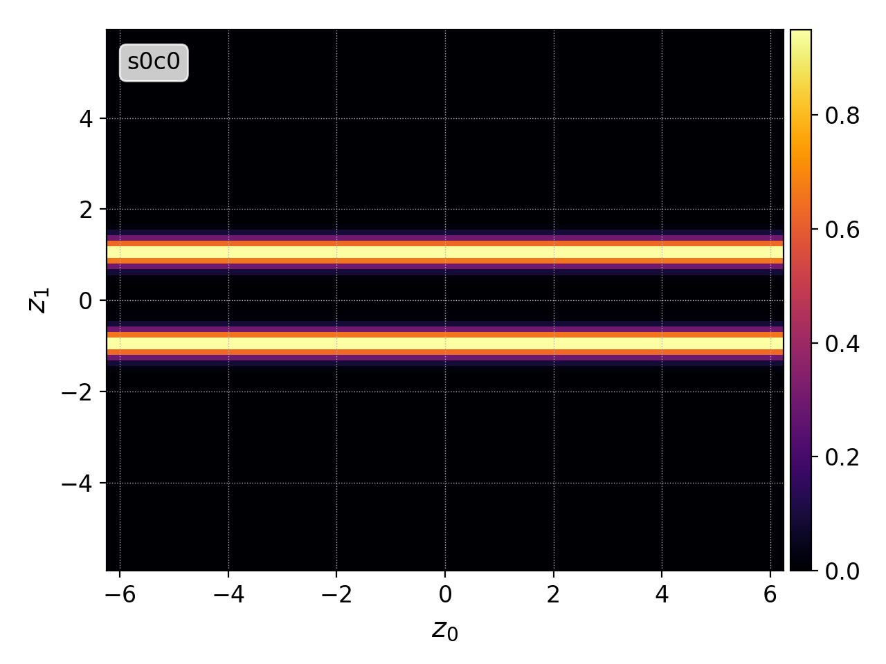
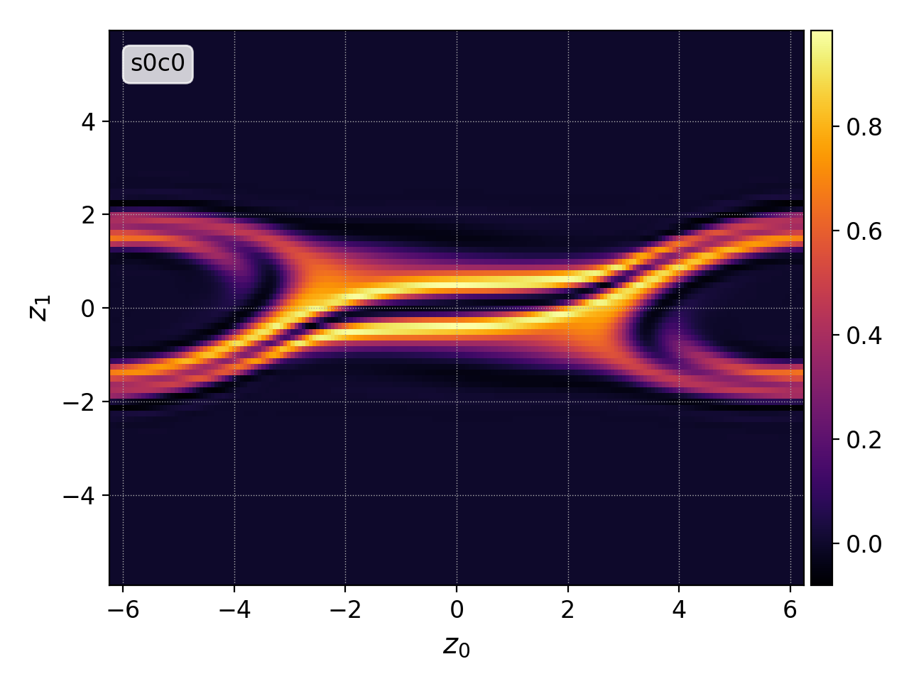
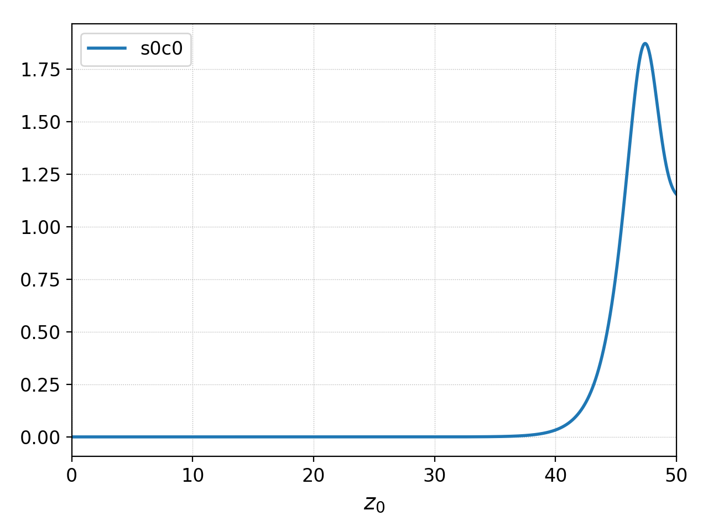
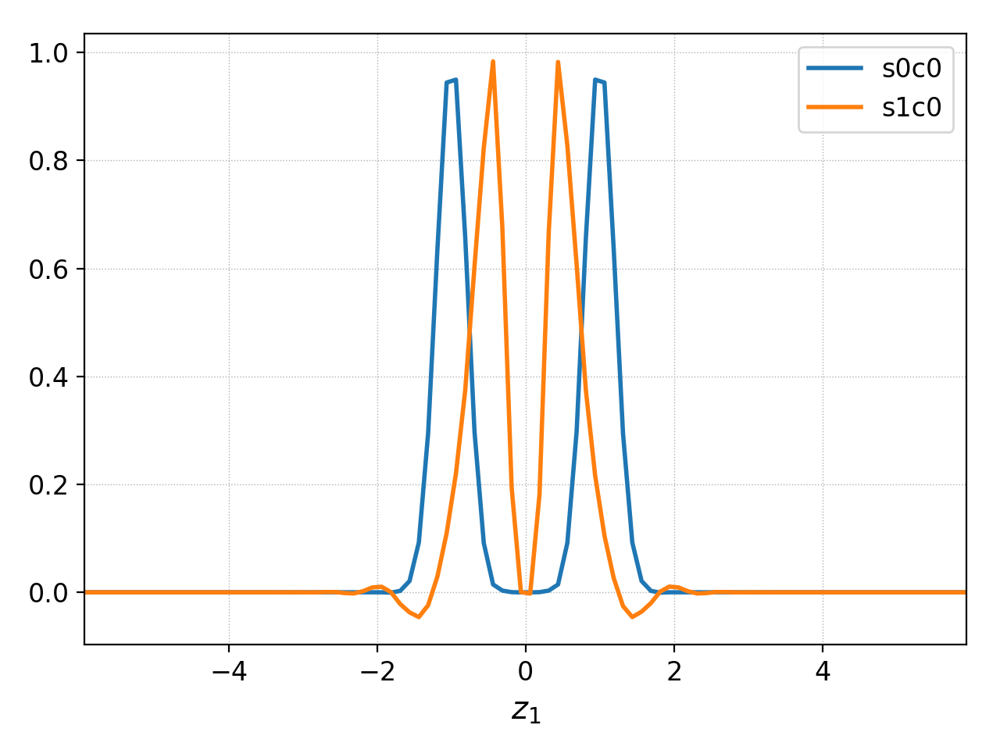
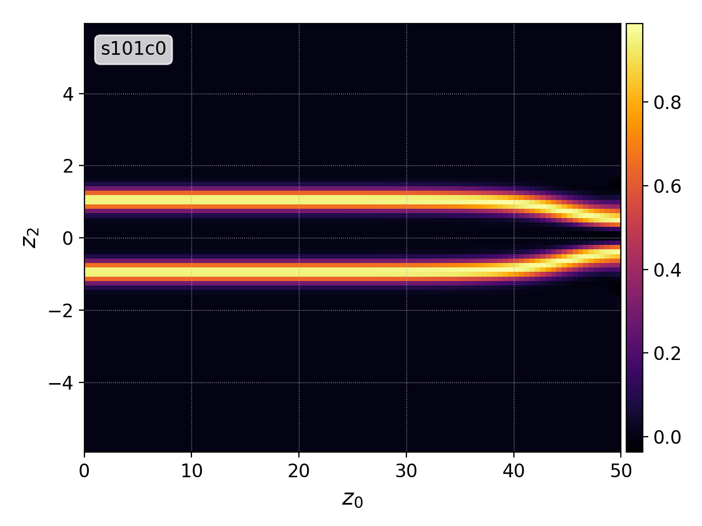
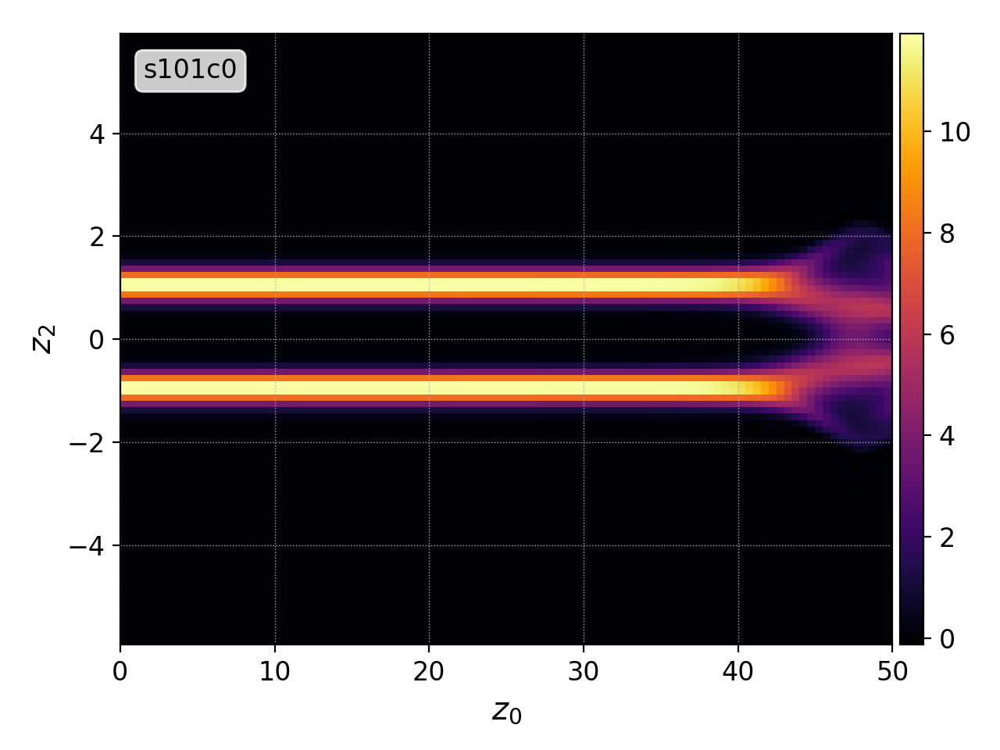

.. _pg_examples:

Examples
++++++++

This section provides an example of typical simulation postprocessing
routine and some advanced chaining patterns (see :ref:`pg_chain` for
basic information on chaining commands together).

Two Stream Instability
^^^^^^^^^^^^^^^^^^^^^^

Following are the results of a two-stream instability simulation
[:doc:`input file<input/two-stream>`] with one configuration space
coordinate and one velocity space coordinate (1X1V).

The ``info`` command (:ref:`pg_cmd-info`) can be used as a first step
to get more information

.. code-block:: bash
   
   $ pgkyl -f two-stream_elc_0.bp info

   Dataset #0
   - Time: 0.000000e+00
   - Number of components: 8
   - Number of dimensions: 2
     - Dim 0: Num. cells: 64; Lower: -6.283185e+00; Upper: 6.283185e+00
     - Dim 1: Num. cells: 32; Lower: -6.000000e+00; Upper: 6.000000e+00
   - Maximum: 1.676015e+00 at (31, 18) component 0
   - Minimum: -4.698334e-01 at (31, 19) component 2

It is a :math:`64\times 32` simulation with 8 expansion coefficients
in each cell (2D second order Serendipity basis).

Next step is to plot the initial and final states. For this, both
files can be loaded simultaneously, interpolated to an uniform mesh
(:ref:`pg_cmd-interpolate`; second order ``-p2`` modal Serendipity
basis ``-b ms``), and plotted (:ref:`pg_cmd-plot`).

.. code-block:: bash
   
   pgkyl -f two-stream_elc_0.bp -f two-stream_elc_100.bp interpolate -p2 -b ms plot

   Chain: ``pgkyl -f two-stream_elc_0.bp interpolate -p2 -b ms plot``

   Chain: ``pgkyl -f two-stream_elc_100.bp interpolate -p2 -b ms
   plot``

For better understanding of chaining and interpolation, it is
interesting to take a look how data information changes in the process

.. code-block:: bash
   
   $ pgkyl -f two-stream_elc_0.bp info interpolate -p2 -b ms info

   Dataset #0
   - Time: 0.000000e+00
   - Number of components: 8
   - Number of dimensions: 2
     - Dim 0: Num. cells: 64; Lower: -6.283185e+00; Upper: 6.283185e+00
     - Dim 1: Num. cells: 32; Lower: -6.000000e+00; Upper: 6.000000e+00
   - Maximum: 1.676015e+00 at (31, 18) component 0
   - Minimum: -4.698334e-01 at (31, 19) component 2

   Dataset #0
   - Time: 0.000000e+00
   - Number of components: 1
   - Number of dimensions: 2
     - Dim 0: Num. cells: 192; Lower: -6.283185e+00; Upper: 6.283185e+00
     - Dim 1: Num. cells: 96; Lower: -6.000000e+00; Upper: 6.000000e+00
   - Maximum: 9.498275e-01 at (95, 55)
   - Minimum: -6.751242e-04 at (97, 62)

During the two-stream instability the free kinetic energy of the
counter-streaming beans is converted into electric field energy. Gkyl
stores the domain integrated field energies into the sequence of
history files ``two-stream_fieldEnergy_X.bp`` which can be loaded in a
similar way to the frame data. However, the files contains multiple
components which correspond to :math:`E_x^2,` :math:`E_y^2,`
:math:`E_y^2,` :math:`B_x^2,` :math:`B_y^2,` and :math:`B_z^2.`  Only
:math:`E_x` is growing in this case, so we might want to limit the
plot only to the first component using ``select``
(:ref:`pg_cmd-select`).

   Chain: ``pgkyl -f two-stream_fieldEnergy_ select --comp 0 plot``

The decrease of kinetic energy can be seen in the previous figures as
the beams are getting closer together for :math:`x=0`. To emphasize
this, line-outs for :math:`x=0` (``select --c0 0.``) could be plotted on top
of each other (``plot -f0``).

   Chain: ``pgkyl -f two-stream_elc_0.bp -f two-stream01_elc_100.bp interpolate -p2 -b ms select --c0 0. plot -f0``

Alternatively, the ``collect`` command (:ref:`pg_cmd-collect`) could
be used to plot the whole time evolution (stacking the line-outs in
time).

   Chain: ``pgkyl -f 'two-stream_elc_[!iM]*.bp' interpolate -p2 -b ms select --c0 0. collect plot`` Note that the time is on the `x`-axis
   and the velocity is on the `y`-axis.

However, the previous plot shows only a localized information.  In
order to get a global view, the `x`-dimension can be integrated out
instead of selecting a line-out (:ref:`pg_cmd-integrate`).

   Chain: ``pgkyl -f 'two-stream_elc_[!iM]*.bp' interpolate -p2 -b ms integrate 0 collect plot``
