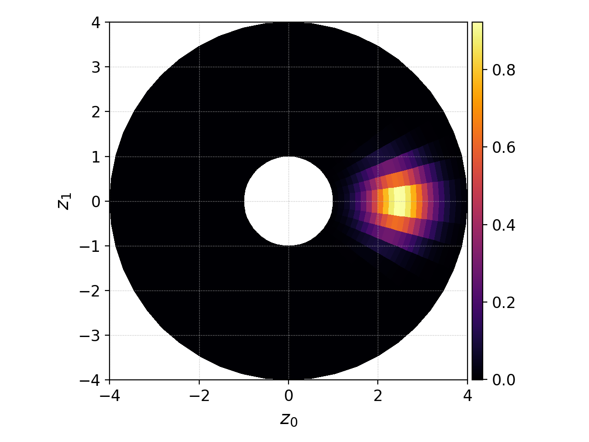

.. _pg_loading:

Data loading
++++++++++++

.. epigraph::

   "I disagree strongly with whatever work this quote is attached to."
   -- Randall Munroe

One can argue that loading data is the most important part of a
postprocessing tool. In Postgkyl, it is handled by the
``postgkyl.data.Data`` class (there is a ``postgkyl.Data``
shortcut). It load data on initialization and serves as an input for
all the other parts of Postgkyl.

.. raw:: html

   

   
<a>Docstrings</a>

   <iframe src="../_static/postgkyl/data/data.html"></iframe>
   

    

Examples are provided simultaneously for scripting and command line
using output files of an electrostatic two-stream instability
simulation [:doc:`two-stream.lua<input/two-stream>`].

.. contents::

Accessing a Gkeyll file
---------------------

Gkeyll files are loaded in Postgkyl by creating a new instance of the
``Data`` class with the file name as the parameter.

.. code-block:: python
  :caption: Script

  import postgkyl as pg
  data = pg.Data('filename')

Next, ``getGrid()`` and ``getValues()`` can be used to return the grid
and values as NumPy arrays. For structured meshes, the ``getGrid()``
return a Python ``list`` of 1D NumPy arrays which represent the nodal
points of the grid in each dimension. Note that since these are nodal
points, these arrays will always have one more cell in each dimension
in comparison to the value array. Another important note is that the
**value array always have one extra dimension for
components**. Components can represent many things from vector
elements to discontinuous Galerkin expansion coefficients. As a rule,
this extra dimension is always retained even if there is just one
component.

.. raw:: html
         
   

   
<a>Script example</a>

.. code-block:: python
  :emphasize-lines: 1,2,3,36,47,49,51

  import postgkyl as pg
  data = pg.Data('two-stream_elc_0.bp')
  print(data.getGrid())
    [array([-6.283185307179586 , -6.086835766330224 , -5.890486225480862 ,
            -5.6941366846315   , -5.497787143782138 , -5.301437602932776 ,
            -5.105088062083414 , -4.908738521234052 , -4.71238898038469  ,
            -4.516039439535327 , -4.319689898685965 , -4.123340357836604 ,
            -3.9269908169872414, -3.730641276137879 , -3.5342917352885173,
            -3.3379421944391554, -3.141592653589793 , -2.945243112740431 ,
            -2.748893571891069 , -2.552544031041707 , -2.356194490192345 ,
            -2.1598449493429825, -1.9634954084936211, -1.7671458676442588,
            -1.5707963267948966, -1.3744467859455343, -1.178097245096172 ,
            -0.9817477042468106, -0.7853981633974483, -0.589048622548086 ,
            -0.3926990816987246, -0.1963495408493623,  0.                ,
             0.1963495408493623,  0.3926990816987246,  0.589048622548086 ,
             0.7853981633974483,  0.9817477042468106,  1.178097245096172 ,
             1.3744467859455343,  1.5707963267948966,  1.767145867644258 ,
             1.9634954084936211,  2.1598449493429825,  2.356194490192344 ,
             2.552544031041707 ,  2.7488935718910685,  2.9452431127404317,
             3.141592653589793 ,  3.3379421944391545,  3.5342917352885177,
             3.730641276137879 ,  3.9269908169872423,  4.123340357836604 ,
             4.319689898685965 ,  4.516039439535328 ,  4.71238898038469  ,
             4.908738521234051 ,  5.105088062083414 ,  5.301437602932776 ,
             5.497787143782137 ,  5.6941366846315   ,  5.890486225480862 ,
             6.086835766330225 ,  6.283185307179586 ]),
     array([-6.    , -5.8125, -5.625 , -5.4375, -5.25  , -5.0625, -4.875 ,
            -4.6875, -4.5   , -4.3125, -4.125 , -3.9375, -3.75  , -3.5625,
            -3.375 , -3.1875, -3.    , -2.8125, -2.625 , -2.4375, -2.25  ,
            -2.0625, -1.875 , -1.6875, -1.5   , -1.3125, -1.125 , -0.9375,
            -0.75  , -0.5625, -0.375 , -0.1875,  0.    ,  0.1875,  0.375 ,
             0.5625,  0.75  ,  0.9375,  1.125 ,  1.3125,  1.5   ,  1.6875,
             1.875 ,  2.0625,  2.25  ,  2.4375,  2.625 ,  2.8125,  3.    ,
             3.1875,  3.375 ,  3.5625,  3.75  ,  3.9375,  4.125 ,  4.3125,
             4.5   ,  4.6875,  4.875 ,  5.0625,  5.25  ,  5.4375,  5.625 ,
             5.8125,  6.    ])]
  print(data.getValues())
    [[[ 1.6182154425614533e-127  2.2497634664678846e-136
        2.1705614015952743e-127 ...  1.4466223559100639e-127
        7.7862978418103503e-137  2.0112020871650523e-136]
      [ 7.2163320153412515e-118  1.0032681083505769e-126
        9.6785762877207286e-118 ...  6.4497610162539372e-118
        3.4719259660326997e-127  8.9669370964188083e-127]
      [ 1.3363156717841295e-108  1.8578453383418215e-117
        1.7920360303344134e-108 ...  1.1940080895062958e-108
        6.4284392330301674e-118  1.6599988152412963e-117]
      ...
  print(data.getGrid()[0].shape)
    (65,)
  print(data.getGrid()[1].shape)
    (65,)
  print(data.getValues().shape)
    (64, 64, 8)
      
.. raw:: html
         
   

    

It is also possible to create an empty instance and fill it using the
``push`` function.
   
In the command line mode, a data file is loaded by simply adding it to
the ``pgkyl`` script chain at any position.

.. code-block:: bash
  :caption: Command line
            
  pgkyl filename

.. note::

   Under the hood, Postgkyl calls a hidden ``load`` command to load
   the file. When provided string does not match any command but is
   matching a file, the load command is invoked and the file name is
   passed to it. The load command should *not* be called manually but
   it can be used to access the help.

   .. code-block:: bash

     pgkyl load --help

Currently, Postgkyl supports ``h5`` file that were used in Gkeyll 1,
Gkeyll 2 ADIOS ``bp`` files, and Gkeyll 0 ``gkyl`` binary files. Many
of the advanced functions like loading only partial data and some
quality of life features like storing the polynomial order of DG
representation are currently available only for the ADIOS ``bp``
files.

Loading multiple datasets
-------------------------

Loading multiple files in a script is straightforward; one creates more
instances of the ``Data`` class. Postgkyl does naturally support loading
any number of files.

.. code-block:: bash

  pgkyl two-stream_elc_0.bp two-stream_elc_1.bp

All the commands are then generally batch performed on all the data
sets and the :ref:`pg_cmd_plot` command creates a separate figure for
each data set (this can be modified with :ref:`pg_cmd_plot` options
like ``-f0``).

When batch application of commands is *not* the desired behavior, some
data files can be loaded later in the chain, loaded dataset can be
changed from active to inactive
(:ref:`pg_cmd_activate`/:ref:`pg_cmd_deactivate`), or the command
scope can be limmited by specifying :ref:`tags
<pg_keyconcepts_tags>`. The :ref:`pg_keyconcepts` section provides
examples where one desired behavior is achieved in multiple ways. It
is left up to the user to chose the preferred one.

Postgkyl also allows for loading with a wild card characters:

.. code-block:: bash

  pgkyl 'two-stream*.bp'

.. warning::

   While the quotes are entirely optional when loading a single file,
   they change behavior when used with wild card characters. With
   quotes, a single load command is performed and the wild cart
   matching is done internally by Postgkyl. Without quotes, the wild
   cart is replaced before calling Postgkyl which results in several
   load command calls. This leads to several key differences:

   1. With quotes, Postgkyl orders files correctly, i.e., ``file_2`` will be before
      ``file_10``.

   2. With quotes, tags, labels, etc., are applied to all the matching
      files, not just the last one.

   3. Some wildcard characters like ``[0-9]`` are not supported by
      every shell.

Using wild card characters might lead to unexpected situations. For
example in the two-stream case, the query ``two-stream_elc_*`` is
going to return ``two-stream_elc_0.bp`` but also the moment files like
``two-stream_elc_M0_0.bp``. If we want to load just the distribution
functions, we can limit the query. For example:

.. code-block:: bash

  pgkyl 'two-stream_elc_[0-9]*.bp'

This requires the first character to be a number between 0 and 9,
which effectively eliminates all the outputs except for the
distribution functions themselves.

Following are details on load parameters which alter the
behavior. Here, we would like to mention that these can be specified
individually for each file of as the global options of the ``pgkyl``
script itself.  For example, the partial loading flag ``--z0`` (see
bellow) can be applied to one file (``file_0``):

.. code-block:: bash

  pgkyl file_0 --z0 0 file_1

Or it can be applied globally to all the files:

.. code-block:: bash

  pgkyl --z0 0 file_0 file_1

This is analogous to:

.. code-block:: bash

  pgkyl file_0 --z0 0 file_1 --z0 0

  

Partial loading
---------------

Gkeyll output files, especially the higher dimensional ones, can be
large. Therefore, Postgkyl allows to load just a smaller subsection of
each file. This is done with the optional ``z0`` to ``z5`` parameters
for coordinates and ``comp`` for components. Each can be either an
integer number or a string in the form of ``start:end``. Note that
this does follow the Python convention so **the last index is
excluded**, i.e., ``1:5`` will load only the indices/components 1, 2,
3, and 4. This functionality is supported both in the script mode and
the command line mode.

.. code-block:: python
  :emphasize-lines: 5
  :caption: Script

  import postgkyl as pg
  data = pg.Data('two-stream_elc_0.bp', z1='1:3', comp=0)

.. code-block:: bash
  :caption: Command line
            
  pgkyl two-stream_elc_0.bp --z1 1:3 -c 0

Note that the :ref:`pg_cmd_select` command has a similar use. In
addition, it allows to specify a coordinate value instead of an
index. However, it requires the whole file to be loaded into memory.

Tags and labels
---------------

Datasets can be decorated with tags and labels. The former serve
mostly to specify the scope of commands (see :ref:`tags
<pg_keyconcepts_tags>`) in the command line mode while the later one
allows to add custom labels for plots and print-outs.

When no labels are specified, Postgkyl attempts to find the shortest
unique identifier and uses it as a label. For example:

.. code-block:: bash
                
  pgkyl two-stream_elc_0.bp two-stream_elc_1.bp info -c
  0 (default#0)
  1 (default#1)

.. code-block:: bash
                
  pgkyl two-stream_elc_0.bp two-stream_field_0.bp info -c
  elc (default#0)
  field (default#1)

.. code-block:: bash
                
  pgkyl two-stream_elc_0.bp two-stream_field_1.bp info -c
  elc_0 (default#0)
  field_1 (default#1)

These labels, can be customized and can include LaTeX syntax, which
will be properly rendered in a plot legend.

.. code-block:: bash
                
  pgkyl two-stream_elc_0.bp -l '$t\omega_{pe}=0$' two-stream_elc_1.bp -l '$t\omega_{pe}=0.5$' info -c
  $t\omega_{pe}=0$ (default#0)
  $t\omega_{pe}=0.5$ (default#1)

Note, the in all these examples, both datasets have the ``default``
tag and are indexed ``0`` and ``1``. These can be manually specified.

.. code-block:: bash
                
  pgkyl two-stream_elc_0.bp -t 'el' two-stream_field_0.bp -t 'em' info -c
  elc (el#0)
  field (em#0)

Loading data with c2p mapping
-----------------------------

.. warning::

   This feature was introduced in 1.6.7 and currently only works with
   ``gkyl`` binary files.

Postgkyl supports the c2p mapping used in Gkeyll. The file with the
map can be specified using the ``--c2p`` keyword. Following are two
plots where a Maxwellian particle distribution is evaluated in
cylindrical coordinates with and without c2p map provided to Postgkyl.

.. code-block:: bash
                
  pgkyl rt_eval_on_nodes_f-ser.gkyl interpolate -bms -p2 plot -a
   
.. figure:: fig/load/comp.png
  :align: center
        
  Plot of Maxwellian distribution in cylindrical coordinates without a
  c2p map.

.. code-block:: bash
                
  pgkyl rt_eval_on_nodes_f-ser.gkyl --c2p rt_eval_on_nodes_rtheta-ten.gkyl interpolate -bms -p2 plot -a
   

        
  Plot of Maxwellian distribution in cylindrical coordinates with a
  c2p map provided with ``--c2p``.

Gkeyll stores the c2p coordinate information as expansion coefficients
of a finite element representation independent of the representation of
the data itself. It is converted to plotting nodal points during the
:ref:`pg_cmd_interpolate` command when the information about the data
is provided. However, the :ref:`pg_cmd_interpolate` command is never
used when working with finite-volume data. For this instance, the
``--fv`` flag is available which converts the expansion coefficients
to nodal values immediately after loading.

.. code-block:: bash
                
  pgkyl euler_axis_sodshock-euler_0.gkyl --c2p euler_axis_sodshock-mapc2p.gkyl --fv select -c0 plot -a

.. figure:: fig/load/fv.png
  :align: center

  Plot of finite-volume data with ``--c2p`` provided and the ``--fv``
  flag on.
