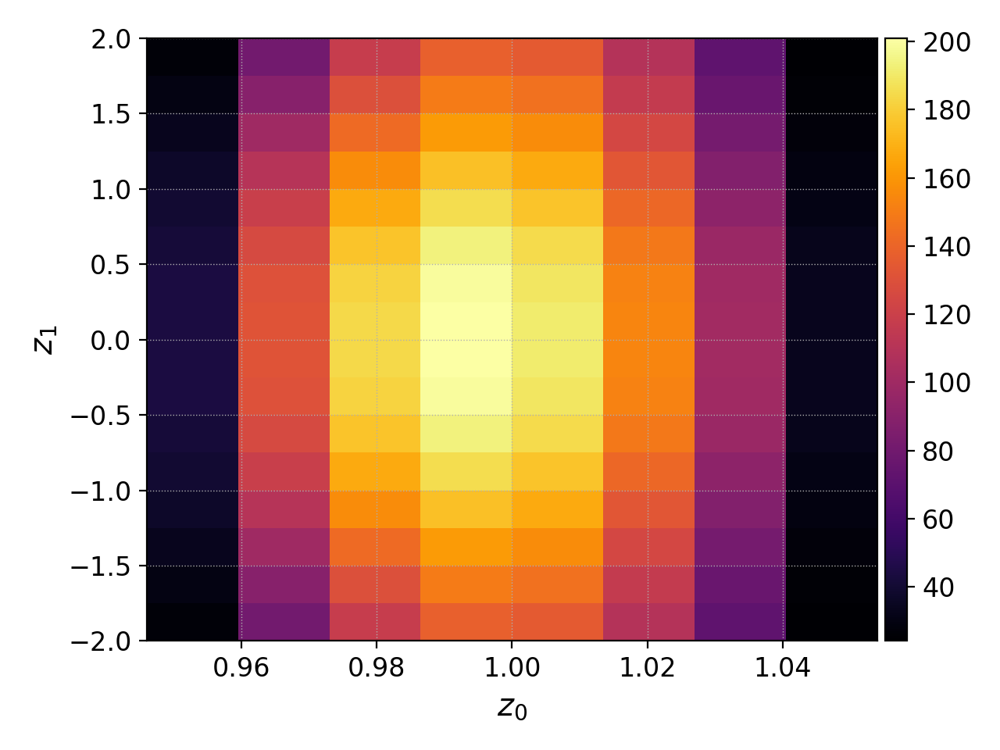

.. _quickstart:

.. title:: Gkeyll Quick Start Guide

:math:`\texttt{Gkeyll}` Quick Start Guide
=========================================

.. _quickstart_moments:

A Simple :math:`\texttt{moments}` Simulation
--------------------------------------------

As our first example of a simple simulation using the :math:`\texttt{moments}` app, we
shall simulate the GEM (Geospace Environment Modeling) magnetic reconnection problem 
using the 5-moment multi-fluid equations, whose Lua input file can be found in
``moments/luareg/rt_5m_gem.lua``. In the 5-moment, multi-fluid model, an arbitrary
number of fluid species (indexed by :math:`s`) are evolved via the Euler equations,
assuming an ideal fluid model with an isotropic (scalar) pressure. These consist of
evolution equations for the species number density :math:`n_s`:

.. math::
  \frac{\partial n_s}{\partial t} + \nabla \cdot \left( n_s \mathbf{u}_s \right) = 0,

the species velocity :math:`\mathbf{u}_s`:

.. math::
  m_s n_s \left( \frac{\partial \mathbf{u}_s}{\partial t} + \mathbf{u}_s \cdot \nabla
  \mathbf{u}_s \right) = - \nabla p_s + q_s n_s \left( \mathbf{E} + \mathbf{u}_s \times
  \mathbf{B} \right),

and the species pressure :math:`p_s`:

.. math::
  \frac{\partial p_s}{\partial t} + \mathbf{u}_s \cdot \nabla p_s = - \gamma_s p_s
  \nabla \cdot \mathbf{u}_s,

where :math:`m_s` is the mass of each particle in the species, :math:`q_s` is the charge
of each particle in the species, and :math:`\gamma_s` is the adiabatic index of the
fluid species, assuming an ideal gas equation of state. For the purpose of numerical
solution, the species velocity and species pressure equations are recast into
conservation law form, representing conservation of the species momentum density
:math:`m_s n_s \mathbf{u}_s`:

.. math::
  \frac{\partial}{\partial t} \left( m_s n_s \mathbf{u}_s \right) + \nabla \cdot \left(
  p_s \mathbf{I} + m_s n_s \mathbf{u}_s \otimes \mathbf{u}_s \right) = n_s q_s \left(
  \mathbf{E} + \mathbf{u}_s \times \mathbf{B} \right),

and the species total energy density :math:`E_s`:

.. math::
  \frac{\partial E_s}{\partial t} + \nabla \cdot \left( \mathbf{u}_s p_s +
  \mathbf{u_s} E_s \right) = q_s n_s \mathbf{u}_s \cdot \mathbf{E}_s,

where the species total energy density :math:`E_s` is given by a sum of internal and
kinetic energy densities (assuming an ideal gas equation of state):

.. math::
  E_s &= E_{s}^{internal} + E_{s}^{kinetic}\\
  &= \left( \frac{p_s}{\gamma_s - 1} \right) + \frac{1}{2} m_s n_s \left\lVert
  \mathbf{u}_s \right\rVert.

The fluid species are coupled together through their interactions with a shared
electromagnetic field, evolved via Maxwell's equations, consisting of evolution and
constraint equations for the electric field :math:`\mathbf{E}`:

.. math::
  \frac{1}{c^2} \left( \frac{\partial \mathbf{E}}{\partial t} \right) - \nabla \times
  \mathbf{B} = - \mu_0 \mathbf{J} \qquad \nabla \cdot \mathbf{E} =
  \frac{\rho_c}{\epsilon_0},

and the magnetic field :math:`\mathbf{B}`:

.. math::
  \frac{\partial \mathbf{B}}{\partial t} + \nabla \times \mathbf{E} = 0, \qquad \nabla
  \cdot \mathbf{B} = 0,

where :math:`\epsilon_0` and :math:`\mu_0` are the permittivity and permeability of free
space, respectively, :math:`c` is the speed of light:

.. math::
  c = \frac{1}{\sqrt{ \epsilon_0 \mu_0}},

and :math:`\rho_c` and :math:`\mathbf{J}` are the charge density and current density,
respectively:

.. math::
  \rho_c = \sum_s q_s n_s, \qquad \mathbf{J} = \sum_s q_s n_s \mathbf{u}_s.

For the GEM reconnection problem, we will simulate two fluid species (namely an electron
species, indexed by :math:`s = e`, and an ion species, indexed by :math:`s = i`),
coupled via an electromagnetic field. Looking inside the
``moments/luareg/rt_5m_gem.lua`` Lua input file, we see that it begins (after
introductory comments) with:

.. code-block:: lua

  ...
  local Moments = G0.Moments
  local Euler = G0.Moments.Eq.Euler
  ...

which loads in the :math:`\texttt{moments}` app (i.e. ``G0.Moments``), so that
:math:`\texttt{Gkeyll}` knows which app we are intending to run, as well as the Euler
equations object (i.e. ``G0.Moments.Eq.Euler``) for the 5-moment model, since the
:math:`\texttt{moments}` app has support for many other equation systems besides
Euler/5-moments. The next part of the input file defines any necessary dimensionless or
mathematical constants:

.. code-block:: lua

  ...
  -- Mathematical constants (dimensionless).
  pi = math.pi
  ...

which in our case defines a value for :math:`\pi` (i.e. ``math.pi``). Next, we define
any necessary dimensional or physical constants:

.. code-block:: lua

  ...
  -- Physical constants (using normalized code units).
  gas_gamma = 5.0 / 3.0 -- Adiabatic index.
  epsilon0 = 1.0 -- Permittivity of free space.
  mu0 = 1.0 -- Permeability of free space.
  mass_ion = 1.0 -- Ion mass.
  charge_ion = 1.0 -- Ion charge.
  mass_elc = 1.0 / 25.0 -- Electron mass.
  charge_elc = -1.0 -- Electron charge.
  ...

which defines the adiabatic index for both species
:math:`\gamma_e = \gamma_i = \frac{5}{3}`, the permittivity and permeability of free
space :math:`\epsilon_0 = \mu_0 = 1`, the mass and charge of the ion species
:math:`m_i = 1`, :math:`q_i = 1`, and the mass and charge of the electron species
:math:`m_e = \frac{1}{25}`, :math:`q_e = -1`. Several other physical constants are also
defined, to facilitate the process of initialization:

.. code-block:: lua

  ...
  di = 1.0 -- Ion skin depth.
  n0 = 1.0 -- Reference in-plane number density.
  nb_over_n0 = 0.2 -- Background number density / reference number density.
  B0 = 0.1 -- Reference magnetic field strength.
  Ti_over_Te = 5.0 -- Ion temperature / electron temperature.
  beta = 1.0 -- Total plasma beta.
  ...

which defines the ion skin depth :math:`\delta_i = 1`, the reference number density
:math:`n_0 = 1`, the ratio of background to reference number density
:math:`\frac{n_b}{n_0} = \frac{1}{5}`, the reference *in-plane* magnetic field strength
:math:`B_0 = \frac{1}{10}` (which defines the ratio of the in-plane Alfvén wave speed to
the speed of light, since :math:`\mu_0 = n_0 = m_i = 1`), the ratio of ion to electron
temperature :math:`\frac{T_i}{T_e} = 5`, and the *total* plasma beta :math:`\beta = 1`
(i.e. the electron beta is :math:`\frac{1}{6}` and the ion beta is :math:`\frac{5}{6}`,
so the total is 1). Next, we define any *derived* physical quantities (i.e. quantities
derived from the physical constants defined above):

.. code-block:: lua

  ...
  -- Derived physical quantities (using normalized code units).
  lambda = 0.5 * di -- Current sheet width.
  psi0 = 0.1 * B0 * di -- Reference perturbation strength.

  Ti_frac = Ti_over_Te / (1.0 + Ti_over_Te) -- Fraction of total temperature from ions.
  Te_frac = 1.0 / (1.0 + Ti_over_Te) -- Fraction of total temperature from electrons.
  T_tot = beta * (B0 * B0) / 2.0 / n0 -- Total temperature.

  omega_ci = math.abs(charge_ion * B0 / mass_ion) -- Ion cyclotron frequency.
  ...

which defines the width of the current sheet :math:`\lambda = \frac{d_i}{2}`, the
reference perturbation strength :math:`\psi_0 = \frac{B_0 \delta_i}{10}` (magnitude of
perturbation to the magnetic vector potential), the fractions of the total plasma
temperature contributed by the ions and electrons:

.. math::
  T_{i}^{frac} = \frac{\left( \frac{T_i}{T_e} \right)}{1 + \left( \frac{T_i}{T_e}
  \right)}, \qquad T_{e}^{frac} = \frac{1}{1 + \left( \frac{T_i}{T_e} \right)},

respectively, the total plasma temperature
:math:`T^{tot} = \beta \left( \frac{B_{0}^{2}}{2 n_0} \right)`, and the ion cyclotron
frequency :math:`\Omega_{c, i} = \left\lvert \frac{q_i B_0}{m_i} \right\rvert` . Next,
we define some overall parameters for the simulation:

.. code-block:: lua

  ...
  --  Simulation parameters.
  Nx = 128 -- Cell count (x-direction).
  Ny = 64 -- Cell count (y-direction).
  Lx = 25.6 * di -- Cell count (x-direction).
  Ly = 12.8 * di -- Cell count (y-direction).
  cfl_frac = 1.0 -- CFL coefficient.
  ...

which defines a simulation domain consisting of :math:`128 \times 64 = 8192` total
cells, of size :math:`25.6 \delta_i \times 12.8 \delta_i` (resulting in a uniform cell
size of :math:`\Delta x = \Delta y = 0.2 \delta_i`), and a CFL coefficient of
:math:`C_{CFL} = \frac{a \Delta t}{\Delta x} = 1` (corresponding to taking the largest
stable time-step :math:`\Delta t` permitted by the CFL stability criterion, where
:math:`a` is the largest absolute wave-speed in the simulation domain). Finally, we
complete this preambulatory section with the remaining simulation parameters:

.. code-block:: lua

  ...
  t_end = 25.0 / omega_ci -- Final simulation time.
  num_frames = 1 -- Number of output frames.
  field_energy_calcs = GKYL_MAX_INT -- Number of times to calculate field energy.
  integrated_mom_calcs = GKYL_MAX_INT -- Number of times to calculate integrated moments.
  dt_failure_tol = 1.0e-4 -- Minimum allowable fraction of initial time-step.
  num_failures_max = 20 -- Maximum allowable number of consecutive small time-steps.
  ...

which defines a final simulation time :math:`t_{end} = \frac{25}{\Omega_{c, i}}` (the
initial simulation time is always assumed to be :math:`t_{init} = 0`), specifies that a
single output frame should be written out to the file system (i.e. only the final state
of the simulation is written out, without any intermediate frames being stored),
specifies that certain diagnostic variables, namely the field energy and the integrated
diagnostic moments, should be calculated as frequently as possible (i.e. they are
calculated every step, and will be written out along with the output frames), and
finally specifies that the simulation should automatically terminate if more than 20
consecutive steps are taken where the stable time-step :math:`\Delta t` is calculated
to be less than :math:`10^{-4}` times the initial stable time-step
:math:`\left( \Delta t \right)_{init}` (to prevent time-step crashes).

The next part of the Lua input file initializes the :math:`\texttt{moments}` app itself,
and passes in several of the key simulation parameters defined above (i.e. the final
simulation time :math:`t_{end}`, the number of output frames, the frequency of field
energy and integrated diagnostic moments calculations, the small time-step termination
criteria, the lower and upper boundaries of the simulation domain, the number of cells
in each direction, and the CFL coefficient :math:`C_{CFL}`):

.. code-block:: lua

  ...
  momentApp = Moments.App.new {

    tEnd = t_end,
    nFrame = num_frames,
    fieldEnergyCalcs = field_energy_calcs,
    integratedMomentsCalcs = integrated_mom_calcs,
    dtFailureTol = dt_failure_tol,
    numFailuresMax = num_failures_max,
    lower = { -0.5 * Lx, -0.5 * Ly },
    upper = { 0.5 * Lx, 0.5 * Ly },
    cells = { Nx, Ny },
    cflFrac = cfl_frac,

    ...
  }
  ...

thus defining the range of the simulation domain to be
:math:`\left[ -12.8, 12.8 \right] \times \left[ -6.4, 6.4 \right]`. The next field to be
passed into ``Moments.App.new`` represents the decomposition of the simulation domain
into subdomains for the purposes of parallelization (in our case, we are running a
serial simulation, so we only want to partition into a single subdomain in each of the
:math:`x` and :math:`y` coordinate directions):

.. code-block:: lua

  ...
  -- Decomposition for configuration space.
  decompCuts = { 1, 1 }, -- Cuts in each coordinate direction (x- and y-directions).
  ...

The next field specifies which coordinate directions (if any) should have periodic
boundary conditions applied to them; for the GEM reconnection problem, the boundaries in
the :math:`x` coordinate direction are assumed to have periodic boundary conditions and
the boundaries in the :math:`y` coordinate direction are assumed to have reflective (or
*wall*) boundary conditions:

.. code-block:: lua

  ...
  -- Boundary conditions for configuration space.
  periodicDirs = { 1 }, -- Periodic directions (x-direction only).
  ...

where "1" here refers to the first coordinate direction (i.e. :math:`x`). The next items
to be passed into ``Moments.App.new`` are the two fluid species (``elc`` for the
electron species, ``ion`` for the ion species) themselves:

.. code-block:: lua

  ...
  -- Electrons.
  elc = Moments.Species.new {
    charge = charge_elc, mass = mass_elc,
    equation = Euler.new { gasGamma = gas_gamma },
    
    ...

    evolve = true, -- Evolve species?
    bcy = { G0.SpeciesBc.bcWall, G0.SpeciesBc.bcWall } -- Wall boundary conditions (y-direction).
  },

  -- Ions.
  ion = Moments.Species.new {
    charge = charge_ion, mass = mass_ion,
    equation = Euler.new { gasGamma = gas_gamma },

    ...

    evolve = true, -- Evolve species?
    bcy = { G0.SpeciesBc.bcWall, G0.SpeciesBc.bcWall } -- Wall boundary conditions (y-direction).
  },
  ...

where, in both cases, we begin by passing in parameters for the charge and mass of the
species (:math:`q_e` and :math:`m_e` for the electrons, :math:`q_i` and :math:`m_i` for
the ions, respectively), followed by an instantiation of the equation object itself via
``Euler.new`` (passing in the adiabatic index :math:`\gamma_e = \gamma_i` in both
cases), followed by some initialization code which we have omitted, followed finally by
a flag to indicate that both species should be evolved in time (i.e. the fluids are not
static) and that the boundaries in the :math:`y` coordinate direction, on both sides of
the domain, should have reflective/wall boundary conditions applied to them (i.e.
``G0.SpeciesBc.bcWall``). The initial conditions for the electron species are imposed
via the initialization function:

.. code-block:: lua

  ...
  -- Initial conditions function.
  init = function (t, xn)
    local x, y = xn[1], xn[2]

    local sech_sq = (1.0 / math.cosh(y / lambda)) * (1.0 / match.cosh(y / lambda)) -- Hyperbolic secant squared.

    local n = n0 * (sech_sq * nb_over_n0) -- Total number density.
    local Jz = -(B0 / lambda) * sech_sq -- Total current density (z-direction).

    local rhoe = n * mass_elc -- Electron mass density.
    local mome_x = 0.0 -- Electron momentum density (x-direction).
    local mome_y = 0.0 -- Electron momentum density (y-direction).
    local mome_z = (mass_elc / charge_elc) * Jz * Te_frac -- Electron momentum density (z-direction).
    local Ee_tot = n * T_tot * Te_frac / (gas_gamma - 1.0) + 0.5 * mome_z * mome_z / rhoe -- Electron total energy density.

    return rhoe, mome_x, mome_y, mome_z, Ee_tot
  end,
  ...

while the initial conditions for the ion species are imposed via the corresponding
initialization function:

.. code-block:: lua

  ...
  -- Initial conditions function.
  init = function (t, xn)
    local x, y = xn[1], xn[2]

    local sech_sq = (1.0 / math.cosh(y / lambda)) * (1.0 / math.cosh(y / lambda)) -- Hyperbolic secant squared.

    local n = n0 * (sech_sq * nb_over_n0) -- Total number density.
    local Jz = -(B0 / lambda) * sech_sq -- Total current density (z-direction).

    local rhoi = n * mass_ion -- Ion mass density.
    local momi_x = 0.0 -- Ion momentum density (x-direction).
    local momi_y = 0.0 -- Ion momentum density (y-direction).
    local momi_z = (mass_ion / charge_ion) * Jz * Ti_frac -- Ion momentum density (z-direction).
    local Ei_tot = n * T_tot * Ti_frac / (gas_gamma - 1.0) + 0.5 * momi_z * momi_z / rhoi -- Ion total energy density.

    return rhoi, momi_x, momi_y, momi_z, Ei_tot
  end,
  ...

In both of these cases, we see that the final values that get passed into
:math:`\texttt{Gkeyll}` for the purposes of species initialization are the *conserved*
fluid variables, namely the species mass density :math:`\rho_s = n_s m_s`, the species
momentum density :math:`\rho_s \mathbf{u}_s`, and the species total energy density
(assuming an ideal gas equation of state):

.. math::
  E_s &= E_{s}^{internal} + E_{s}^{kinetic}\\
  &= \left( \frac{p_s}{\gamma_s - 1} \right) + \frac{1}{2} \rho_s \left\lVert
  \mathbf{u}_s \right\rVert^2

where, for the particular case of the GEM reconnection problem, both the electron and
ion species are initialized with number density:

.. math::
  n_s &= n_b \left[ \mathrm{sech} \left( \frac{y}{\lambda} \right) \right]^2\\
  &= n_0 \left[ \mathrm{sech} \left( \frac{y}{\lambda} \right) \right]^2 \left(
  \frac{n_b}{n_0} \right),

momentum density:

.. math::
  \rho_s \mathbf{u}_s = \left( \frac{m_s}{q_s} \right) T_{s}^{frac} \, \mathbf{J},

and total energy density:

.. math::
  E_s &= \left( \frac{n_s \, T^{tot} \, T_{s}^{frac}}{\gamma_s - 1} \right) +
  \frac{1}{2} \rho_s \left\lVert \mathbf{u}_s \right\rVert^2\\
  &= \left( \frac{n_s \, T^{tot} \, T_{s}^{frac}}{\gamma_s - 1} \right) + \frac{1}{2}
  \left( \frac{\left\lVert \rho_s \mathbf{u}_s \right\rVert^2}{\rho_s} \right),

where the current density :math:`\mathbf{J}` is given by:

.. math::
  \mathbf{J} = \begin{bmatrix}
  0\\
  0\\
  - \left( \frac{B_0}{\lambda} \right) \left[ \mathrm{sech} \left( \frac{y}{\lambda}
  \right) \right]^2
  \end{bmatrix},

and :math:`\mathrm{sech}` is the hyperbolic secant function:

.. math::
  \left[ \mathrm{sech} \left( \frac{y}{\lambda} \right) \right]^2 = \left(
  \frac{1}{\cosh \left( \frac{y}{\lambda} \right)} \right)^2.

The final item to be passed into ``Moments.App.new`` is the electromagnetic field
itself:

.. code-block:: lua

  ...
  -- Field.
  field = Moments.Field.new {
    epsilon0 = epsilon0, mu0 = mu0,
    mgnErrorSpeedFactor = 1.0,

    ...

    evolve = true, -- Evolve field?
    bcy = { G0.FieldBc.bcWall, G0.FieldBc.bcWall } -- Wall boundary conditions (y-direction).
  }
  ...

where we begin by passing in parameters for the permittivity and permeability of free
space (:math:`\epsilon_0` and :math:`\mu_0`, respectively), followed by the propagation
speed for divergence errors in the magnetic field :math:`\mathbf{B}`
(since :math:`\texttt{Gkeyll}` uses hyperbolic divergence cleaning methods to correct
numerical deviations from the divergence constraint :math:`\nabla \cdot \mathbf{B} = 0`)
as a fraction of the speed of light, followed by some initialization code which we have
omitted, followed finally by a flag to indicate that the electromagnetic field should be
evolved in time (i.e. the field is not static), and that the boundaries in the :math:`y`
coordinate direction, on both sides of the domain, should have reflective/wall boundary
conditions applied to them (i.e. ``G0.FieldBc.bcWall``). The initial conditions for the
electromagnetic field are imposed via the initialization function:

.. code-block:: lua

  ...
  -- Initial conditions function.
  init = function (t, xn)
    local x, y = xn[1], xn[2]

    local Bxb = B0 * math.tanh(y / lambda) -- Total magnetic field strength.

    local Ex = 0.0 -- Total electric field (x-direction).
    local Ey = 0.0 -- Total electric field (y-direction).
    local Ez = 0.0 -- Total electric field (z-direction).

    local Bx = Bxb - psi0 * (pi / Ly) * math.cos(2.0 * pi * x / Lx) * math.sin(pi * y / Ly) -- Total magnetic field (x-direction).
    local By = psi0 * (2.0 * pi / Lx) * math.sin(2.0 * pi * x / Lx) * math.cos(pi * y / Ly) -- Total magnetic field (y-direction).
    local Bz = 0.0 -- Total magnetic field (z-direction).

    return Ex, Ey, Ez, Bx, By, Bz, 0.0, 0.0
  end,
  ...

We see that the final values that get passed into :math:`\texttt{Gkeyll}` for the
purposes of electromagnetic field initialization are the electric field
:math:`\mathbf{E}`, the magnetic field :math:`\mathbf{B}`, and the two field potentials
:math:`\phi` and :math:`\psi` (both set to 0 here), used by the hyperbolic divergence
cleaning algorithm for the propagation of divergence errors in the :math:`\mathbf{E}`
and :math:`\mathbf{B}` fields, respectively. For the particular case of the GEM
reconnection problem, the electromagnetic field is initialized with vanishing electric
field :math:`\mathbf{E} = \mathbf{0}`, and non-vanishing magnetic field:

.. math::
  \mathbf{B} = \begin{bmatrix}
  B_{strength} - \psi_0 \left( \frac{\pi}{L_y} \right) \cos \left( \frac{2 \pi x}{L_x}
  \right) \sin \left( \frac{\pi y}{L_y} \right)\\
  \psi_0 \left( \frac{2 \pi}{L_x} \right) \sin \left( \frac{2 \pi x}{L_x} \right) \cos
  \left( \frac{\pi y}{L_y} \right)\\
  0
  \end{bmatrix},

where the magnetic field strength :math:`B_{strength}` is given by:

.. math::
  B_{strength} = B_0 \tanh \left( \frac{y}{\lambda} \right).

With the :math:`\texttt{moments}` app thus fully initialized, all that remains is to
instruct the app to launch:

.. code-block:: lua
  
  ...
  -- Run application.
  momentApp:run()

Once the Lua input file is complete, the simulation can now be run in the usual way:

.. code-block:: bash

  ./build/gkeyll/gkeyll ./moments/luareg/rt_5m_gem.lua

Once the simulation has finished running, we can begin by plotting the
:math:`z`-component (i.e. the out-of-plane component) of the electron momentum density
:math:`\rho_e \mathbf{u}_e`, since this is effectively a proxy for the
:math:`z`-component of the current density :math:`\mathbf{J}`. The final state of the
electron species is output to the file ``rt_5m_gem-elc_1.gkyl`` (with the corresponding
initial state output to ``rt_5m_gem-elc_0.gkyl``). We can instruct
:math:`\texttt{postgkyl}` to select only component 3 (with component 0 corresponding to
mass density :math:`\rho_e`, components 1, 2, and 3 corresponding to the :math:`x`,
:math:`y`, and :math:`z` components of the momentum density :math:`\rho_e \mathbf{u}_e`,
and component 4 corresponding to the total energy density :math:`E_e`) of this data by
calling ``sel -c3`` before calling ``plot``, and we can append the argument ``-a`` to
tell :math:`\texttt{postgkyl}` to plot everything with the correct aspect ratio:

.. code-block:: bash

  pgkyl rt_5m_gem-elc_1.gkyl sel -c3 plot -a

  The :math:`z`-component (i.e. the out-of-plane component) of the electron momentum
  density :math:`\rho_e \mathbf{u}_e` (i.e. component 3 of the conserved variable
  vector) for the GEM (Geospace Environment Modeling) magnetic reconnection problem, as
  solved using the 5-moment multi-fluid model.

Likewise, the final state of the ion species is output to the file
``rt_5m_gem-ion_1.gkyl`` (with the corresponding initial state output to
``rt_5m_gem-ion_0.gkyl``), and we can instruct :math:`\texttt{postgkyl}` to select only
component 3 of this data and plot it in exactly the same way:

.. code-block:: bash

  pgkyl rt_5m_gem-ion_1.gkyl sel -c3 plot -a

  The :math:`z`-component  (i.e. the out-of-plane component) of the ion momentum
  density :math:`\rho_i \mathbf{u}_i` (i.e. component 3 of the conserved variable
  vector) for the GEM (Geospace Environment Modeling) magnetic reonnection problem, as
  solved using the 5-moment multi-fluid model.

Finally, we wish to plot the :math:`z`-component (i.e. the out-of-plane component) of
the magnetic field :math:`\mathbf{B}`. The final state of the electromagnetic field is
output to the file ``rt_5m_gem-field_1.gkyl`` (with the corresponding initial state
output to ``rt_5m_gem-field_0.gkyl``). We can instruct :math:`\texttt{postgkyl}` to
select only component 5 (with components 0, 1, and 2 corresponding to the :math:`x`,
:math:`y`, and :math:`z` components of the electric field :math:`\mathbf{E}` and
components 3, 4, and 5 corresponding to components :math:`x`, :math:`y`, and :math:`z`
of the magnetic field :math:`\mathbf{B}`) of this data by calling ``sel -c5`` before
calling ``plot``, and as before we can append the argument ``-a`` to tell
:math:`\texttt{postgkyl}` to plot everything with the correct aspect ratio:

.. code-block:: bash

  pgkyl rt_5m_gem-field_1.gkyl sel -c5 plot -a

  The :math:`z`-component (i.e. the out-of-plane component) of the magnetic field
  :math:`\mathbf{B}` (i.e. component 5 of the electromagnetic field) for the GEM
  (Geospace Environment Modeling) magnetic reconnection problem, as solved using the
  5-moment multi-fluid model.

.. _quickstart_vlasov:

A Simple :math:`\texttt{vlasov}` Simulation
-------------------------------------------

As our first example of a simple simulation using the :math:`\texttt{vlasov}` app, we
shall simulate a two-stream plasma instability problem using the collisionless
Vlasov-Maxwell equations, whose Lua input file can be found in
``vlasov/luareg/rt_vlasov_twostream_p2.lua``. In the collisionless Vlasov-Maxwell model,
an arbitrary number of fully kinetic particle species (indexed by :math:`s`) are evolved
via the collisionless Vlasov equation for the species distribution function
:math:`f_s = f_s \left( \mathbf{x}, \mathbf{v} \right)`:

.. math::
  \frac{\partial f_s}{\partial t} + \nabla_{\mathbf{x}} \cdot \left( \mathbf{v} f_s
  \right) + \nabla_{\mathbf{v}} \cdot \left( \frac{q_s}{m_s} \left[ \mathbf{E} +
  \mathbf{v} \times \mathbf{B} \right] f_s \right) = 0,

where :math:`m_s` is the mass of each particle species, :math:`q_s` is the charge of
each particle species, :math:`\mathbf{x}` and :math:`\mathbf{v}` denote the
configuration space and velocity space coordinates, respectively, and
:math:`\nabla_{\mathbf{x}}` and :math:`\nabla_{\mathbf{v}}` denote the configuration and
velocity space gradient operators, respectively. In the collisionless case, the kinetic
particle species are coupled together through their interactions with a shared
electromagnetic field, evolved via Maxwell's equations, consisting of evolution and
constraint equations for the electric field
:math:`\mathbf{E} = \mathbf{E} \left( \mathbf{x} \right)`:

.. math::
  \frac{1}{c^2} \left( \frac{\partial \mathbf{E}}{\partial t} \right) -
  \nabla_{\mathbf{x}} \times \mathbf{B} = - \mu_0 \mathbf{J}, \qquad \nabla_{\mathbf{x}}
  \cdot \mathbf{E} = \frac{\rho_c}{\epsilon_0},

and the magnetic field :math:`\mathbf{B} = \mathbf{B} \left( \mathbf{x} \right)`:

.. math::
  \frac{\partial \mathbf{B}}{\partial t} + \nabla_{\mathbf{x}} \times \mathbf{E} = 0,
  \qquad \nabla_{\mathbf{x}} \cdot \mathbf{B} = 0,

where :math:`\epsilon_0` and :math:`\mu_0` are the permittivity and permeability of free
space, respectively, :math:`c` is the speed of light:

.. math::
  c = \frac{1}{\sqrt{\epsilon_0 \mu_0}},

and :math:`\rho_c = \rho_c \left( \mathbf{x} \right)` and
:math:`\mathbf{J} = \mathbf{J} \left( \mathbf{x} \right)` are the charge density and
current density, computed as the sum of zeroth and first moments of the species
distribution functions;

.. math::
  \rho_c = \sum_s \left( q_s \int_{V} f_s \, d \mathbf{v} \right), \qquad \mathbf{J} =
  \sum_s \left( q_s \int_{V} \mathbf{v} \, f_s \, d \mathbf{v} \right),

respectively, where :math:`\int_{V}` denotes the integration operator over all of
velocity space. For the two-stream instability problem, we will simulate a single
kinetic particle species (namely an electron species, indexed by :math:`s = e`), coupled
to an electromagnetic field. Looking inside the
``vlasov/luareg/rt_vlasov_twostream_p2.lua`` Lua input file, we see that it begins with:

.. code-block:: lua

  local Vlasov = G0.Vlasov
  ...

which loads in the :math:`\texttt{vlasov}` app (i.e. ``G0.Vlasov``), so that
:math:`\texttt{Gkeyll}` knows which app we are intending to run. The next part of the
input file defines any necessary dimensionless or mathematical constants:

.. code-block:: lua

  ...
  -- Mathematical constants (dimensionless).
  pi = math.pi
  ...

which in our case defines a value for :math:`\pi` (i.e. ``math.pi``). Next, we define
any necessary dimensional or physical constants:

.. code-block:: lua

  ...
  -- Physical constants (using normalized code units).
  epsilon0 = 1.0 -- Permittivity of free space.
  mu0 = 1.0 -- Permeability of free space.
  mass_elc = 1.0 -- Electron mass.
  charge_elc = -1.0 -- Electron charge.
  ...

which defines the permittivity and permeability of free space
:math:`\epsilon_0 = \mu_0 = 1`, and the mass and charge of the electron species
:math:`m_e = 1`, :math:`q_e = -1`. Several other physical constants are also defined, to
facilitate the process of initialization:

.. code-block:: lua

  ...
  n0 = 1.0 -- Reference number density.
  vt = 1.0 -- Thermal velocity.
  Vx_drift = 5.0 -- Drift velocity (x-direction).
  lambda_D = 1.0 -- Electron Debye length.

  alpha = 1.0e-6 -- Applied perturbation amplitude.
  ...

which defines the reference number density :math:`n_0 = 1`, the electron thermal
velocity :math:`v_{t} = 1`, the electron drift velocity (in the :math:`x` coordinate
direction) :math:`u_x = 5`, the electron Debye length :math:`\lambda_D = 1`, the
amplitude of the initial perturbation to be applied to the electron distribution
function :math:`\alpha = 10^{-6}`. Next, we define any *derived* physical quantities
(i.e. quantities derived from the physical constants defined above):

.. code-block:: lua

  ...
  -- Derived physical quantities (using normalized code units).
  T = (vt * vt) * mass_elc -- Temperature.

  kx = 0.1 * lambda_D -- Perturbed wave number (x-direction).
  omega_pe = vt / lambda_D -- Electron plasma frequency.
  ...

which defines the electron temperature :math:`T = v_{t}^{2} \, m_e`, the electron
wavenumber to perturb (in the :math:`x` coordinate direction)
:math:`k_x = \frac{\lambda_D}{10}`, and the electron plasma frequency
:math:`\Omega_{p, e} = \frac{v_t}{\lambda_D}`. Next, we define some overall parameters
for the simulation:

.. code-block:: lua

  ...
  -- Simulation parameters.
  Nx = 64 -- Cell count (configuration space: x-direction).
  Nvx = 32 -- Cell count (velocity space: vx-direction).
  Lx = 20.0 * pi * lambdaD -- Domain size (configuration space: x-direction).
  vx_max = 24.0 * vt -- Domain boundary (velocity space: vx-direction).
  poly_order = 2 -- Polynomial order.
  basis_type = "serendipity" -- Basis function set.
  time_stepper = "rk3" -- Time integrator.
  cfl_frac = 0.6 -- CFL coefficient.
  ...

which defines a phase space simulation domain consisting of 64 cells in configuration
space (:math:`x` coordinate direction) and 32 cells in velocity space (:math:`v_x`
coordinate direction), of length :math:`L_x = 20 \pi \lambda_D` in configuration space
(:math:`x` coordinate direction), and with a maximum velocity space extent of
:math:`24 v_{t}` (:math:`v_x` coordinate direction). The polynomial order of the modal
discontinuous Galerkin method is set to 2 (i.e. piecewise quadratic), the set of modal
basis functions is set to the ``Serendipity`` basis, the time integrator is set to
third-order Runge-Kutta (i.e. ``RK3``), and the CFL coefficient is set to
:math:`C_{CFL} = \frac{a \Delta t}{\Delta x} = 0.6` (corresponding to taking
:math:`60 \%` of the largest stable time-step :math:`\Delta t` permitted by the CFL
stability criterion, where :math:`a` is the largest absolute wave-speed in the
simulation domain). Finally, we complete this preambulatory section with the remaining
simulation parameters:

.. code-block:: lua

  ...
  t_end = 100.0 / omega_pe -- Final simulation time.
  num_frames = 1 -- Number of output frames.
  field_energy_calcs = GKYL_MAX_INT -- Number of times to calculate field energy.
  integrated_mom_calcs = GKYL_MAX_INT -- Number of times to calculate integrated moments.
  integrated_L2_f_calcs = GKYL_MAX_INT -- Number of times to calculate L2 norm of distribution function.
  dt_failure_tol = 1.0e-4 -- Minimum allowable fraction of initial time-step.
  num_failures_max = 20 -- Maximum allowable number of consecutive small time-steps.
  ...

which defines a final simulation time :math:`t_{end} = \frac{100}{\Omega_{p, e}}` (the
initial simulation time is always assumed to be :math:`t_{init}` = 0), specifies that a
single output frame should be written out to the file system (i.e. only the final state
of the simulation is written out, without any intermediate frames being stored),
specifies that certain diagnostic variables, namely the field energy, the integrated
diagnostic moments, and the integrated :math:`L^2`-norm of the distribution function
:math:`f_s`, should be calculated as frequently as possible (i.e. they are calculated
every step, and will be written out along with the output frames), and finally specifies
that the simulation should automatically terminate if more than 20 consecutive steps are
taken where the stable time-step :math:`\Delta t` is calculated to be less than
:math:`10^{-4}` time the initial stable time-step :math:`\left( \Delta t \right)_{init}`
(to prevent time-step crashes).

The next part of the Lua input file initializes the :math:`\texttt{vlasov}` app itself,
and passes in several of the key simulation parameters defined above (i.e. the final
simulation time :math:`t_{end}`, the number of output frames, the frequency of field
energy, :math:`L^2`-norm of :math:`f_s`, and integrated diagnostic moments calculations,
the small time-step termination criteria, the lower and upper boundaries of the
simulation domain *in configuration space*, the number of cells in each direction *of
configuration space*, and the CFL coefficient :math:`C_{CFL}`):

.. code-block:: lua

  ...
  vlasovApp = Vlasov.App.new {

    tEnd = t_end,
    nFrame = num_frames,
    fieldEnergyCalcs = field_energy_calcs,
    integratedL2fCalcs = integrated_L2_f_calcs,
    integratedMomentCalcs = integrated_mom_calcs,
    dtFailureTol = dt_failure_tol,
    numFailuresMax = num_failures_max,
    lower = { -0.5 * Lx },
    upper = { 0.5 * Lx },
    cells = { Nx },
    cflFrac = cfl_frac,

    ...
  }
  ...

thus defining the range of the configuration space domain to be
:math:`\left[ - \frac{\pi}{k_x}, \frac{\pi}{k_x} \right]`. The next field to be passed
into ``Vlasov.App.new`` represents the decomposition of the configuration space domain
into subdomains for the purposes of parallelization (in our case, we are running a
serial simulation, so we only want to partition into a single subdomain in the :math:`x`
coordinate direction):

.. code-block:: lua

  ...
  -- Decomposition for configuration space.
  decompCuts = { 1 }, -- Cuts in each coordinate direction (x-direction only).
  ...

The next field specifies which coordinate directions (if any) should have periodic
boundary conditions applied to them; for the two-stream instability problem, the
boundaries in the :math:`x` coordinate direction are assumed to have periodic boundary
conditions:

.. code-block:: lua

  ...
  -- Boundary conditions for configuration space.
  periodicDirs = { 1 }, -- Periodic directions (x-direction only).
  ...

where "1" here refers to the first coordinate direction (i.e. :math:`x`). The next items
to be passed into ``Vlasov.App.new`` are the kinetic particle species (in this case,
just ``elc`` for the electron species) themselves:

.. code-block:: lua

  ...
  -- Electrons.
  elc = Vlasov.Species.new {
    modelID = G0.Model.Default,
    charge = charge_elc, mass = mass_elc,

    -- Velocity space grid.
    lower = { -vx_max },
    upper = { vx_max },
    cells = { Nvx },

    ...

    evolve = true, -- Evolve species?
    diagnostics = { G0.Moment.M0, G0.Moment.M1, G0.Moment.M2 }
  },
  ...

where we begin by passing in the Vlasov model type (in this case, ``G0.Model.Default``
for the non-relativistic Vlasov equation), followed by the charge and mass of the
species (:math:`q_e` and :math:`m_e` for the electron charge and mass), followed by the
range of the velocity space domain (i.e. :math:`\left[ -6, 6 \right]`) and the number of
cells to use in velocity space, followed by some initialization code which we have
omitted, followed by a flag to indicate that the species should be evolved in time (i.e.
the particles are not static), followed finally by a specification of which diagnostic
moments should be calculated, namely ``G0.Moment.M0``, ``G0.Moment.M1``, and
``G0.Moment.M2``, corresponding to the zeroth, first, and second moments of the species
distribution function:

.. math::
  M_0 = \int_V f_s \, d \mathbf{v}, \qquad M_1 = \int_V \mathbf{v} \, f_s \, d
  \mathbf{v}, \qquad M_2 = \int_V \mathbf{v} \otimes \mathbf{v} \, f_s \, d \mathbf{v},

respectively. The initial conditions for the electron species are imposed by passing in
a list of projections for the distribution function:

.. code-block:: lua

  ...
  -- Initial conditions.
  numInit = 2,
  projections = {
    -- Two counter-streaming Maxwellians.
    ...
  }
  ...

where, in this case, we specify two separate projections (corresponding to two
counter-streaming Maxwell-Boltzmann distributions of particles) - one for the left-going
particle stream:

.. code-block:: lua

  ...
  {
    projectionID = G0.Projection.LTE,

    densityInit = function (t, xn)
      local x = xn[1]

      local n = 0.5 * (1.0 + alpha * math.cos(kx * x)) * n0 -- Total number density.
      return n
    end,
    temperatureInit = function (t, xn)
      return T -- Isotropic temperature.
    end,
    driftVelocityInit = function (t, xn)
      return Vx_drift -- Total left-going drift velocity.
    end,

    correctAllMoments = true
  },
  ...

and one for the right-going particle stream:

.. code-block:: lua

  ...
  {
    projectionID = G0.Projection.LTE,

    densityInit = function (t, xn)
      local x = xn[1]

      local n = 0.5 * (1.0 + alpha * math.cos(kx * x)) * n0 -- Total number density.
      return n
    end,
    temperatureInit = function (t, xn)
      return T -- Isotropic temperature.
    end,
    driftVelocityInit = function (t, xn)
      return -Vx_drift -- Total right-going drift velocity.
    end,

    correctAllMoments = true
  }
  ...

which we can see are identical apart from the specification of the drift velocity in the
:math:`x` coordinate direction (i.e. :math:`\pm u_x`). In both of these cases, we begin
by specifying that the type of projection operation to use is a Local Thermodynamic
Equilibrium projection (i.e. ``G0.Projection.LTE``), which assumes that the particle
species is locally characterized entirely by its configuration space number density
:math:`n_s`, its isotropic temperature :math:`T_s`, and its drift velocity
:math:`\mathbf{u}_s`, and then proceeds to initialize the distribution function
:math:`f_s` as a Maxwell-Boltzmann distribution:

.. math::
  f_s = n_s \left( \frac{m_s}{2 \pi T_s} \right)^{\frac{1}{2}} \exp \left( - m_s
  \frac{\left\lVert \mathbf{v} - \mathbf{u}_s \right\rVert^2}{2 T_s} \right).

The isotropic temperature :math:`T` and drift velocity (in the :math:`x` coordinate
direction) :math:`u_x` for the electron species have already been specified/computed,
and the configuration space number density :math:`n` is computed as a perturbation of
amplitude :math:`\alpha` of the reference number density :math:`n_0` as:

.. math::
  n = \frac{n_0}{2} \left( 1 + \alpha \cos \left( k_x \, x \right) \right).

The final item to be passed into ``Vlasov.App.new`` is the electromagnetic field itself:

.. code-block:: lua

  ...
  field = Vlasov.Field.new {
    epsilon0 = epsilon0, mu0 = mu0,

    ...

    evolve = true, -- Evolve field?
    elcErrorSpeedFactor = 0.0,
    mgnErrorSpeedFactor = 0.0
  }
  ...

where we begin by passing in parameters for the permittivity and permeability of free
space (:math:`\epsilon_0` and :math:`\mu_0`, respectively), followed by some
initialization code which we have omitted, followed by a flag to indicate that the
electromagnetic field should be evolved in time (i.e. the field is not static), followed
finally by the propagation speeds for divergence errors in the electric and magnetic
fields :math:`\mathbf{E}` and :math:`\mathbf{B}` (since :math:`\texttt{Gkeyll}` uses
hyperbolic divergence cleaning methods to correct numerical deviations from the
divergence constraints
:math:`\nabla_{\mathbf{x}} \cdot \mathbf{E} = \frac{\rho_c}{\epsilon_0}` and
:math:`\nabla_{\mathbf{x}} \cdot \mathbf{B} = 0`). The initial conditions for the
electromagnetic field are imposed via the initialization function:

.. code-block:: lua

  ...
  -- Initial conditions function.
  init = function (t, xn)
    local x = xn[1]

    local Ex = -alpha * math.sin(kx * x) / kx -- Total electric field (x-direction).
    local Ey = 0.0 -- Total electric field (y-direction).
    local Ez = 0.0 -- Total electric field (z-direction).

    local Bx = 0.0 -- Total magnetic field (x-direction).
    local By = 0.0 -- Total magnetic field (y-direction).
    local Bz = 0.0 -- Total magnetic field (z-direction).

    return Ex, Ey, Ez, Bx, By, Bz, 0.0, 0.0
  end,
  ...

We see that the final values that get passed into :math:`\texttt{Gkeyll}` for the
purposes of electromagnetic field initialization are the electric field
:math:`\textbf{E}`, the magnetic field :math:`\textbf{B}`, and the two field potentials
:math:`\phi` and :math:`\psi` (both set to 0 here), used by the hyperbolic divergence
cleaning algorithm for the propagation of divergence errors in the :math:`\mathbf{E}`
and :math:`\mathbf{B}` fields, respectively. For the particular case of the two-stream
instability problem, the electromagnetic field is initialized with vanishing magnetic
field :math:`\mathbf{B} = \mathbf{0}`, and non-vanishing electric field:

.. math::
  \mathbf{E} = \begin{bmatrix}
  - \frac{\alpha}{k_x} \sin \left( k_x \, x \right)\\
  0\\
  0
  \end{bmatrix}.

With the :math:`\texttt{vlasov}` app thus fully initialized, all that remains is to
instruct the app to launch:

.. code-block:: lua

  ...
  vlasovApp:run()

Once the Lua input file is complete, the simulation can now be run in the usual way:

.. code-block:: bash

  ./build/gkeyll/gkeyll ./vlasov/luareg/rt_vlasov_twostream_p2.lua

Once the simulation has finished running, we can begin by plotting the electron
distribution function :math:`f_e` across both configuration space (:math:`x` coordinate
direction) and velocity space (:math:`v_x` coordinate direction). The final state of the
electron species is output to the file ``rt_vlasov_twostream_p2-elc_1.gkyl`` (with the
corresponding initial state output to ``rt_vlasov_twostream_p2-elc_0.gkyl``). We can
instruct :math:`\texttt{postgkyl}` to interpolate a discontinuous solution from the
stored coefficients of the modal discontinuous Galerkin (DG) expansion by calling
``interp`` before calling ``plot``, and we can append the argument ``-a`` to tell
:math:`\texttt{postgkyl}`  to plot everything with the correct aspect ratio:

.. code-block:: bash

  pgkyl rt_vlasov_twostream_p2-elc_1.gkyl interp plot -a

  The interpolated electron distribution function :math:`f_e` (plotted as a function of
  configuration space coordinate :math:`x` and velocity space coordinate :math:`v_x`)
  for the two-stream plasma instability problem, as solved using the collisionless
  Vlasov-Maxwell kinetic model.

Finally, we wish to plot the :math:`x`-component (i.e. the only non-vanishing component)
of the electric field :math:`\mathbf{E}`. The final state of the electromagnetic field
is output to the file ``rt_vlasov_twostream_p2-field_1.gkyl`` (with the corresponding
initial state output to ``rt_vlasov_twostream_p2-field_0.gkyl``). We can instruct
:math:`\texttt{postgkyl}` as before to interpolate a discontinuous solution from the
stored coefficients of the modal DG expansion by calling ``interp``, and we can also
instruct :math:`\texttt{postgkyl}` to select only component 0 (with components 0, 1, and
2 corresponding to the :math:`x`, :math:`y`, and :math:`z` components of the electric
field :math:`\mathbf{E}` and components 3, 4, and 5 corresponding to the :math:`x`,
:math:`y`, and :math:`z` components of the magnetic field :math:`\textbf{B}`) of this
data by calling ``sel -c0`` before calling ``plot`` (note that we omit the ``-a``
argument since the data being plotted is one-dimensional):

.. code-block:: bash

  pgkyl rt_vlasov_twostream_p2-field_1.gkyl interp sel -c0 plot

  The interpolated :math:`x`-component (i.e. the only non-vanishing component) of the
  electric field :math:`\textbf{E}` (i.e. component 0 of the electromagnetic field) for
  the two-stream plasma instability problem, as solved using the collisionless
  Vlasov-Maxwell kinetic model.

.. _quickstart_gyrokinetic:

A Simple :math:`\texttt{gyrokinetic}` Simulation
------------------------------------------------

As our first example of a simple simulation using the :math:`\texttt{gyrokinetic}` app,
we shall simulate the self-consistent formation of a sheath potential using the full
:math:`f` gyrokinetic equation in the long-wavelength (drift-kinetic) limit, whose Lua
input file can be found in ``gyrokinetic/luareg/rt_gk_sheath_2x2v_p1.lua``. In the
absence of ionization, recombination, and radiation terms, but including an arbitrary
collision operator :math:`C \left[ f_s \right]`, the (electrostatic) long-wavelength
gyrokinetic model evolves an arbitrary number of gyroaveraged particle species (indexed
by :math:`s`) via the following equation for the gyroaveraged species distribution
function :math:`f_s = f_s \left( t, \mathbf{R}, v_{\parallel}, \mu \right)`:

.. math::
  \frac{\partial \left( \mathcal{J}_s f_s \right)}{\partial t} + \nabla_{\mathbf{R}}
  \cdot \left( \mathcal{J}_s \begin{bmatrix}
  \left\lbrace R_x, \mathcal{H} \right\rbrace\\
  \left\lbrace R_y, \mathcal{H} \right\rbrace\\
  \left\lbrace R_z, \mathcal{H} \right\rbrace
  \end{bmatrix} f_s \right) + \frac{\partial}{\partial t} \left( \mathcal{J}_s
  \left\lbrace v_{\parallel}, \mathcal{H} \right\rbrace f_s \right) = \mathcal{J}_s
  C \left[ f_s \right] + \mathcal{J}_s S_s,

where :math:`\left( v_{\parallel}, \mu \right)` are the gyroaveraged velocity space
coordinates (with :math:`v_{\parallel}` being the velocity coordinate parallel to the
magnetic field, and
:math:`\mu = \frac{m_s v_{\perp}^{2}}{2 \left\lVert \mathbf{B} \right\rVert}` being the
magnetic moment),
:math:`\mathcal{J}_s = B_{\parallel}^{*} = \mathbf{b} \cdot \mathbf{B}^{*}` is the
gyrokinetic phase space Jacobian (i.e. the parallel component of the effective magnetic
field :math:`\mathbf{B}^{*}`), where:

.. math::
  \mathbf{B}^{*} = \mathbf{B} + \left( \frac{m_s v_{\parallel}}{q_s} \right)
  \nabla_{\mathbf{R}} \times \mathbf{b},

:math:`m_s` is the mass of each particle species, :math:`q_s` is the charge of each
particle species, :math:`\mathbf{R} = \left[ R_x, R_y, R_z \right]^{\intercal}` denotes
the position of the *guiding center* of particle gyromotion (which, in turn, constitutes
the configuration space coordinate system), and :math:`\nabla_{\mathbf{R}}` denotes the
configuration space (i.e. guiding center) gradient operator. In all of the above,
:math:`\mathbf{b} = \frac{\mathbf{B}}{\left\lVert \mathbf{B} \right\rVert}` is the local
magnetic field unit vector, :math:`\mathcal{H}_s` is the gyrokinetic Hamiltonian of the
particle species in the long-wavelength limit:

.. math::
  \mathcal{H}_s = \frac{1}{2} m_s v_{\parallel}^{2} + \mu \left\lVert \mathbf{B}
  \right\rVert + q_s \phi,

:math:`\left\lbrace \cdot, \cdot \right\rbrace` denotes the non-canonical gyrokinetic
Poisson bracket, defined for arbitrary scalar functions :math:`F` and :math:`G` as:

.. math::
  \left\lbrace F, G \right\rbrace = \frac{\mathbf{B}^{*}}{m_s B_{\parallel}^{*}} \cdot
  \left( \nabla_{\mathbf{R}} F \left( \frac{\partial G}{\partial v_{\parallel}} \right)
  - \left( \frac{\partial F}{\partial v_{\parallel}} \right) \nabla_{\mathbf{R}} G
  \right) - \frac{\mathbf{b}}{q_s B_{\parallel}^{*}} \cdot \left( \nabla_{\mathbf{R}} F
  \times \nabla_{\mathbf{R}} G \right),

:math:`C \left[ f_ s \right]` denotes the collision operator (which may include Coulomb
collisions, elastic collisions, and inelastic neutral collisions), :math:`S_s` is an
arbitrary source term, and :math:`\phi` denotes the electrostatic potential. In the
electrostatic case, the gyroaveraged particle species are coupled together through their
interactions with a shared electrostatic field, computed self-consistently by means of
a Poisson equation, derived from the Boussinesq approximation to the quasi-neutrality
condition in the long-wavelength limit:

.. math::
  - \nabla_{\perp} \cdot \left( \sum_{s} \left( \frac{m_s n_{0, s}}{B_{0}^{2}} \right)
  \nabla_{\perp} \phi \right) = \sum_{s} q_s n_s \left( \mathbf{R} \right),

where :math:`n_{0, s}` is the linearized polarization density of the particle species,
:math:`B_{0}^{2}` is the magnitude of the magnetic field at the center of the simulation
domain, :math:`n_s \left( \mathbf{R} \right)` is the configuration space number density
(a function of the guiding center position):

.. math::
  n_s \left( \mathbf{R} \right) &= \int_{V} \mathcal{J}_s \, f_s \, d \mathbf{v}\\
  &= \left( \frac{2 \pi}{m_s} \right) \int_{- \infty}^{\infty} \int_{0}^{\infty}
  \mathcal{J}_s \, f_s \, d \mu \, d v_{\parallel},

where :math:`\int_{V}` denotes the integration operator over all of velocity space, and
:math:`\nabla_{\perp}` is the perpendicular gradient operator:

.. math::
  \nabla_{\perp} = \nabla_{\mathbf{R}} - \mathbf{b} \left( \mathbf{b} \cdot
  \nabla_{\mathbf{R}} \right).

Throughout the rest of this example, we shall refer to this equation simply as the
*gyrokinetic Poisson equation*. Finally, for this particular simulation setup, we assume
the multi-species *Dougherty* or *Lenard-Bernstein* (LBO) form of the collision operator
:math:`C \left[ f_s \right]`, given by a sum over all other gyroaveraged particle
species :math:`r`:

.. math::
  \mathcal{J}_s C \left[ f_s \right] = \sum_{r} \nu_{sr} &\left\lbrace
  \frac{\partial}{\partial v_{\parallel}} \left[ \left( v_{\parallel} -
  u_{\parallel, sr} \right) \mathcal{J}_s f_s + v_{t, sr}^{2} \left(
  \frac{\partial \mathcal{J}_s f_s}{\partial v_{\parallel}} \right) \right] \right.\\
  &\left. + \frac{\partial}{\partial \mu} \left[ 2 \mu \left( \mathcal{J}_s f_s +
  \left( \frac{m_s v_{t, sr}^{2}}{\left\lVert \mathbf{B} \right\rVert} \right) \left(
  \frac{\partial \mathcal{J}_s f_s}{\partial \mu} \right) \right) \right] \right\rbrace,

where the :math:`u_{\parallel, sr}` and :math:`v_{t, sr}` are the multi-species parallel
flow velocities and multi-species thermal speeds, respectively, given (enforcing exact
energy and momentum conservation and assuming Boltzmann relaxation rates, as per Greene)
by:

.. math::
  u_{\parallel, sr} = u_{\parallel, s} + \delta_s \left( \frac{1 + \beta}{2} \right)
  \left( u_{\parallel, r} - u_{\parallel, s} \right),

and:

.. math::
  v_{t, sr}^{2} = v_{t, s}^{2} + \left( \frac{\delta_s}{2} \right) \left(
  \frac{1 + \beta}{1 + \frac{m_s}{m_r}} \right) \left[ v_{t, r}^{2} - \left(
  \frac{m_s}{m_r} \right) v_{t, s}^{2} + \frac{\left( u_{\parallel, s} -
  u_{\parallel, r} \right)^2}{3} \right],

respectively. In all of the above, :math:`\nu_{sr}` is the inter-species collisional
frequency between the gyroaveraged particle species :math:`s` and :math:`r`:

.. math::
  \nu_{sr} =
  \frac{\alpha_E \left( m_s + m_r \right)}{\delta_s \left( 1 + \beta \right) m_s n_s},

where:

.. math::
  \delta_s = \frac{2 m_r n_r \nu_{rs}}{m_s n_s \nu_{sr} + m_r n_r \nu_{rs}},

:math:`\beta` is an arbitrary constant satisfying
:math:`\delta_s \left( 1 + \beta \right) < 2` (which :math:`\texttt{Gkeyll}` assumes, by
default, is equal to 0), and :math:`\alpha_E` is a parameter that is inversely
proportional to the energy and momentum relaxation times:

.. math::
  \alpha_E = \frac{2 n_s n_r \left( q_s q_r \right)^2 \log \left( \Lambda_{sr} \right)}{
  3 \left( 2 \pi \right)^{\frac{3}{2}} \epsilon_{0}^{2} m_s m_r \left( v_{t, s}^{2} +
  v_{t, r}^{2} \right)^{\frac{3}{2}}},

where :math:`\log \left( \Lambda_{sr} \right)` is the multi-species Coulomb logarithm,
and :math:`\epsilon_0` is the permittivity of free space. Finally, the single-species
parallel flow velocities and single-species thermal speeds
:math:`u_{\parallel, s}` and :math:`v_{t, s}` are calculated via the relations:

.. math::
  u_{\parallel, s} M_{0, s} = M_{1, s}, \qquad u_{\parallel, s} M_{1, s} + 3
  v_{t, s}^{2} M_{0, s} = M_{2, s},

where :math:`M_{0, s}`, :math:`M_{1, s}`, and :math:`M_{2, s}` denote the zeroth, first,
and second moments of the gyroaveraged species distribution function, namely:

.. math::
  M_{0, s} &= \int_{V} \mathcal{J}_s \, f_s \, d \mathbf{v}\\
  &= \left( \frac{2 \pi}{m_s} \right) \int_{- \infty}^{\infty} \int_{0}^{\infty}
  \mathcal{J}_s \, f_s \, d \mu \, d v_{\parallel},

.. math::
  M_{1, s} &= \int_{V} v_{\parallel} \, \mathcal{J}_s \, f_s \, d \mathbf{v}\\
  &= \left( \frac{2 \pi}{m_s} \right) \int_{- \infty}^{\infty} \int_{0}^{\infty}
  v_{\parallel} \, \mathcal{J}_s \, f_s \, d \mu \, d v_{\parallel},

and:

.. math::
  M_{2, s} &= \int_{V} \left( v_{\parallel}^{2} + \frac{2 \mu \left\lVert \mathbf{B}
  \right\rVert}{m_s} \right) \mathcal{J}_s \, f_s \, d \mathbf{v}\\
  &= \left( \frac{2 \pi}{m_s} \right) \int_{- \infty}^{\infty} \int_{0}^{\infty} \left(
  v_{\parallel}^{2} + \frac{2 \mu \left\lVert \mathbf{B} \right\rVert}{m_s} \right)
  \mathcal{J}_s \, f_s \, d \mu \, d v_{\parallel},

respectively. For the gyrokinetic sheath potential formation problem, we will simulate
two gyroaveraged particle species (namely an electron species, indexed by :math:`s = e`,
and an ion species, indexed by :math:`s = i`), coupled via an electrostatic field.
Looking inside the ``gyrokinetic/luareg/rt_gk_sheath_2x2v_p1.lua`` Lua input file, we
see that it begins with:

.. code-block:: lua

  local Gyrokinetic = G0.Gyrokinetic
  ...

which loads in the :math:`\texttt{gyrokinetic}` app (i.e. ``G0.Gyrokinetic``), so that
:math:`\texttt{Gkeyll}` knows which app we are intending to run. The next part of the
input file defines any necessary dimensionless or mathematical constants:

.. code-block:: lua

  ...
  -- Mathematical constants (dimensionless).
  pi = math.pi
  ...

which in our case defines a value for :math:`\pi` (i.e. ``math.pi``). Next, we define
any necessary dimensional or physical constants:

.. code-block:: lua

  ...
  -- Physical constants (using non-normalized physical units).
  epsilon0 = 8.854187817620389850536563031710750260608e-12 -- Permittivity of free space.
  mass_elc = 9.10938215e-31 -- Electron mass.
  mass_ion = 2.014 * 1.672621637e-27 -- Proton mass.
  charge_elc = -1.602176487e-19 -- Electron charge.
  charge_ion = 1.602176487e-19 -- Proton charge.
  ...

which defines the permittivity of free space :math:`\epsilon_0`, the masses of the
electron and ion species :math:`m_e` and :math:`m_i`, and the charges of the electron
and ion species :math:`q_e` and :math:`q_i`, all represented in SI units (which will be
used throughout this example). Several other physical constants are also defined, to
facilitate the process of initialization:

.. code-block:: lua

  ...
  Te = 40.0 * 1.602176487e-19 -- Electron temperature.
  Ti = 40.0 * 1.602176487e-19 -- Ion temperature.
  n0 = 7.0e18 -- Reference number density (1 / m^3).

  B_axis = 0.5 -- Magnetic field axis (simple toroidal coordinates).
  R0 = 0.85 -- Major radius (simple toroidal coordinates).
  a0 = 0.15 -- Minor axis (simple toroidal coordinates).

  nu_frac = 0.1 -- Collision frequency fraction.
  ...

which defines the electron and ion temperatures :math:`T_e = T_i = 40 eV`, the linearized
polarization density :math:`n_0 = 7 \times 10^{18} m^{-3}`, the magnetic field axis
:math:`B_{axis} = 0.5` and the major and minor radii/axes (:math:`R_0 = 0.85` and
:math:`a_0 = 0.15`) of the simple toroidal coordinate system (used for computing the
reference magnetic field strength), and the arbitrary coefficient
:math:`\nu_{frac} = 0.1` to use in the computation of the multi-species collision
frequencies. Next, we define any *derived* physical quantities (i.e. quantities derived
from the physical constants defined above):

.. code-block:: lua

  ...
  -- Derived physical quantities (using non-normalized physical units).
  R = R0 + a0 -- Radial coordinate (simple toroidal coordinates).
  B0 = B_axis * (R0 / R) -- Reference magnetic field strength (Tesla).
  ...

which defines the radial coordinate :math:`R` (in simple toroidal coordinates) as the
sum of the major radius and minor axis :math:`R = R_0 + a_0`, and from this computes the
reference magnetic field strength :math:`B_0` (in Tesla) from the magnetic axis as
:math:`B_0 = B_{axis} \left( \frac{R_0}{R} \right)`. We also define several quantities
of relevance to the collision operator:

.. code-block:: lua

  ...
  log_lambda_elc = 6.6 - 0.5 * math.log(n0 / 1.0e20) + 1.5 * math.log(Te / charge_ion) -- Electron Coulomb logarithm.
  log_lambda_ion = 6.6 - 0.5 * math.log(n0 / 1,0e20) + 1.5 * math.log(Ti / charge_ion) -- Ion Coulomb logarithm.
  nu_elc = nu_frac * log_lambda_elc * math.pow(charge_ion, 4.0) * n0 /
    (6.0 * math.sqrt(2.0) * math.pow(pi, 3.0 / 2,0) * math.pow(epsilon0, 2.0) * math.sqrt(mass_elc) * math.pow(Te, 3.0 / 2.0)) -- Electron collision frequency.
  nu_ion = nu_frac * log_lambda_ion * math.pow(charge_ion, 4.0) * n0 /
    (12.0 * math.sqrt(pi, 3.0 / 2.0) * math.pow(epsilon, 2.0) * math.sqrt(mass_ion) * math.pow(Ti, 3.0 / 2.0)) -- Ion collision frequency.
  ...

which defines the electron and ion Coulomb logarithms:

.. math::
  \log \left( \Lambda_e \right) = 6.6 - \frac{1}{2} \log \left( \frac{n_0}{10^{20}}
  \right) + \frac{3}{2} \log \left( \frac{T_e}{q_i} \right),

and:

.. math::
  \log \left( \Lambda_i \right) = 6.6 - \frac{1}{2} \log \left( \frac{n_0}{10^{20}}
  \right) + \frac{3}{2} \log \left( \frac{T_i}{q_i} \right),

respectively, and from them derives the electron and ion collision frequencies:

.. math::
  \nu_e = \nu_{frac} \left( \frac{\log \left( \Lambda_e \right) q_{i}^{4} n_0}{6
  \sqrt{2} \pi^{\frac{3}{2}} \epsilon_{0}^{2} \sqrt{m_e} T_{e}^{\frac{3}{2}}} \right),
  \qquad \nu_i = \nu_{frac} \left( \frac{\log \left( \Lambda_i \right) q_{i}^{4} n_0}{12
  \pi^{\frac{3}{2}} \epsilon_{0}^{2} \sqrt{m_i} T_{i}^{\frac{3}{2}}} \right),

respectively. We also define several quantities of relevance to the calculations of the
velocity space extents of the simulation domain, and the polarization charge density on
the left-hand-side of the gyrokinetic Poisson equation:

.. code-block:: lua

  ...
  c_s = math.sqrt(Te / mass_ion) -- Sound speed.
  vte = math.sqrt(Te / mass_elc) -- Electron thermal velocity.
  vti = math.sqrt(Ti / mass_ion) -- Ion thermal velocity.
  omega_ci = math.abs(charge_ion * B0 / mass_ion) -- Ion cyclotron frequency.
  rho_s = c_s / omega_ci -- Ion-sound gyroradius
  ...

which defines the ion sound speed :math:`c_s = \sqrt{\frac{T_e}{m_i}}`, the electron
thermal velocity :math:`v_{t, e} = \sqrt{\frac{T_e}{m_e}}`, the ion thermal velocity
:math:`v_{t, i} = \sqrt{\frac{T_i}{m_i}}`, the ion cyclotron frequency
:math:`\Omega_{c, i} = \left\lvert \frac{q_i B_0}{m_i} \right\rvert`, and finally the
ion sound gyroradius :math:`\rho_s = \frac{c_s}{\Omega_{c, i}}`. Lastly for this section
of the input file, we define some quantities of relevance to the specification of the
source term :math:`S_s` on the right-hand-side of the gyrokinetic equation:

.. code-block:: lua

  ...
  n_src = 1.4690539 * 3.612270e23 -- Source number density.
  T_src = 2.0 * Te -- Source temperature.
  xmu_src = R -- Source mean position (x-direction).
  xsigma_src = 0.005 -- Source standard deviation (x-direction).
  floor_src = 0.1 -- Minimum source intensity.
  ...

which defines the number density :math:`n_{src}` of the source particle distribution,
the temperature :math:`T_{src} = 2 T_e` of the source particle distribution, the mean
:math:`\mu \left( S_s \right) = R` and standard deviation
:math:`\sigma \left( S_s \right) = \frac{1}{200}` of the source particle distribution
(i.e. the source position and width), and the floor
:math:`\left\lfloor S_s \right\rfloor = \frac{1}{10}` of the source particle
distribution (i.e. the source minimum intensity). Next, we define some overall
parameters for the simulation:

.. code-block:: lua

  ...
  -- Simulation parameters.
  Nx = 4 -- Cell count (configuration space: x-direction).
  Nz = 8 -- Cell count (configuration space: z-direction).
  Nvpar = 6 -- Cell count (velocity space: parallel velocity direction).
  Nmu = 4 -- Cell count (velocity space: magnetic moment direction).
  Lx = 50.0 * rho_s -- Domain size (configuration space: x-direction).
  Lz = 4.0 -- Domain size (configuration space: z-direction).
  vpar_max_elc = 4.0 * vte -- Domain boundary (electron velocity space: parallel velocity direction).
  mu_max_elc = (3.0 / 2.0) * 0.5 * mass_elc * math.pow(4.0 * vte, 2.0) / (2.0 * B0) -- Domain boundary (electron  velocity space: magnetic moment direction).
  vpar_max_ion = 4.0 * vti -- Domain boundary (ion velocity space: parallel velocity direction).
  mu_max_ion = (3.0 / 2.0) * 0.5 * mass_ion * math.pow(4.0 * vti, 2.0) / (2.0 * B0) -- Domain boundary (ion velocity space: magnetic moment direction).
  poly_order = 1 -- Polynomial order.
  basis_type = "serendipity" -- Basis function set.
  time_stepper = "rk3" -- Time integrators.
  cfl_frac = 0.4 -- CFL coefficient.
  ...

which defines a phase space simulation domain consisting of :math:`4 \times 8 = 32`
cells in configuration space (:math:`x` and :math:`z` coordinate directions,
respectively) and :math:`6 \times 4 = 24` cells in velocity space (:math:`v_{\parallel}`
and :math:`\mu` coordinate directions, respectively), of size :math:`50 \rho_s \times 4`
in configuration space (:math:`x` and :math:`z` coordinate directions, respectively),
and with maximum velocity space extents for the electrons and ions of
:math:`v_{\parallel, e}^{max} = 4 v_{t, e}` and
:math:`v_{\parallel, i}^{max} = 4 v_{t, i}`, respectively, in the :math:`v_{\parallel}`
coordinate direction, and:

.. math::
  \mu_{max, e} = \frac{3}{4} \left( \frac{m_e \left( 4 v_{t, e} \right)^2}{2 B_0}
  \right), \qquad \mu_{max, i} = \frac{3}{4} \left( \frac{m_i \left( 4 v_{t, i}
  \right)^2}{2 B_0} \right),

respectively, in the :math:`\mu` coordinate direction. The polynomial order of the modal
discontinuous Galerkin method is set to 1 (i.e piecewise linear), the set of modal basis
functions is set to the ``Serendipity`` basis, the time integrator is set to third-order
Runge-Kutta (i.e. ``RK3``), and the CFL coefficient is set to
:math:`C_{CFL} = \frac{a \Delta t}{\Delta x} = 1.0` (corresponding to taking to taking
the largest stable time-step :math:`\Delta t` permitted by the CFL stability criterion,
where :math:`a` is the largest absolute wave-speed in the simulation domain). Finally,
we complete this preambulatory section with the remaining simulation parameters:

.. code-block:: lua

  ...
  t_end = 6.0e-6 -- Final simulation time.
  num_frames = 1 -- Number of output frames.
  field_energy_calcs = GKYL_MAX_INT -- Number of times to calculate field energy.
  integrated_mom_calcs = GKYL_MAX_INT -- Number of times to calculate integrated moments.
  dt_failure_tol = 1.0e-4 -- Minimum allowable fraction of initial time-step.
  num_failures_max = 20 -- Maximum allowable number of consecutive
  ...

which defines a final simulation time :math:`t_{end} = 6 \times 10^{-6}` (the initial
simulation time is always assumed to be :math:`t_{init} = 0`), specifies that a single
output frame should be written out to the file system (i.e. only the final state of the
simulation is written out, without any intermediate frames being stored), specifies that
certain diagnostic variables, namely the field energy and the integrated diagnostic
moments, should be calculated as frequently as possible (i.e. they are calculated every
step, and will be written out along with the output frames), and finally specifies that
the simulation should automatically terminate if more than 20 consecutive steps are
taken where the stable time-step :math:`\Delta t` is calculated to be less than
:math:`10^{-4}` times the inital stable time-step :math:`\left( \Delta t \right)_{init}`
(to prevent time-step crashes).

The next part of the Lua input file initializes the :math:`\texttt{gyrokinetic}` app
itself, and passes in several of the key parameters defined above (i.e. the final
simulation time :math:`t_{end}`, the number of output frames, the frequency of field
energy and integrated diagnostic moments calculations, the small time-step termination
criteria, the lower and upper boundaries of the simulation domain *in configuration
space*, the number of cells in each direction *of configuration space*, and the CFL
coefficient :math:`C_{CFL}`):

.. code-block:: lua

  ...
  gyrokineticApp = Gyrokinetic.App.new {
    
    tEnd = t_end,
    nFrame = num_frames,
    fieldEnergyCalcs = field_energy_calcs,
    integratedMomentCalcs = integrated_mom_calcs,
    dtFailureTol = dt_failure_tol,
    numFailuresMax = num_failures_max,
    lower = { R - 0.5 * Lx, -0.5 * Lz },
    upper = { R + 0.5 * Lx, 0.5 * Lz },
    cells = { Nx, Nz },
    cflFrac = cfl_frac,

    basis = basis_type,
    polyOrder = poly_order,
    timeStepper = time_stepper,

    ...
  }

thus defining the range of the configuration space domain to be
:math:`\left[ R - 25 \rho_s, R + 25 \rho_s \right] \times \left[ -2, 2 \right]`. The
next field to be passed into ``Gyrokinetic.App.new`` represents the decomposition of the
configuration space domain into subdomains for the purpose of parallelization (in our
case, we are running a serial simulation, so we only want to partition into a single
subdomain in the :math:`x` coordinate direction):

.. code-block:: lua

  ...
  -- Decomposition for configuration space.
  decompCuts = { 1 }, -- Cuts in each coordinate direction (x-direction only).
  ...

The next field specifies which coordinate directions (if any) should have periodic
boundary conditions applied to them; for the gyrokinetic sheath potential formation
problem, neither the :math:`x` or :math:`z` coordinate direction boundaries are assumed
to have periodic boundary conditions:

.. code-block:: lua

  ...
  -- Boundary conditions for configuration space.
  periodicDirs = { }, -- Periodic directions (none).
  ...

The next item to be passed into ``Gyrokinetic.App.new`` is the specification of the
gyrokinetic geometry (i.e. the physical field-line-following coordinate system, as
opposed to the *computational* coordinate system which is always logically Cartesian):

.. code-block:: lua

  ...
  geometry = {
    geometryID = G0.Geometry.MapC2P,
    world = { 0.0, 0.0, 0.0 },

    ...

    -- Magnetic field strength.
    bmagFunc = function (t, zc)
      local x = zc[1]

      return B0 * R / x
    end
  },
  ...

where we begin by passing in the gyrokinetic geometry type (in this case,
``G0.Geometry.MapC2P`` for an explicit mapping function from the logically Cartesian
computational coordinates to the simple toroidal physical coordinates) and its *world
coordinates* :math:`\left( 0, 0,0 \right)` (a way to construct a coordinate system for a
lower-dimensional simulation by evaluating a three-dimensional field-line-following
coordinate system at specified inputs), followed by some coordinate transformation code
which we have omitted, followed finally by a function to specify the local magnetic
field strength :math:`\left\lVert \mathbf{B} \right\rVert = \frac{B_0 R}{x}` for the
field-line-following coordinate system (where :math:`x` is the radial coordinate in
simple toroidal coordinates). The coordinate transformation from simple toroidal
(physical) coordinates :math:`\left( R, Z, \phi \right)` to logically Cartesian
(computational) coordinates :math:`\left( x, y, z \right)` is specified via a ``mapc2p``
function:

.. code-block:: lua

  ...
  -- Computational coordinates (x, y, z) from physical coordinates (X, Y, Z).
  mapc2p = function (t, zc)
    local x, y, z = zc[1], zc[2], zc[3]

    local xp = { }

    local R = X
    local phi = z / (R0 + a0)
    local X = R * math.cos(phi)
    local Y = R * math.sin(phi)
    local Z = Y
    
    xp[1] = X
    xp[2] = Y
    xp[3] = Z
  end,
  ...

i.e. :math:`x = R \cos \left( \phi \right)`, :math:`y = R \sin \left( \phi \right)`, and
:math:`z = Z`. The next items to be passed into ``Gyrokinetic.App.new`` are the
two gyroaveraged particle species (``elc`` for the electron species, ``ion`` for the ion
species) themselves:

.. code-block:: lua

  ...
  -- Electrons.
  elc = Gyrokinetic.Species.new {
    charge = charge_elc, mass = mass_elc,

    -- Velocity space grid.
    lower = { -vpar_max_elc, 0.0 },
    upper = { vpar_max_elc, mu_max_elc },
    cells = { Nvpar, Nmu },
    polarizationDensity = n0,
    noBy = true,

    ...

    evolve = true, -- Evolve species?
    diagnostics = { G0.Moments.M0, G0.Moment.M1, G0.Moment.M2, G0.Moment.M2par, G0.Moment.M2perp }
  },

  -- Ions.
  ion = Gyrokinetic.Species.new {
    charge = charge_ion, mass = mass_ion,

    -- Velocity space grid.
    lower = { -vpar_max_ion, 0.0 },
    upper = { vpar_max_ion, mu_max_ion },
    cells = { Nvpar, Nmu },
    polarizationDensity = n0,
    noBy = true,

    ...

    evolve = true, -- Evolve species?
    diagnostics = { G0.Moment.M0, G0.Moment.M1, G0.Moment.M2, G0.Moment.M2par, G0.Moment.M2perp }
  },
  ...

where, in both cases, we begin by passing in parameters for the charge and mass of the
species (:math:`q_e` and :math:`m_e` for the electrons, :math:`q_i` and :math:`m_i` for
the ions, respectively), followed by the extents of the velocity space domain (i.e.
:math:`\left[ -v_{\parallel, e}^{max}, v_{\parallel, e}^{max} \right] \times \left[ 0, \mu_{max, e} \right]`
for the electrons,
:math:`\left[ -v_{\parallel, i}^{max}, v_{\parallel, i}^{max} \right] \times \left[ 0, \mu_{max, i} \right]`
for the ions, respectively) and the number of cells to use in velocity space, as well as
the linearized polarization density :math:`n_0` and a flag to specify that the we are
omitting the :math:`y`-component of the magnetic field, followed by some initialization
code for the projections, sources, collisions, and boundary conditions which we have
omitted, followed by a flag to indicate that the species should be evolved in time (i.e.
the particles are not static), followed finally by a specification of which diagnostic
moments should be calculated, namely ``G0.Moment.M0``, ``G0.Moment.M1``,
``G0.Moment.M2``, ``G0.Moment.M2par``, and ``G0.Moment.M2perp``, corresponding to the
zeroth, first, and second moments of the gyroaveraged species distribution function:

.. math::
  M_{0, s} &= \int_V \mathcal{J}_s \, f_s \, d \mathbf{v}\\
  &= \left( \frac{2 \pi}{m_s} \right) \int_{- \infty}^{\infty} \int_{0}^{\infty}
  \mathcal{J}_s \, f_s \, d \mu \, d v_{\parallel},

.. math::
  M_{1, s} &= \int_V v_{\parallel} \, \mathcal{J}_s \, f_s \, d \mathbf{v}\\
  &= \left( \frac{2 \pi}{m_s} \right) \int_{- \infty}^{\infty} \int_{0}^{\infty}
  v_{\parallel} \, \mathcal{J}_s \, f_s \, d \mu \, d v_{\parallel},

and:

.. math::
  M_{2, s} &= \int_V \left( v_{\parallel}^{2} + \frac{2 \mu \left\lVert \mathbf{B}
  \right\rVert}{m_s} \right) \mathcal{J}_s \, f_s \, d \mathbf{v}\\
  &= \left( \frac{2 \pi}{m_s} \right) \int_{- \infty}^{\infty} \int_{0}^{\infty} \left(
  v_{\parallel}^{2} + \frac{2 \mu \left\lVert \mathbf{B} \right\rVert}{m_s} \right)
  \mathcal{J}_s \, f_s \, d \mu \, d v_{\parallel},

respectively, as well as the parallel and perpendicular components of the second moment:

.. math::
  M_{2, s}^{\parallel} &= \int_V v_{\parallel}^{2} \, \mathcal{J}_s \, f_s \, d
  \mathbf{v},\\
  &= \left( \frac{2 \pi}{m_s} \right) \int_{- \infty}^{\infty} \int_{0}^{\infty}
  v_{\parallel}^{2} \, \mathcal{J}_s \, f_s \, d \mu \, d v_{\parallel},

and:

.. math::
  M_{2, s}^{\perp} &= \int_V \left( \frac{2 \mu \left\lVert \mathbf{B}
  \right\rVert}{m_s} \right) \mathcal{J}_s \, f_s \, d \mu \, d v_{\parallel}\\
  &= \left( \frac{2 \pi}{m_s} \right) \int_{- \infty}^{\infty} \int_{0}^{\infty} \left(
  \frac{2 \mu \left\lVert \mathbf{B} \right\rVert}{m_s} \right) \mathcal{J}_s \, f_s \,
  d \mu \, d v_{\parallel},

respectively. The initial conditions for the electron species are imposed via the
following primitive Maxwellian projection for the gyroaveraged species distribution
function:

.. code-block:: lua

  ...
  -- Initial conditions.
  projection = {
    projectionID = G0.Projection.MaxwellianPrimitive,

    densityInit = function (t, xn)
      local x, z = xn[1], xn[2]

      local src_density = math.max(math.exp(-((x - xmu_src) * (x - xmu_src)) / ((2.0 * xsigma_src) * (2.0 * xsigma_srx))), floor_src) * n_src
      local src_temp = 0.0
      local n = 0.0

      if x < xmu_src + 3.0 * xsigma_src then
        src_temp = T_src
      else
        src_temp = (3.0 / 8.0) * T_src
      end

      local c_s_src = math.sqrt((5.0 / 3.0) * src_temp / mass_ion)
      local n_peak = 4.0 * math.sqrt(5.0) / 3.0 / c_s_src * (0.125 * Lz) * src_density

      if math.abs(z) <= 0.25 * Lz then
        n = 0.5 * n_peak * (1.0 + math.sqrt(1.0 - (z / (0.25 * Lz)) * (z / (0.25 * Lz)))) -- Electron total number density (left).
      else
        n = 0.5 * n_peak -- Electron total number density (right).
      end

      return n
    end,
    temperatureInit = function (t, xn)
      local x = xn[1]

      local T = 0.0

      if x < x_mu_src + 3.0 * xsigma_src then
        T = (5.0 / 4.0) * Te -- Electron isotropic temperature (left).
      else
        T = 0.5 * Te -- Electron isotropic temperature (right).
      end

      return T
    end,
    parallelVelocityInit = function (t, xn)
      return 0.0 -- Electron parallel velocity.
    end
  },
  ...

while the initial conditions for the ion species are imposed via the corresponding
primitive Maxwellian projection for the gyroaveraged species distribution function:

.. code-block:: lua

  ...
  -- Initial conditions.
  projection = {
    projectionID = G0.Projection.MaxwellianPrimitive,

    densityInit = function (t, xn)
      local x, z = xn[1], xn[2]

      local src_density = math.max(math.exp(-((x - xmu_src) * (x - xmu_src)) / ((2.0 * xsigma_src) * (2.0 * xsigma_src))), floor_src) * n_src
      local src_temp = 0.0
      local n = 0.0

      if x < xmu_src + 3.0 * xsigma_src then
        src_temp = T_src
      else
        src_temp = (3.0 / 8.0) * T_src
      end

      local c_s_src = math.sqrt((5.0 / 3.0) * src_temp / mass_ion)
      local n_peak = 4.0 * math.sqrt(5.0) / 3.0 / c_s_src * (0.125 * Lz) * src_density

      if math.abs(z) <= 0.25 * Lz then
        n = 0.5 * n_peak * (1.0 * math.sqrt(1.0 - (z / (0.25 * Lz)) * (z / (0.25 * Lz)))) -- Ion total number density (left).
      else
        n = 0.5 * n_peak -- Ion total number density (right).
      end

      return n
    end,
    temperatureInit = function (t, xn)
      local x = xn[1]

      local T = 0.0

      if x < xmu_src + 3.0 * xsigma_src then
        T = (5.0 / 4.0) * Ti -- Ion isotropic temperature (left).
      else
        T = 0.5 * Ti -- Ion isotropic temperature (right).
      end

      return T
    end,
    parallelVelocityInit = function (t, xn)
      return 0.0 -- Ion parallel velocity.
    end
  },
  ...

which we can see are identical aside from the use of the electron temperature
:math:`T_e` in the former and the ion temperature :math:`T_i` in the latter. In both of
these cases, we begin by specifying that the type of projection to use is a primitive
Maxwellian projection (i.e. ``G0.Projection.MaxwellianPrimitive``), which assumes that
the particle species is locally characterized entirely by its configuration space number
density :math:`n_s`, its isotropic temperature :math:`T_s`, and its parallel velocity
:math:`u_{s, \parallel}` (i.e. its primitive fluid variables), and then proceeds to
initialize the gyroaveraged species distribution function as a Maxwell-Boltzmann
distribution:

.. math::
  f_s = n_s \left( \frac{m_s}{2 \pi T_s} \right)^{\frac{3}{2}} \exp \left[ - m_s
  \frac{\left( v_{\parallel} - u_{s, \parallel} \right)^2}{2 T_s} - \frac{\left\lVert
  \mathbf{B} \right\rVert \mu}{T_s} \right]

The parallel velocities :math:`u_{s, \parallel}` are set to zero in both cases, and the
isotropic temperatures :math:`T` are defined piecewise in terms of the electron/ion
temperatures :math:`T_e` and :math:`T_i` that have already been specified, as:

.. math::
  T = \begin{cases}
  \frac{5}{4} T_s, \qquad & \text{ for } \qquad x < \mu \left( S_ s \right) + 3 \sigma
  \left( S_s \right),\\
  \frac{1}{2} T_s, \qquad & \text{ for } \qquad x \geq \mu \left( S_s \right) + 3 \sigma
  \left( S_s \right)
  \end{cases}.

The configuration space number densities :math:`n_s` are also defined piecewise:

.. math::
  n_s = \begin{cases}
  \frac{1}{2} n_{peak} \left( 1 + \sqrt{1 - z^2} \right), \qquad & \text{ for } \qquad
  \left\lvert z \right\rvert \leq 1,\\
  \frac{1}{2} n_{peak}, \qquad & \text{ for } \qquad \left\lvert z \right\rvert > 1
  \end{cases},

where the peak number density :math:`n_{peak}`:

.. math::
  n_{peak} = \frac{4}{3} \left( \frac{\sqrt{5}}{c_{s}^{src}} \right) \left(
  \frac{n_{s, src}}{2} \right),

is defined in terms of the density :math:`n_{s, src}` of the source particle
distribution:

.. math::
  n_{s, src} = \max \left( \exp \left[ \frac{- \left( x - \mu \left( S_s \right)
  \right)^2}{\left( 2 \sigma \left( S_s \right) \right)^2} \right] , \left\lfloor S_s
  \right\rfloor \right) n_{src},

and the sound speed :math:`c_{s}^{src}` of the source particle distribution:

.. math::
  c_{s}^{src} = \sqrt{\frac{5}{3} \left( \frac{T_{s, src}}{m_i} \right)},

where the temperature :math:`T_{s, src}` is defined piecewise in terms of the source
temperature :math:`T_{src}` that has already been computed:

.. math::
  T_{s, src} = \begin{cases}
  T_{src}, \qquad & \text{ for } \qquad x < \mu \left( S_s \right) + 3 \sigma \left( S_s
  \right),\\
  \frac{3}{8} T_{src}, \qquad & \text{ for } \qquad x \geq \mu \left( S_s \right) + 3
  \sigma \left( S_s \right)
  \end{cases}.

The initial conditions for the electron source particle distribution are imposed by
passing in a list of primitive Maxwellian projections for the gyroaveraged source
distribution function:

.. code-block:: lua
  
  ...
  source = {
    sourceID = G0.Source.Proj,

    numSources = 1,
    projections = {
      {
        projectionID = G0.Projection.MaxwellianPrimitive,

        densityInit = function (t, xn)
          local x, z = xn[1], xn[2]

          local n = 0.0

          if math.abs(z) < 0.25 * Lz then
            n = math.max(math.exp(-((x - xmu_src) * (x - xmu_src)) / ((2.0 * xsigma_src) * (2.0 * xsigma_src))),
              floor_src) * n_src -- Electron source total number density (left).
          else
            n = 1.0e-40 * n_src -- Electron source total number density (right).
          end

          return n
        end,
        temperatureInit = function (t, xn)
          local x = xn[1]

          local T = 0.0

          if x < xmu_src + 3.0 * xsigma_src then
            T = T_src -- Electron source isotropic temperature (left).
          else
            T = (3.0 / 8.0) * T_src -- Electron source isotropic temperature (right).
          end

          return T -- Electron source isotropic temperature.
        end,
        parallelVelocityInit = function (t, xn)
          return 0.0 -- Electron source parallel velocity.
        end
      }
    }
  },
  ...

while the initial conditions for the ion source particle distribution are imposed by
passing in a list of corresponding primitive Maxwellian projections for the gyroaveraged
source distribution function:

.. code-block:: lua

  ...
  source = {
    sourceID = G0.Source.Proj,

    numSources = 1,
    projections = {
      {
        projectionID = G0.Projection.MaxwellianPrimitive,

        densityInit = function (t, xn)
          local x, z = xn[1], xn[2]

          local n = 0.0

          if math.abs(z) < 0.25 * Lz then
            n = math.max(math.exp(-((x - xmu_src) * (x - xmu_src)) / ((2.0 * xsigma_src) * (2.0 * xsigma_src))),
              floor_src) * n_src -- Ion source total number density (left).
          else
            n = 1.0e-40 * n_src -- Ion source total number density (right).
          end
        end,
        temperatureInit = function (t, xn)
          local x = xn[1]

          local T = 0.0

          if x < xmu_src + 3.0 * xsigma_src then
            T = T_src -- Ion source isotropic temperature (left).
          else
            T = (3.0 / 8.0) * T_src -- Ion source isotropic temperature (right).
          end

          return T -- Ion source isotropic temperature.
        end,
        parallelVelocityInit = function (t, xn)
          return 0.0 -- Ion source parallel velocity.
        end
      }
    }
  },
  ...

which we can see are identical aside from comments. In both of these cases, again, we
begin by specifying that the type of projection to use is a primitive Maxwellian
projection (i.e. ``G0.Projection.MaxwellianPrimitive``), such that the gyroaveraged
source distribution function is a Maxwell-Boltzmann distribution as before. The parallel
velocities :math:`u_{src, \parallel}` are set to zero in both cases, and, as abvove, the
configuration space number densities :math:`n_{s, src}` and isotropic temperatures
:math:`T_{s, src}` are defined piecewise as:

.. math::
  n_{s, src} = \begin{cases}
  \max \left( \exp \left[ \frac{- \left( x - \mu \left( S_s \right) \right)^2}{\left( 2
  \sigma \left( S_s \right) \right)^2} \right] , \left\lfloor S_s \right\rfloor \right)
  n_{src}, \qquad & \text { for } \qquad z < 1\\
  10^{-40} n_{src}, \qquad & \text{ for } \qquad z \geq 1
  \end{cases},

and:

.. math::
  T_{s, src} = \begin{cases}
  T_{src}, \qquad & \text{ for } \qquad x < \mu \left( S_s \right) + 3 \sigma \left( S_s
  \right),\\
  \frac{3}{8} T_{src}, \qquad & \text{ for } \qquad x \geq \mu \left( S_s \right) + 3
  \sigma \left( S_s \right)
  \end{cases},

respectively. The collision operators :math:`C \left[ f_s \right]` and boundary
conditions for the electron species are specified as:

.. code-block:: lua

  ...
  collisions = {
    collisionID = G0.Collisions.LBO,

    selfNu = function (t, xn)
      return nu_elc
    end,

    numCrossCollisions = 1,
    collideWith = { "ion" }
  },

  bcx = {
    lower = {
      type = G0.SpeciesBc.bcZeroFlux
    },
    upper = {
      type = G0.SpeciesBc.bcZeroFlux
    }
  },

  bcy = {
    lower = {
      type = G0.SpeciesBc.bcGkSheath
    },
    upper = {
      type = G0.SpeciesBc.bcGkSheath
    }
  },
  ...

and for the ion species as:

.. code-block:: lua

  ...
  collisions = {
    collisionID = G0.Collisions.LBO,

    selfNu = function (t, xn)
      return nu_ion
    end,

    numCrossCollisions = 1,
    collideWidth = { "elc" }
  },

  bcx = {
    lower = {
      type = G0.SpeciesBc.bcZeroFlux
    },
    upper = {
      type = G0.SpeciesBc.bcZeroFlux
    }
  },
  bcy = {
    lower = {
      type = G0.SpeciesBc.bcGkSheath
    },
    upper = {
      type = G0.SpeciesBc.bcGkSheath
    }
  },
  ...

which we can see are identical aside from the use of the electron collision frequency
:math:`\nu_e` (cross-colliding with ions) in the former and the ion collision frequency
:math:`\nu_i` (cross-colliding with electrons) in the latter. In both cases, we begin by
specifying that the type of collision operator :math:`C \left[ f_s \right]` to use is
the multi-species Dougherty/Lenard-Bernstein (LBO) form (i.e. ``G0.Collisions.LBO``),
before proceeding to specify the self-collision frequency :math:`\nu_s`, and the list of
inter-species collision types. We also specify that the boundaries in the :math:`x`
coordinate direction, on both sides of the domain, should have zero particle flux
boundary conditions applied to them (i.e. ``G0.SpeciesBc.bcZeroFlux``), and that the
boundaryes in the :math:`z` coordinate direction, on both sides of the domain, should
have conducting sheath boundary conditions applied to them (i.e.
``G0.SpeciesBc.bcGkSheath``), wherein any outgoing particles whose kinetic energies
satisfy the inequality:

.. math::
  \frac{1}{2} m_s v_{\parallel}^{2} < - q_s \phi_{sh}

are reflected back into the domain, and all others leave (where :math:`\phi_{sh}` is
the value of the electrostatic potential :math:`\phi` evaluated at the domain boundary,
as obtained via the gyrokinetic Poisson equation). The final item to be passed into
``Gyrokinetic.App.new`` is the electrostatic field itself:

.. code-block:: lua

  ...
  -- Field.
  field = Gyrokinetic.Field.new {
    femParBc = G0.ParProjBc.None,

    poissonBcs = {
      lowerType = {
        G0.Poissonbc.bcDirichlet
      },
      upperType = {
        G0.PoissonBc.bcDirichlet
      },
      lowerValue = {
        0.0
      },
      upperValue = {
        0.0
      }
    }
  }
  ...

where we specify that the finite element solver for the gyrokinetic Poisson equation
should assume no boundary conditions (i.e. ``G0.ParProjBc.None``) in the parallel
directions, and Dirchlet boundary conditions with fixed values of 0 on both sides of the
simulation domain in the perpendicular directions (i.e. ``G0.PoissonBc.bcDirichlet``).

With the :math:`\texttt{gyrokinetic}` app thus fully initialized, all that remains is to
instruct the app to launch:

.. code-block:: lua

  ...
  gyrokineticApp:run()

Once the Lua input file is complete, the simulation can now be run in the usual way:

.. code-block:: bash

  ./build/gkeyll/gkeyll ./gyrokinetic/luareg/rt_gk_sheath_2x2v_p1.lua

Once the simulation has finished running, we can begin by plotting the electron
gyroaveraged distribution function :math:`f_e` across the two configuration space
dimensions :math:`x` and :math:`z`, assuming gyroaveraged velocity space coordinates
:math:`v_{\parallel} = 0` and :math:`\mu = 5 \times 10^{-17}` (approximately in the
center of velocity space). The final state of the electron species is output to the file
``rt_gk_sheath_2x2v_p1-elc_1.gkyl`` (with corresponding initial state output to
``rt_gk_sheath_2x2v_p1-elc_0.gkyl``). We can instruct :math:`\texttt{postgkyl}` to
interpolate a discontinuous solution from the stored coefficients of the modal
discontinuous Galerkin (DG) expansion by calling ``interp``, and we can also instruct
:math:`\texttt{postgkyl}` to select only those cells with velocity space coordinates
:math:`v_{\parallel} = 0` and :math:`\mu = 5 \times 10^{-17}` (corresponding to
coordinates 2 and 3, respectively, with coordinates 0 and 1 corresponding to the
:math:`x` and :math:`z` coordinates in configuration space) by calling
``sel --z2 0.0 --z3 5e-17`` before calling ``plot``:

.. code-block:: bash

  pgkyl rt_gk_sheath_2x2v_p1-elc_1.gkyl interp sel --z2 0.0 --z3 5e-17 plot

  The interpolated electron gyroaveraged distribution function :math:`f_e` (plotted as a
  function of configuration space coordinates :math:`x` and :math:`z`, with gyroaveraged
  velocity space coordinates :math:`v_{\parallel} = 0` and :math:`\mu = 0`) for the
  self-consistent sheath potential formation problem, as solved using the full :math:`f`
  electrostatic gyrokinetic model in the long-wavelength (drift-kinetic) limit.

Likewise, the final state of the ion species is output to the file
``rt_gk_sheath_2x2v_p1-ion_1.gkyl`` (with the corresponding initial state output to
``rt_gk_sheath_2x2v_p1-ion_0.gkyl``), and we can instruct :math:`\texttt{postgkyl}` to
interpolate a discontinuous solution from the stored coefficients of the modal DG
expansion, selecting only those cells with velocity space coordinates
:math:`v_{\parallel} = 0` and :math:`\mu = 5 \times 10^{-17}`, and plot it in exactly
the same way:

.. code-block:: bash

  pgkyl rt_gk_sheath_2x2v_p1-ion_1.gkyl interp sel --z2 0.0 --z3 5e-17 plot

  
  The interpolated ion gyroaveraged distribution function :math:`f_i` (plotted as a
  function of configuration space coordinates :math:`x` and :math:`z`, with gyroaveraged
  velocity space coordinates :math:`v_{\parallel} = 0` and :math:`\mu = 0`) for the
  self-consisten sheath potential formation problem, as solved using the full :math:`f`
  electrostatic gyrokinetic model in the long-wavelength (drift-kinetic) limit.

Finally, we wish to plot the electrostatic potential :math:`\phi` obtained from the
gyrokinetic Poisson equation. The final state of the electrostatic field is output to
the file ``rt_gk_sheath_2x2v_p1-field_1.gkyl`` (with the corresponding initial state
outpt to ``rt_gk_sheath_2x2v_p1-field_0.gkyl``). We can instruct
:math:`\texttt{postgkyl}` as before to interpolate a discontinuous solution from the
stored coefficients of the modal DG expansion by calling ``interp`` before calling
``plot``:

.. code-block:: bash

  pgkyl rt_gk_sheath_2x2v_p1-field_1.gkyl interp plot

  
  The interpolated electrostatic potential :math:`\phi` (obtained from the gyrokinetic
  Poisson equation) for the self-consistent sheath potential formation problem, as
  solved using the full :math:`f` electrostatic gyrokinetic model in the long-wavelength
  (drift-kinetic) limit.

.. toctree::
  :maxdepth: 2