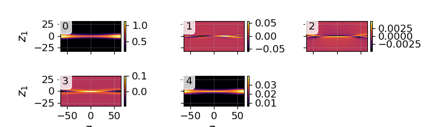
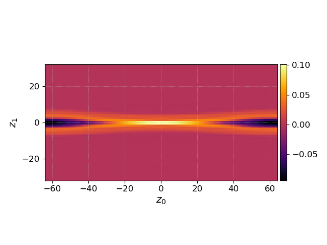

.. _qs_fluid1:

Fluid example
+++++++++++++

.. contents::

Physics model and initial conditions
------------------------------------

This simulation models 2d fast magnetic reconnection in a two-fluid
(electron-ion) plasma (see [Birn2001]_ for the classical paper on this
topic and [Wang2015]_ for our earlier application).
The electron and ion fluid spcies are evolved
using the five-moment model

.. math::

   \begin{aligned}
    & \frac{\partial\rho_{s}}{\partial t}+\nabla\cdot\left(\rho_{s}\mathbf{u}_{s}\right)=0,\\
    & \frac{\partial\left(\rho_{s}\mathbf{u}_{s}\right)}{\partial t}+\nabla p+\nabla\cdot\left(\rho_{s}\mathbf{u}_{s}\mathbf{u}_{s}\right)=n_{s}q_{s}\left(\mathbf{E}+\mathbf{u}_{s}\times\mathbf{B}\right),\\
    & \frac{\partial\mathcal{E}_{s}}{\partial t}+\nabla\cdot\left[\mathbf{u}_{s}\left(p_{s}+\mathcal{E}_{s}\right)\right]=n_{s}q_{s}\mathbf{u}_{s}\cdot\mathbf{E},\end{aligned}

where :math:`\rho_{s}`, :math:`\mathbf{u}_{s}`, :math:`p_{s}`, and
:math:`\mathcal{E}=\frac{3}{2}p_{s}+\frac{1}{2}\rho_{s}\mathbf{u}_{s}^{2}`
are the mass density, velocity, thermal pressure, and total energy of
the species :math:`s`. The electromagnetic fields are evolved and
coupled to the plasma species by the usual Maxwell’s equations

.. math::

   \begin{aligned}
    & \frac{1}{c^{2}}\frac{\partial\mathbf{E}}{\partial t}=\nabla\times\mathbf{B}-\mu_{0}\sum_{s}\mathbf{J}_{s},\\
    & \frac{\partial\mathbf{B}}{\partial t}=-\nabla\times\mathbf{E}.\end{aligned}

The algorithms are summarized in more detail in :ref:`app_moments`, as well as
in [Hakim2006]_, [Hakim2008]_, and [Wang2020]_.

The simulation input file is adapted from those used in our earlier work presented
in [Wang2015]_, though only a five-moment version is presented here.
We employ a 2D simulation domain that is periodic in :math:`x`
(:math:`-L_{x}/2<x<L_{x}/2`) and is bounded by conducting walls in
:math:`y` at :math:`y=\pm L_{y}/2`. Here :math:`L_{x}=100d_{i0}`,
:math:`L_{y}=50d_{i0}`, where
:math:`d_{i0}=\sqrt{m_{i}/\mu_{0}n_{0}\left|e\right|^{2}}` is the ion
inertia length due to :math:`n_{0}`. The initial equilibrium is a single
Harris sheet where magnetic field and number densities are specified by

.. math:: \mathbf{B}_{0}=B_{0}\tanh\left(y/\lambda_{B}\right)\hat{\mathbf{x}},

and

.. math:: n_{e}=n_{i}=n_{0}\text{sech}^{2}\left(y/\lambda_{B}\right)+n_{b},

respectively. The total current,
:math:`\mathbf{J}_{0}=\nabla\times\mathbf{B}_{0}/\mu_{0}`, is decomposed
according to :math:`J_{ze0}/J_{zi0}=T_{i0}/T_{e0}`, where the initial
temperatures :math:`T_{e0}` and :math:`T_{i0}` are constant. A sinusoid
perturbation is then applied on the magnetic field according to
:math:`\delta\mathbf{B}=\hat{\mathbf{z}}\times\nabla\psi`, where

.. math:: \psi=\delta\psi\cos\left(2\pi x/L_{x}\right)\cos\left(\pi y/L_{y}\right).

Input file
----------

.. literalinclude:: inputFiles/rt-5m-gem.lua
  :linenos:
  :language: lua

Running the simulation
----------------------

The input file :code:`rt-5m-gem.lua` can be run using the gkyl executable

.. code-block:: bash

  mpirun -n 4 ~/gkylsoft/gkyl/bin/gkyl inputFiles/rt-5m-gem.lua

assuming :code:`gkyl` has been installed in the user's home directory.
When running this simulation, a user should see the following output 

.. code-block:: bash

   Fri Sep 18 2020 15:53:11.000000000
   Gkyl built with e0fd133198bd+
   Gkyl built on Sep 11 2020 17:59:49
   Initializing PlasmaOnCartGrid simulation ...
   Using CFL number 1
   Initializing completed in 0.0723601 sec

   Starting main loop of PlasmaOnCartGrid simulation ...

    ** Time step too large! Aborting this step! ** Time step 1250 too large! Will retake with dt 1
    Step 0 at time 0. Time step 1. Completed 0%
   0123456789 Step   125 at time 125. Time step 1. Completed 10%
   0123456789 Step   250 at time 250. Time step 1. Completed 20%
   0123456789 Step   375 at time 375. Time step 1. Completed 30%
   0123

Postprocessing
--------------
The output of this simulation is the following set of files:

- Electron fluid moments: ``rt-5m-gem_elc_#.bp``.
- Ion fluid moments: ``rt-5m-gem_ion_#.bp``.
- Electromagnetic fields: ``rt-5m-gem_field_#.bp``.
- Field energy: ``rt-5m-gem_fieldEnergy.bp``.
- Diagnostic integrated moments: ``rt-5m-gem_elc_intMom.bp`` and ``rt-5m-gem_in_intMom.bp``.

Snapshots (frames) are labeled by the number ``#`` at the end of the file name, while integrated diagnostics that are computed as a time-series, such as the field energy, are written out as a single file.
Since :code:`nFrame=1` in the input file, the only frames that are output are ``0``, corresponding to the initial condition, and ``1``, corresponding to the end of the simulation.

Plotting all physical quantities in a frame
~~~~~~~~~~~~~~~~~~~~~~~~~~~~~~~~~~~~~~~~~~~

The following command plot all five moment term in the 5th electron output frame. Note that the five moment terms are ordered as :math:`\rho,\,\rho v_x\, \rho v_y, \rho v_z, \mathcal{E}`. 

.. code-block:: bash

  pgkyl rt-5m-gem_elc_5.bp plot --fix-aspect

   All five moment terms of the electron fluid. 

Plotting one physical quantity
~~~~~~~~~~~~~~~~~~~~~~~~~~~~~~

The following command plot the 3rd moment term in the 5th electron output frame., The 3rd moment is the out-of-plane momentum, which differs from the electron out-of-plane current by an coefficient :math:`q_e/m_e` . 

.. code-block:: bash

  pgkyl rt-5m-gem_elc_5.bp -c 3 plot --fix-aspect

   Out-of-plane electron current, :math:`\rho u_{e,z}`, in the 5th (last) output frame.

Plotting integrated quantities over time
~~~~~~~~~~~~~~~~~~~~~~~~~~~~~~~~~~~~~~~~
Finally, since we performed this simulation at two different resolutions, and interesting diagnostic to look at is a comparison of integrated quantities between the two simulations.
For ease of plotting we have moved the data from the two simulations to two different folders, :code:`res1` (:math:`16^2 \times 16^2`) and :code:`res2` (:math:`32^2 \times 32^2`).
Here, we are being agnostic on what a user might have named these two different simulations and labeling them ourselves with postgkyl.

.. code-block:: bash

  pgkyl rt-5m-gem_fieldEnergy.bp select -c 5 plot --logy

.. figure:: figures/rt-5m-gem_fieldEnergy.png
  :scale: 60 %
  :align: center

  Integrated magnetic field energy, :math:`|B_z|^2`, plotted as a function of time.

References
----------

.. [Hakim2006] Hakim, A., Loverich, J., & Shumlak, U. (2006). A high resolution wave propagation scheme for ideal Two-Fluid plasma equations. Journal of Computational Physics, 219, 418–442. https://doi.org/10.1016/j.jcp.2006.03.036

.. [Hakim2008] Hakim, A. H. (2008). Extended MHD modeling with the ten-moment equations. Journal of Fusion Energy, 27, 36–43. https://doi.org/10.1007/s10894-007-9116-z

.. [Wang2020] Wang, L., Hakim, A. H., Ng, J., Dong, C., & Germaschewski, K. (2020). Exact and locally implicit source term solvers for multifluid-Maxwell systems. Journal of Computational Physics. https://doi.org/10.1016/j.jcp.2020.109510

.. [Birn2001] Birn, L., et al. (2001). Geospace Environmental Modeling ({GEM}) magnetic reconnection challenge. Journal of Geophysical Research, 106, 3715.

.. [Wang2015] Wang, L., Hakim, A. H. A. H., Bhattacharjee, A., & Germaschewski, K. (2015). Comparison of multi-fluid moment models with particle-in-cell simulations of collisionless magnetic reconnection. Physics of Plasmas, 22(1), 012108. https://doi.org/10.1063/1.4906063
