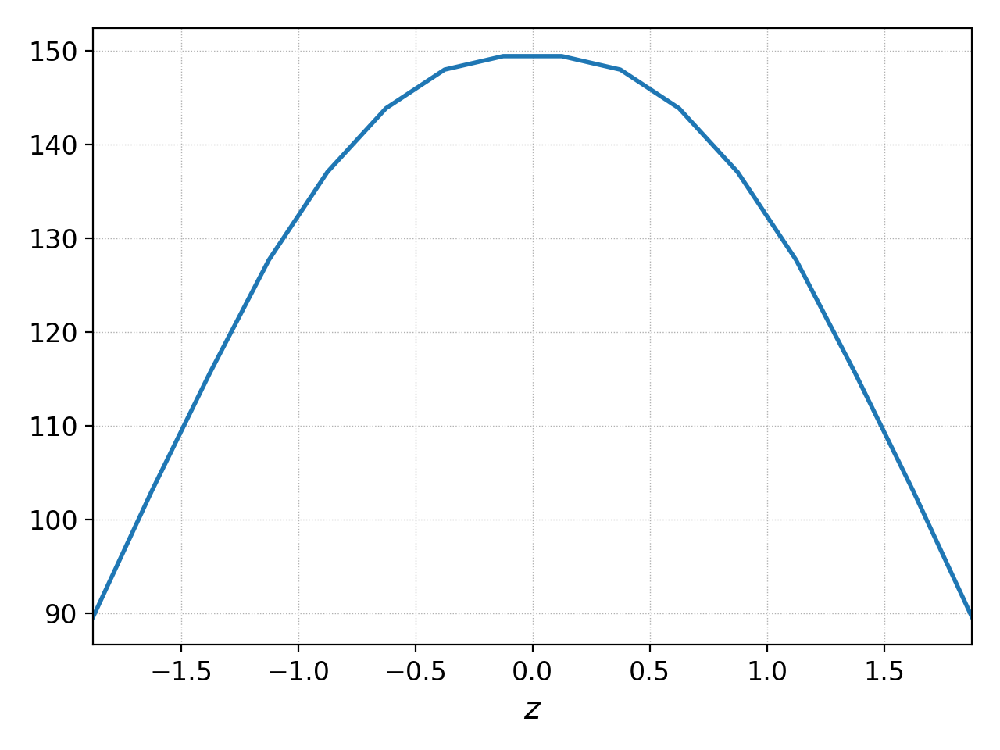
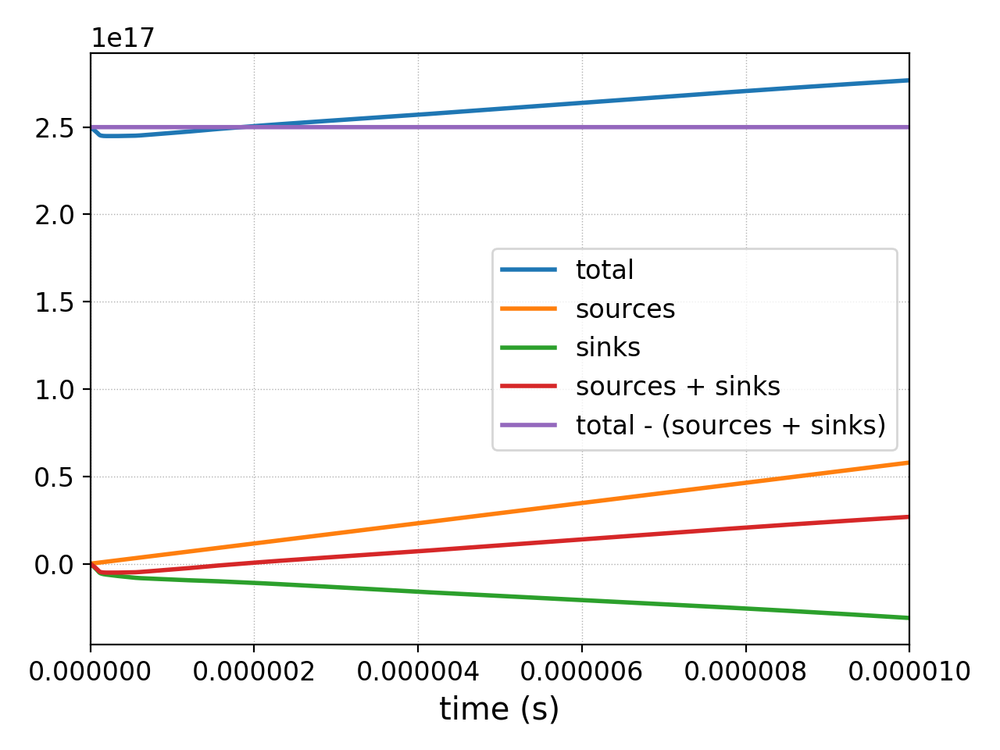

.. highlight:: lua

.. _qs_gk1:

Gyrokinetic example
+++++++++++++++++++

The gyrokinetic system is used to study turbulence in magnetized plasmas.
Gkeyll's :ref:`Gyrokinetic App <app_gk>` is specialized to study the
edge/scrape-off-layer region of fusion devices, which requires
handling of large fluctuations and open-field-line regions.
In this example, we will set up a gyrokinetic problem on open magnetic
field lines (e.g. in the tokamak scrape-off layer). Using specialized
boundary conditions along the field line that model the sheath interaction
between the plasma and conducting end plates, we will see that we can model
the self-consistent formation of the sheath potential. This simple test
case can then be used as a starting point for full nonlinear simulations of
the tokamak SOL.

.. contents::

Background
----------

Gyrokinetics intro?

Input file
----------

The full Lua input file (:doc:`gk-sheath.lua <inputFiles/gk-sheath>`) for
this simulation is a bit longer than the one in :ref:`qs_intro`, but not 
to worry, we will go through each part of the input file carefully.

To set up a gyrokinetic simulation, we first need to load the
``Gyrokinetic`` App package and other dependencies. This should be done
at the top of the input file, via

.. code-block:: lua

  --------------------------------------------------------------------------------
  -- App dependencies
  --------------------------------------------------------------------------------
  local Plasma    = require("App.PlasmaOnCartGrid").Gyrokinetic()   -- load the Gyrokinetic App
  local Constants = require "Lib.Constants"                         -- load some physical Constants

Here we have also loaded the ``Constants`` library, which
contains various physical constants that we will use later.

The next block is the **Preamble**, containing input paramters and simple
derived quantities:

.. code-block:: lua

  --------------------------------------------------------------------------------
  -- Preamble
  --------------------------------------------------------------------------------
  -- Universal constant parameters.
  eps0 = Constants.EPSILON0
  eV = Constants.ELEMENTARY_CHARGE
  qe = -eV                             -- electron charge
  qi = eV                              -- ion charge
  me = Constants.ELECTRON_MASS         -- electron mass
  mi = 2.014*Constants.PROTON_MASS     -- ion mass (deuterium ions)
  
  -- Plasma parameters.
  Te0 = 40*eV                          -- reference electron temperature, used to set up electron velocity grid [eV]
  Ti0 = 40*eV                          -- reference ion temperature, used to set up ion velocity grid [eV]
  n0 = 7e18                            -- reference density [1/m^3]
  
  -- Geometry and magnetic field parameters.
  B_axis = 0.5                         -- magnetic field strength at magnetic axis [T]
  R0 = 0.85                            -- device major radius [m]
  a0 = 0.15                            -- device minor radius [m]
  R = R0 + a0                          -- major radius of flux tube simulation domain [m]
  B0 = B_axis*(R0/R)                   -- magnetic field strength at R [T]
  Lpol = 2.4                           -- device poloidal length (e.g. from bottom divertor plate to top) [m]
  
  -- Parameters for collisions.
  nuFrac = 0.1                         -- use a reduced collision frequency (10% of physical)
  -- Electron collision freq.
  logLambdaElc = 6.6 - 0.5*math.log(n0/1e20) + 1.5*math.log(Te0/eV)
  nuElc = nuFrac*logLambdaElc*eV^4*n0/(6*math.sqrt(2)*math.pi^(3/2)*eps0^2*math.sqrt(me)*(Te0)^(3/2))
  -- Ion collision freq.
  logLambdaIon = 6.6 - 0.5*math.log(n0/1e20) + 1.5*math.log(Ti0/eV)
  nuIon = nuFrac*logLambdaIon*eV^4*n0/(12*math.pi^(3/2)*eps0^2*math.sqrt(mi)*(Ti0)^(3/2))
  
  -- Derived parameters
  vti = math.sqrt(Ti0/mi)              -- ion thermal speed
  vte = math.sqrt(Te0/me)              -- electron thermal speed
  c_s = math.sqrt(Te0/mi)              -- ion sound speed
  omega_ci = math.abs(qi*B0/mi)        -- ion gyrofrequency
  rho_s = c_s/omega_ci                 -- ion sound gyroradius
  
  -- Simulation box size
  Lx = 50*rho_s                        -- x = radial direction
  Ly = 100*rho_s                       -- y = binormal direction
  Lz = 4                               -- z = field-aligned direction

This simulation also requires a source, which models plasma crossing the
separatrix. The next part of the **Preamble** initializes some source parameters,
along with some functions that will be used later to set up the source density
and temperature profiles.

.. code-block:: lua

  -- Source parameters
  P_SOL = 3.4e6                          -- total SOL power, from experimental heating power [W]
  P_src = P_SOL*Ly*Lz/(2*math.pi*R*Lpol) -- fraction of total SOL power into flux tube domain [W]
  xSource = R                            -- source peak radial location [m]
  lambdaSource = 0.005                   -- source radial width [m]

  -- Source density and temperature profiles. 
  -- Note that source density will be scaled to achieve desired source power.
  sourceDensity = function (t, xn)
     local x, y, z = xn[1], xn[2], xn[3]
     local sourceFloor = 1e-10
     if math.abs(z) < Lz/4 then
        -- near the midplane, the density source is a Gaussian
        return math.max(math.exp(-(x-xSource)^2/(2*lambdaSource)^2), sourceFloor)
     else
        return 1e-40
     end
  end
  sourceTemperature = function (t, xn)
     local x, y, z = xn[1], xn[2], xn[3]
     if math.abs(x-xSource) < 3*lambdaSource then
        return 80*eV
     else
        return 30*eV
     end
  end

This concludes the **Preamble**. We now have everything we need to initialize
the ``Gyrokinetic`` App. In this input file, the App initialization consists
of 4 sections:

.. code-block:: lua

  --------------------------------------------------------------------------------
  -- App initialization
  --------------------------------------------------------------------------------
  plasmaApp = Plasma.App {
     -----------------------------------------------------------------------------
     -- Common
     -----------------------------------------------------------------------------
     ...

     -----------------------------------------------------------------------------
     -- Species
     -----------------------------------------------------------------------------
     ...

     -----------------------------------------------------------------------------
     -- Fields
     -----------------------------------------------------------------------------
     ...

     -----------------------------------------------------------------------------
     -- Geometry
     -----------------------------------------------------------------------------
     ...
  }
  
- The **Common** section includes a declaration of parameters that control the
(configuration space) discretization, and time advancement. This first block of
code in :code:`Plasma.App` may specify the periodic directions, the MPI
decomposition, and the frequency with which to output certain diagnostics.

.. code-block:: lua

     -----------------------------------------------------------------------------
     -- Common
     -----------------------------------------------------------------------------
     logToFile = true,                    -- will write simulation output log to gk-sheath_0.log
     tEnd = 10e-6,                        -- simulation end time [s]
     nFrame = 10,                          -- number of output frames for diagnostics
     lower = {R - Lx/2, -Ly/2, -Lz/2},    -- configuration space domain lower bounds, {x_min, y_min, z_min} 
     upper = {R + Lx/2, Ly/2, Lz/2},      -- configuration space domain upper bounds, {x_max, y_max, z_max}
     cells = {4, 1, 8},                   -- number of configuration space cells, {nx, ny, nz}
     basis = "serendipity",               -- basis type (only "serendipity" is supported for gyrokinetics)
     polyOrder = 1,                       -- polynomial order of basis set (polyOrder = 1 fully supported for gyrokinetics, polyOrder = 2 marginally supported)
     timeStepper = "rk3",                 -- timestepping algorithm 
     cflFrac = 0.4,                       -- fractional modifier for timestep calculation via CFL condition
     restartFrameEvery = .2,              -- restart files will be written after every 20% of simulation

     -- Specification of periodic directions 
     -- (1-based indexing, so x-periodic = 1, y-periodic = 2, etc)
     periodicDirs = {2},     -- Periodic in y only (y = 2nd dimension)

- The **Species** section sets up the species to be considered in the simulation.
Each species gets its own Lua table, in which one provides the velocity-space domain
and discretization of the species, initial conditions, sources, collisions, boundary
conditions, and diagnostics.

In this input file, we initialize gyrokinetic electron and ion species. Since this
section is the most involved part of the input file, we will discuss various parts
in detail below.

.. code-block:: lua

   --------------------------------------------------------------------------------
   -- Species
   --------------------------------------------------------------------------------
   -- Gyrokinetic electrons
   electron = Plasma.Species {
      evolve = true,     -- evolve species?
      charge = qe,       -- species charge
      mass = me,         -- species mass

      -- Species-specific velocity domain
      lower = {-4*vte, 0},                    -- velocity space domain lower bounds, {vpar_min, mu_min}
      upper = {4*vte, 12*me*vte^2/(2*B0)},    -- velocity space domain upper bounds, {vpar_max, mu_max}
      cells = {8, 4},                         -- number of velocity space cells, {nvpar, nmu}

      -- Initial conditions
      init = Plasma.MaxwellianProjection {    -- initialize a Maxwellian with the specified density and temperature profiles
         -- density profile
         density = function (t, xn)
            -- The particular functional form of the initial density profile 
            -- comes from a 1D single-fluid analysis (see Shi thesis), which derives
            -- quasi-steady-state initial profiles from the source parameters.
            local x, y, z, vpar, mu = xn[1], xn[2], xn[3], xn[4], xn[5]
            local Ls = Lz/4
            local floor = 0.1
            local effectiveSource = math.max(sourceDensity(t,{x,y,0}), floor)
            local c_ss = math.sqrt(5/3*sourceTemperature(t,{x,y,0})/mi)
            local nPeak = 4*math.sqrt(5)/3/c_ss*Ls*effectiveSource/2
            local perturb = 0 
            if math.abs(z) <= Ls then
               return nPeak*(1+math.sqrt(1-(z/Ls)^2))/2*(1+perturb)
            else
               return nPeak/2*(1+perturb)
            end
         end,
         -- temperature profile
         temperature = function (t, xn)
            local x = xn[1]
            if math.abs(x-xSource) < 3*lambdaSource then
               return 50*eV
            else 
               return 20*eV
            end
         end,
         scaleWithSourcePower = true,     -- when source is scaled to achieve desired power, scale initial density by same factor
      },

      -- Collisions parameters
      coll = Plasma.LBOCollisions {          -- Lenard-Bernstein model collision operator
         collideWith = {'electron'},         -- only include self-collisions with electrons
         frequencies = {nuElc},              -- use a constant (in space and time) collision freq. (calculated in Preamble)
      },

      -- Source parameters
      source = Plasma.Source {       -- source is a Maxwellian with the specified density and temperature profiles
         density = sourceDensity,           -- use sourceDensity function (defined in Preamble) for density profile
         temperature = sourceTemperature,   -- use sourceTemperature function (defined in Preamble) for temperature profile
         power = P_src/2,                   -- sourceDensity will be scaled to achieve desired power
         diagnostics = {"intKE"},
      },

      -- Non-periodic boundary condition specification
      bcx = {Plasma.ZeroFluxBC{diagnostics={"M0", "Upar", "Energy", "intM0", "intM1", "intKE", "intEnergy"}},
             Plasma.ZeroFluxBC{diagnostics={"M0", "Upar", "Energy", "intM0", "intM1", "intKE", "intEnergy"}}},   -- use zero-flux boundary condition in x direction
      bcz = {Plasma.SheathBC{diagnostics={"M0", "Upar", "Energy", "intM0", "intM1", "intKE", "intEnergy"}},
             Plasma.SheathBC{diagnostics={"M0", "Upar", "Energy", "intM0", "intM1", "intKE", "intEnergy"}}},       -- use sheath-model boundary condition in z direction

      -- Diagnostics
      diagnostics = {"M0", "Upar", "Temp", "intM0", "intM1", "intKE", "intEnergy"},
   },

   -- Gyrokinetic ions
   ion = Plasma.Species {
      evolve = true,     -- evolve species?
      charge = qi,       -- species charge
      mass = mi,         -- species mass

      -- Species-specific velocity domain
      lower = {-4*vti, 0},                    -- velocity space domain lower bounds, {vpar_min, mu_min}
      upper = {4*vti, 12*mi*vti^2/(2*B0)},    -- velocity space domain upper bounds, {vpar_max, mu_max}
      cells = {8, 4},                         -- number of velocity space cells, {nvpar, nmu}

      -- Initial conditions
      init = Plasma.MaxwellianProjection {    -- initialize a Maxwellian with the specified density and temperature profiles
         -- density profile
         density = function (t, xn)
            -- The particular functional form of the initial density profile 
            -- comes from a 1D single-fluid analysis (see Shi thesis), which derives
            -- quasi-steady-state initial profiles from the source parameters.
            local x, y, z, vpar, mu = xn[1], xn[2], xn[3], xn[4], xn[5]
            local Ls = Lz/4
            local floor = 0.1
            local effectiveSource = math.max(sourceDensity(t,{x,y,0}), floor)
            local c_ss = math.sqrt(5/3*sourceTemperature(t,{x,y,0})/mi)
            local nPeak = 4*math.sqrt(5)/3/c_ss*Ls*effectiveSource/2
            local perturb = 0 
            if math.abs(z) <= Ls then
               return nPeak*(1+math.sqrt(1-(z/Ls)^2))/2*(1+perturb)
            else
               return nPeak/2*(1+perturb)
            end
         end,
         -- temperature profile
         temperature = function (t, xn)
            local x = xn[1]
            if math.abs(x-xSource) < 3*lambdaSource then
               return 50*eV
            else 
               return 20*eV
            end
         end,
         scaleWithSourcePower = true,     -- when source is scaled to achieve desired power, scale initial density by same factor
      },

      -- Collisions parameters
      coll = Plasma.LBOCollisions {     -- Lenard-Bernstein model collision operator
         collideWith = {'ion'},         -- only include self-collisions with ions
         frequencies = {nuIon},         -- use a constant (in space and time) collision freq. (calculated in Preamble)
      },

      -- Source parameters
      source = Plasma.Source {       -- source is a Maxwellian with the specified density and temperature profiles
         density = sourceDensity,           -- use sourceDensity function (defined in Preamble) for density profile
         temperature = sourceTemperature,   -- use sourceTemperature function (defined in Preamble) for temperature profile
         power = P_src/2,                   -- sourceDensity will be scaled to achieve desired power
         diagnostics = {"intKE"},
      },

      -- Non-periodic boundary condition specification
      bcx = {Plasma.ZeroFluxBC{diagnostics={"M0", "Upar", "Energy", "intM0", "intM1", "intKE", "intEnergy"}},
             Plasma.ZeroFluxBC{diagnostics={"M0", "Upar", "Energy", "intM0", "intM1", "intKE", "intEnergy"}}},   -- use zero-flux boundary condition in x direction
      bcz = {Plasma.SheathBC{diagnostics={"M0", "Upar", "Energy", "intM0", "intM1", "intKE", "intEnergy"}},
             Plasma.SheathBC{diagnostics={"M0", "Upar", "Energy", "intM0", "intM1", "intKE", "intEnergy"}}},       -- use sheath-model boundary condition in z direction

      -- Diagnostics
      diagnostics = {"M0", "Upar", "Temp", "intM0", "intM1", "intKE", "intEnergy"},
   },

This simulation also requires a source, which models plasma crossing the
separatrix. The next part of the **Preamble** initializes some source parameters,
along with some functions that will be used later to set up the source density
and temperature profiles.

.. code-block:: lua

  -- Source parameters
  P_SOL = 3.4e6                          -- total SOL power, from experimental heating power [W]
  P_src = P_SOL*Ly*Lz/(2*math.pi*R*Lpol) -- fraction of total SOL power into flux tube domain [W]
  xSource = R                            -- source peak radial location [m]
  lambdaSource = 0.005                   -- source radial width [m]

  -- Source density and temperature profiles. 
  -- Note that source density will be scaled to achieve desired source power.
  sourceDensity = function (t, xn)
     local x, y, z = xn[1], xn[2], xn[3]
     local sourceFloor = 1e-10
     if math.abs(z) < Lz/4 then
        -- near the midplane, the density source is a Gaussian
        return math.max(math.exp(-(x-xSource)^2/(2*lambdaSource)^2), sourceFloor)
     else
        return 1e-40
     end
  end
  sourceTemperature = function (t, xn)
     local x, y, z = xn[1], xn[2], xn[3]
     if math.abs(x-xSource) < 3*lambdaSource then
        return 80*eV
     else
        return 30*eV
     end
  end

This concludes the **Preamble**. We now have everything we need to initialize
the ``Gyrokinetic`` App. In this input file, the App initialization consists
of 4 sections:

.. code-block:: lua

  --------------------------------------------------------------------------------
  -- App initialization
  --------------------------------------------------------------------------------
  plasmaApp = Plasma.App {
     -----------------------------------------------------------------------------
     -- Common
     -----------------------------------------------------------------------------
     ...

     -----------------------------------------------------------------------------
     -- Species
     -----------------------------------------------------------------------------
     ...
              scaleWithSourcePower = true,     -- when source is scaled to achieve desired power, scale initial density by same factor
      },

      -- Collisions parameters
      coll = Plasma.LBOCollisions {     -- Lenard-Bernstein model collision operator
         collideWith = {'ion'},         -- only include self-collisions with ions
         frequencies = {nuIon},         -- use a constant (in space and time) collision freq. (calculated in Preamble)
      },

      -- Source parameters
      source = Plasma.MaxwellianProjection {       -- source is a Maxwellian with the specified density and temperature profiles
         isSource = true,                   -- designate as source
         density = sourceDensity,           -- use sourceDensity function (defined in Preamble) for density profile
         temperature = sourceTemperature,   -- use sourceTemperature function (defined in Preamble) for temperature profile
         power = P_src/2,                   -- sourceDensity will be scaled to achieve desired power
      },

      -- Non-periodic boundary condition specification
      bcx = {Plasma.ZeroFluxBC{diagnostics={"M0", "Upar", "Energy", "intM0", "intM1", "intKE", "intEnergy"}},
             Plasma.ZeroFluxBC{diagnostics={"M0", "Upar", "Energy", "intM0", "intM1", "intKE", "intEnergy"}}},   -- use zero-flux boundary condition in x direction
      bcz = {Plasma.SheathBC{diagnostics={"M0", "Upar", "Energy", "intM0", "intM1", "intKE", "intEnergy"}},
             Plasma.SheathBC{diagnostics={"M0", "Upar", "Energy", "intM0", "intM1", "intKE", "intEnergy"}}},       -- use sheath-model boundary condition in z direction

      -- Diagnostics
      diagnostics = {"M0", "Upar", "Temp", "intM0", "intM1", "intKE", "intEnergy"},
   },

The initial condition for this problem is given by a Maxwellian. This
is specified using ``init = Plasma.MaxwellianProjection { ... }``,
which is a table with entries for the density and temperature profile
functions (we could also specify the driftSpeed profile) to be used
to initialze the Maxwellian. In this simulation, the initial density
profile takes a particular form that comes from a 1D single-fluid
analysis (see [Shi2019]_), which derives quasi-steady-state initial
profiles from the source parameters.

By default the sources, specified via
``source = Plasma.Source { ... }``, also take the form of Maxwellians. 
For the density and temperature profile functions, we use the
``sourceDensity`` and ``sourceTemperature`` functions defined in the
Preamble. We also specify the desired source power. The source density
is then scaled so that the integrated power in the source matches the
desired power. Therefore, sourceDensity only controls the shape of the
source density profile, not the amplitude. Since the initial conditions
are related to the source, we also scale the initial species density
by the same factor as the source via the ``scaleWithSourcePower = true``
flag in the initial conditions.

Self-species collisions are included using a Lenard-Bernstein model
collision operator via the ``coll = Plasma.LBOCollisions { ... }`` table.
For more details about collision models and options, see
:ref:`Collisions <app_coll>`.

Non-periodic boundary conditions are specified via the ``bcx`` and ``bcz``
tables. For this simulation, we use zero-flux boundary conditions in the
:math:`x` (radial) direction, and sheath-model boundary conditions in the
:math:`z` (field-aligned) direction.

Finally, we specify the diagnostics that should be outputted for each
species. These consist of various moments and integrated quantities. For
more details about available diagnostics, see :ref:`app_gk`.

- The **Fields** section specifies parameters and options related to the
field solvers for the gyrokinetic potential(s). 

.. code-block:: lua

   --------------------------------------------------------------------------------
   -- Fields
   --------------------------------------------------------------------------------
   -- Gyrokinetic field(s)
   field = Plasma.Field {
      evolve = true, -- Evolve fields?
      isElectromagnetic = false,  -- use electromagnetic GK by including magnetic vector potential A_parallel? 

      -- Non-periodic boundary condition specification for electrostatic potential phi
      -- Dirichlet in x.
      phiBcLeft = { T ="D", V = 0.0},
      phiBcRight = { T ="D", V = 0.0},
      -- Periodic in y. --
      -- No BC required in z (Poisson solve is only in perpendicular x,y directions)
   },

- The **Geometry** section specifies parameters related to the
background magnetic field and other geometry parameters.

.. code-block:: lua

   --------------------------------------------------------------------------------
   -- Geometry
   --------------------------------------------------------------------------------
   -- Magnetic geometry
   funcField = Plasma.Geometry {
      -- Background magnetic field profile
      -- Simple helical (i.e. cylindrical slab) geometry is assumed
      bmag = function (t, xn)
         local x = xn[1]
         return B0*R/x
      end,

quantity is controlled by the ``nFrame`` parameter in the input file.

We can use the Gkeyll post-processing tool (:ref:`postgkyl <pg_main>`) to visualize
the outputs.

Electron density and distribution function
^^^^^^^^^^^^^^^^^^^^^^^^^^^^^^^^^^^^^^^^^^

First, let's examine the initial conditions, which are given in output file
sending in ``_0.bp``. The initial electron density :math:`n_e(x,y,z)` is
found in ``gk-sheath_electron_M0_0.bp``, where ``M0`` is the label for
the density moment. Let's look at this file as a function of the :math:`x`
and :math:`z` coordintes by taking a line-out at :math:`y=0` via

.. code-block:: bash

   pgkyl gk-sheath_electron_M0_0.bp interp sel --z1 0. pl -x '$x$' -y '$z$'

where we have used the ``interp`` (:ref:`interpolate <pg_cmd_interpolate>`)
command to interpolate the DG data onto the grid, and the ``sel --z1 0.``
(:ref:`select <pg_cmd_select>`) command to make the line-out at :math:`y=0`
(``--z1`` refers to the :math:`y` coordinate here). The resulting plot looks like

.. figure:: figures/gk-sheath_electron_M0_0.png
   :scale: 40 %
   :align: center

   Initial electron density :math:`n_e(x,y=0,z,t=0)`

We ran this simulation for 10 :math:`\mu\text{s}`, and since ``nframe=10``
we have an output frame for each :math:`\mu\text{s}` of the simulation.
Let's look at the final state now, at :math:`t=10\mu\text{s}`. 

.. code-block:: bash

   pgkyl gk-sheath_electron_M0_10.bp interp sel --z1 0. pl -x '$x$' -y '$z$'

gives

.. figure:: figures/gk-sheath_electron_M0_10.png
   :scale: 40 %
   :align: center

   Electron density :math:`n_e(x,y=0,z,t=10\mu\text{s})`

Seeing as we have run a kinetic calculation, we may wish to examine the velocity-space
structure of the distribution function. From postgkyl's point of view distribution
functions are just another dataset, albeit a higher dimensional one. Since we
can only produce 1D and 2D plots at the moment we have to select at least 3 of
the 5 coordinates at specific values. We will make a 2D plot of velocity-space
at `t=0` by selecting `(x,y,z)=(1.,0,0)`, which is near the center of the domain,
with the following command:

.. code-block:: bash

   pgkyl gk-sheath_electron_0.bp interp sel --z0 1. --z1 0. --z2 0. pl -x '$v_\parallel$' -y '$\mu$' --clabel '$f_e(x=1,y=0,z=0,v_\parallel,\mu,t=0)$'

.. figure:: figures/gk-sheath_elc_z0eq1_z12eq0_0.png
   :scale: 40 %
   :align: center

This plot shows that the initial :math:`f_e` is Maxwellian. In this example the
distribution remains essentially Maxwellian throughout time, so if we were to plot
the last frame we would obtain a similar picture.

Sheath potential
^^^^^^^^^^^^^^^^

Now let's look at the electrostatic potential, :math:`\phi`. We'd like to
see if the sheath potential formed self-consistently due to our
conducting-sheath boundary conditions. Let's look at :math:`\phi` along
the field line (i.e. along the :math:`z` coordinate) by taking line-outs
at :math:`x=1.0` and :math:`y=0`.

.. code-block:: bash

  pgkyl gk-sheath_phi_10.bp interp sel --z0 1. --z1 0. pl -x '$z$'

gives

  Electrostatic potential :math:`\phi(x=1,y=0,z,t=10\mu\text{s})`

Indeed, at the domain ends in :math:`z`, we have a sheath potential
:math:`\phi_{sh} = 90 \text{ V}`. 

We can also make an animation of the evolution of the sheath potential via

.. code-block:: bash

  pgkyl "gk-sheath_phi_[0-9]*.bp" interp sel --z0 1. --z1 0. anim -x '$z$'

.. raw:: html

  

  <video controls height="300" width="450" loop autoplay muted>
    <source src="../_static/gk-sheath_phi_z.mp4" type="video/mp4">
  </video>
  

Particle balance
^^^^^^^^^^^^^^^^
.. _qs_gk1_balance:

We can examine particle balance between the sources and sinks (from end losses
to the wall via the sheath) by looking at the ``electron_intM0.bp`` (integrated
electron density) file and other related files. By using the ``ev``
(:ref:`evaluate <pg_cmd_ev>`) command, we can combine various quantities. ``ev``
is extremely useful and flexible, but it can lead to some complicated ``pgkyl``
commands. For this plot, the full command that we'll use is

.. code-block:: bash

  pgkyl gk-sheath_electron_intM0.bp -l 'total' gk-sheath_electron_source_intM0.bp -l 'sources' \
    gk-sheath_electron_bcZlower_flux_intM0.bp gk-sheath_electron_bcZupper_flux_intM0.bp \
    ev -g -l 'sinks' 'f[2] f[3] + -1 *' ev -g -l 'sources + sinks' 'f[1] f[-1] +' \
    ev -g -l 'total - (sources + sinks)' 'f[0] f[-1] -' activate -i0,1,-3,-2,-1 plot -x 'time (s)' -f0

.. note::

  The above ``pgkyl`` command could use tags instead of dataset indices as follows:
  ::
    pgkyl gk-sheath_electron_intM0.bp -l 'total' -t tot gk-sheath_electron_source_intM0.bp -l 'sources' -t src \
     gk-sheath_electron_bcZlower_flux_intM0.bp -t fluxL gk-sheath_electron_bcZupper_flux_intM0.bp -t fluxU \
     ev -g -l 'sinks' -t sinks 'fluxL fluxU + -1 *' ev -g -l 'sources + sinks' -t srcPsinks 'src sinks +' \
     ev -g -l 'total - (source + sinks)' -t bal 'tot srcPsinks -' activate -t tot,src,sinks,srcPsinks,bal pl -f0

Let's break this command down a bit. We first load all the data files that we need: 

.. code-block:: bash
   
  pgkyl gk-sheath_electron_intM0.bp -l 'total' gk-sheath_electron_source_intM0.bp -l 'sources' \
    gk-sheath_electron_bcZlower_flux_intM0.bp gk-sheath_electron_bcZupper_flux_intM0.bp \

Here ``gk-sheath_electron_intM0.bp`` is the (total) integrated electron density,
``gk-sheath_electron_source_intM0.bp`` is the integrated electron source density,
``gk-sheath_electron_bcZlower_flux_intM0.bp`` is the integrated particle flux to
the lower divertor plate, and ``gk-sheath_electron_bcZupper_flux_intM0.bp`` is the
integrated particle flux to the upper plate. We've used the ``-l`` flag to label
the first two of these as ``'total'`` and ``'sources'``.

Next, we use the ``ev`` command to sum the fluxes and change the sign so that
the result is negative:

.. code-block:: bash

  ev -g -l 'sinks' 'f[2] f[3] + -1 *'  

Here, ``f2`` refers to the 3rd loaded file (active dataset 2, with 0-based indexing)
and ``f3`` the 4th loaded file (active dataset 3); these are the two ``_flux_`` files.
The ``ev`` command uses `reverse Polish notation
<https://en.wikipedia.org/wiki/Reverse_Polish_notation>`_, so that this command
translates to ``-(f2 + f3)``. This creates a new dataset at the end of the stack,
which can be indexed as dataset -1. We label this dataset as ``'sinks'``.

Next, we want to sum the sources and the sinks. To do this, we sum
the ``'source'`` dataset (dataset 1 from the original loading) and the
``'sinks'`` dataset (dataset -1, which we just created with ``ev``), via

.. code-block:: bash

  ev -g -l 'sources + sinks' 'f[1] f[-1] +'

This pushes another, new dataset to the stack, which we label as
``'sources and sinks'``. This becomes dataset -1 and pushes the
``'sinks'`` dataset back to dataset -2. Next, we use ``ev`` to
compute the difference between the ``'total'`` dataset (dataset 0)
and the ``'sources + sinks'`` dataset (dataset -1), via

.. code-block:: bash

  ev -g -l 'total - (sources + sinks)' 'f[0] f[-1] -'

Again, this pushes another dataset to the stack, which we label as
``'total - (sources + sinks)'``. Now we have computed everything we
need. We just need to activate all the datasets we would like to plot,
and plot them. We do this with

.. code-block:: bash

  activate -i0,1,-3,-2,-1 pl -x 'time (s)' -f0

with the ``-f0`` flag to put all the lines on the same figure. The
end result is

   Electron particle balance

The flat purple line shows that electron density is conserved after
accounting for sources and sinks.

.. Energy balance
.. ^^^^^^^^^^^^^^
.. 
.. .. code-block:: bash
.. 
..  pgkyl 'gk-sheath_electron_intKE.bp' -l 'electron kinetic' 'gk-sheath_ion_intKE.bp' \
..    -l 'ion kinetic' 'gk-sheath_esEnergy.bp' -l 'ES field' 'gk-sheath_electron_source_intKE.bp' \
..    -l 'electron source' 'gk-sheath_ion_source_intKE.bp' -l 'ion source' \
..    'gk-sheath_electron_bcZlower_flux_intEnergy.bp' 'gk-sheath_electron_bcZupper_flux_intEnergy.bp' \
..    'gk-sheath_ion_bcZlower_flux_intEnergy.bp' 'gk-sheath_ion_bcZupper_flux_intEnergy.bp' dataset -i5,6 \
..    ev -l 'electron sink' 'f[5] f[6] + -1 *' ev -l 'ion sink' 'f[7] f[8] + -1 *' ev \
..    -l 'electron source + sink' 'f[3] f[-2] +' ev -l 'ion source + sink' 'f[4] f[-2] +' \
..    ev -l 'total kinetic + ES field - (sources + sinks)' 'f[0] f[1] + f[2] + f[-2] - f[-1] -' \
..    activate -i0,1,2,-3,-2,-1 pl -f0 --ylim -1,9
 

Divertor Fluxes
^^^^^^^^^^^^^^^

.. code-block:: bash

  pgkyl gk-sheath_ion_bcZlower_flux_M0_10.bp interp ev 'f[0] 1,2 avg' pl -x '$x$'

Here we use ``ev`` to average in the :math:`y` and :math:`z` direction
(for boundary fluxes, an average in the boundary direction is always
required). This results in

.. figure:: figures/gk-sheath_ion_M0FluxZlower_10.png
  :scale: 40 %
  :align: center

  Ion particle flux to lower divertor at t=10 :math:`\mu\text{s}`

The ion energy (heat) flux profile can similarly be plotted via

.. code-block:: bash

  pgkyl gk-sheath_ion_bcZlower_flux_Energy_10.bp interp ev 'f[0] 1,2 avg' pl -x '$x$'

.. figure:: figures/gk-sheath_ion_GkEnergyFluxZlower_10.png
  :scale: 40 %
  :align: center

  Ion heat flux to lower divertor at t=10 :math:`\mu\text{s}`

Suppose instead of the instantaneous flux, we want the time-averaged
flux over some period of time, perhaps from 5-10 :math:`\mu\text{s}`.
To compute this, we can use

.. code-block:: bash

  pgkyl "gk-sheath_ion_bcZlower_flux_Energy_*.bp" interp collect \
    sel --z0 5:10 ev 'f[0] 0,2,3 avg' pl -x '$x$'

This uses the :ref:`collect <pg_cmd_collect>` command to aggregate the
frames into a time dimension, which becomes coordinate 0. We then use
``sel --z0 5:10`` to select frames 5-10. Then we use ``ev 'f[-1] 0,2,3 avg'``
to average the data in the 0th (time), 2nd (:math:`y`), and 3rd (:math:`z`)
dimensions. This gives

.. figure:: figures/gk-sheath_ion_GkEnergyFluxZlower_timeavg.png
  :scale: 40 %
  :align: center

  Time-averaged ion heat flux to lower divertor (t= 5-10 :math:`\mu\text{s}`)

References
----------

.. [Shi2019] Shi, E. L., Hammett, G. W., Stoltzfus-Dueck, T., & Hakim,
  A. (2019). "Full-f gyrokinetic simulation of turbulence in a helical
  open-field-line plasma", *Physics of Plasmas*, **26**,
  012307. https://doi.org/10.1063/1.5074179

