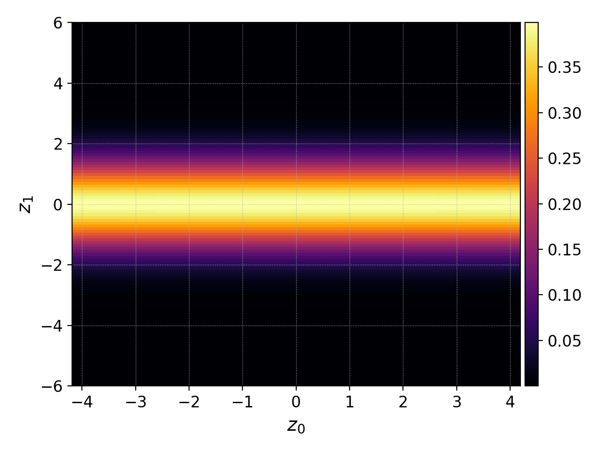
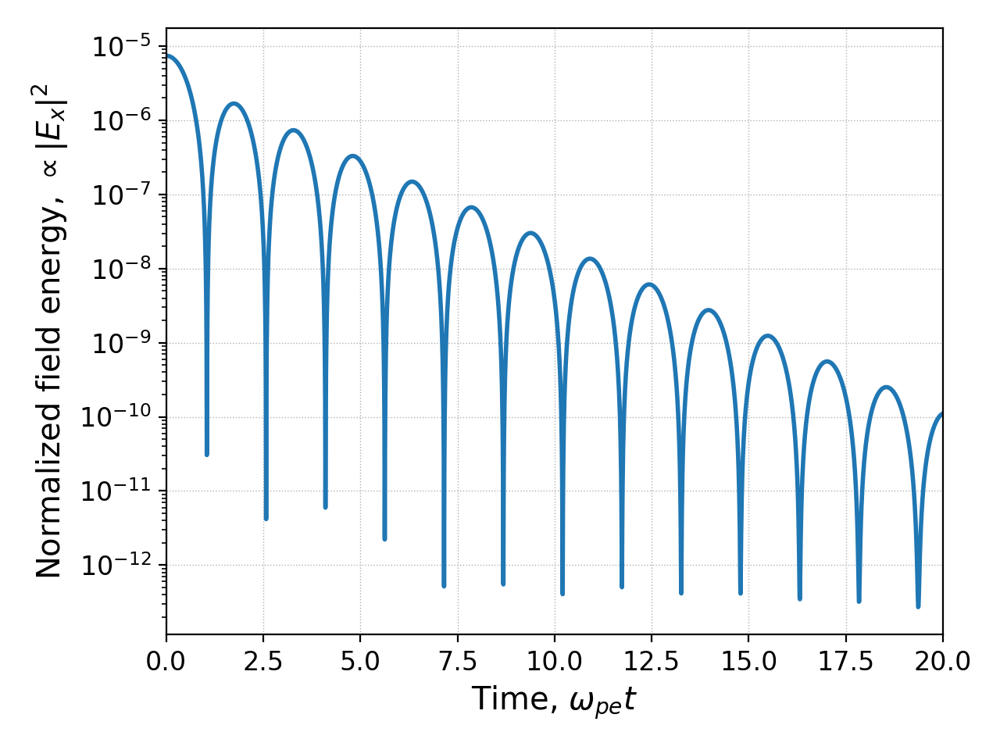

.. highlight:: lua

.. _qs_intro:

Introduction: A first Gkeyll simulation
+++++++++++++++++++++++++++++++++++++++

Gkeyll supports several models and numerous capabilities. Before diving into those,
here's a short overview of an input file, how to run it and plot its results.

.. contents::

Physics model
-------------

Consider the collisionless Landau damping of an electrostatic wave in a plasma.
We simulate it with the Vlasov-Maxwell model:

.. math::

  \frac{\partial f_s}{\partial t} &+ \mathbf{v}\cdot\nabla f_s + \frac{q_s}{m_s}
  \left(\mathbf{E}+\mathbf{v}\times\mathbf{B}\right)\cdot\nabla_{\mathbf{v}}f = 0, \\
  \frac{\partial\mathbf{B}}{\partial t} &+ \nabla\times\mathbf{E} = 0, \\
  \epsilon_0\mu_0\frac{\partial\mathbf{E}}{\partial t} &- \nabla\times\mathbf{B} = -\mu_0\mathbf{J}.

More information about the model can be found in the :doc:`Vlasov-Maxwell
documentation <../gkyl/App/Vlasov/VlasovMaxwell>`. In this case we consider an electrostatic
wave, and there are `subtleties regarding electrostatic simulation using Maxwell's induction
equations <http://ammar-hakim.org/sj/je/je33/je33-buneman.html>`_. So we initialize the
electron density as having a small sinusoidal perturbation:

.. math::

  n_e(x,t=0) = n_0(1+A\cos(kx))

and initialize the electric field in a manner consistent with the Poisson
equation (using quasineutrality of the equilibrium electron and ion densities,
:math:`n_i(x,t=0)=n_0`):

.. math::

  E_x(x,t=0) = -\frac{A}{k}\sin(kx)

Input file
----------

This simulation is setup using :ref:`vlasovNorm` in
:doc:`a short Lua input file <inputFiles/vm-damp>`, which begins with the
**Preamble**:

.. code-block:: lua

  local Plasma = require("App.PlasmaOnCartGrid").VlasovMaxwell()
  
  permitt  = 1.0   -- Permittivity of free space.
  permeab  = 1.0   -- Permeability of free space.
  eV       = 1.0   -- Elementary charge, or Joule-eV conversion factor.
  elcMass  = 1.0   -- Electron mass.
  ionMass  = 1.0   -- Ion mass.
  
  nElc = 1.0    -- Electron number density.
  nIon = nElc   -- Ion number density.
  Te   = 1.0    -- Electron temperature.
  Ti   = Te     -- Ion temperature.
  
  vtElc   = math.sqrt(eV*Te/elcMass)                   -- Electron thermal speed.
  vtIon   = math.sqrt(eV*Ti/ionMass)                   -- Ion thermal speed.
  wpe     = math.sqrt((eV^2)*nElc/(permitt*elcMass))   -- Plasma frequency.
  lambdaD = vtElc/wpe                                  -- Debye length.
  
  -- Amplitude and wavenumber of sinusoidal perturbation.
  pertA = 1.0e-3
  pertK = .750/lambdaD
  
  -- Maxwellian in (x,vx)-space, given the density (denU), bulk flow
  -- velocity (flowU), mass and temperature (temp).
  local function maxwellian1D(x, vx, den, flowU, mass, temp)
     local v2   = (vx - flowU)^2
     local vtSq = temp/mass
     return (den/math.sqrt(2*math.pi*vtSq))*math.exp(-v2/(2*vtSq))
  end

The Preamble typically consists of a line loading the Gkeyll plasma 'App' to be used
(in this case VlasovMaxwell), and a specification of a number of user input parameters
and simple derived quantities. One can also create user-defined functions, like
:code:`maxwellian1D` in this case, which may be used in the preamble or in the Gkeyll
App that follows. For this specific simulation the Gkeyll app is created by the following:

.. code-block:: lua

  plasmaApp = Plasma.App {
     tEnd         = 20.0/wpe,           -- End time.
     nFrame       = 20,                 -- Number of output frames.
     lower        = {-math.pi/pertK},   -- Lower boundary of configuration space.
     upper        = { math.pi/pertK},   -- Upper boundary of configuration space.
     cells        = {64},               -- Configuration space cells.
     polyOrder    = 1,                  -- Polynomial order.
     periodicDirs = {1},                -- Periodic directions.
  
     elc = Plasma.Species {
        charge = -eV, mass = elcMass,
        lower = {-6.0*vtElc},      -- Velocity space lower boundary.
        upper = { 6.0*vtElc},      -- Velocity space upper boundary.
        cells = {64},              -- Number of cells in velocity space.
        init = function (t, xn)    -- Initial conditions.
           local x, v = xn[1], xn[2]
           return (1+pertA*math.cos(pertK*x))*maxwellian1D(x, v, nElc, 0.0, elcMass, Te)
        end,
        evolve = true, -- Evolve species?
     },
  
     ion = Plasma.Species {
        charge = eV, mass = ionMass,
        lower = {-6.0*vtIon},      -- Velocity space lower boundary.
        upper = { 6.0*vtIon},      -- Velocity space upper boundary.
        cells = {64},              -- Number of cells in velocity space.
        init  = function (t, xn)   -- Initial conditions.
           local x, v = xn[1], xn[2]
           return maxwellian1D(x, v, nIon, 0.0, ionMass, Ti)
        end,
        evolve = true, -- Evolve species?
     },
  
     field = Plasma.Field {
        epsilon0 = permitt, mu0 = permeab,
        init = function (t, xn)   -- Initial conditions.
           local Ex, Ey, Ez = -pertA*math.sin(pertK*xn[1])/pertK, 0.0, 0.0
           local Bx, By, Bz = 0.0, 0.0, 0.0
           return Ex, Ey, Ez, Bx, By, Bz
        end,
        evolve = true, -- Evolve field?
     },
  }

The Gkeyll App typically consists of three sections:

- **Common**: a declaration of parameters that control the (configuration space)
  discretization, and time advancement. This first block of code in :code:`Plasma.App`
  may specify the periodic directions, the MPI decomposition, and the frequency with
  which to output certain diagnostics.
- **Species**: Definition of the species to be considered in the simulation. Each species
  gets its own Lua table, in which one provides the velocity-space domain and
  discretization of that species (for kinetic models), initial condition, diagnostics,
  boundary conditions, and whether to evolve it or not (:code:`evolve`).
- **Fields**: A field table, which tells the App whether to evolve the electric and/or
  magnetic fields according to the field equations of the model. In this table we also
  specify the initial condition of the fields.

In some applications other sections of the Plasma.App may be necessary, for example,
to specify the **geometry**. 

Running your first simulation
-----------------------------

Now that we have a Gkeyll input file (named :code:`vm-damp.lua`),
simply run the simulation by typing

.. code-block:: lua

  gkyl vm-damp.lua

You should see the program printing to screen like this:

.. code-block:: bash

  wsName:gkyldir gabriel$ gkyl vm-damp.lua
  Tue Sep 15 2020 16:16:44.000000000
  Gkyl built with b0b8203670c7+
  Gkyl built on Sep 14 2020 16:29:40
  Initializing PlasmaOnCartGrid simulation ...
   ** WARNING: timeStepper not specified, assuming rk3
  Using CFL number 0.333333
  Initializing completed in 0.0629927 sec
  
  Starting main loop of PlasmaOnCartGrid simulation ...
  
   Step 0 at time 0. Time step 0.00727108. Completed 0%
  0123456789 Step   276 at time 2.00698. Time step 0.00727174. Completed 10%
  0123456789 Step   551 at time 4.00677. Time step 0.00727214. Completed 20%
  0123456

Gkeyll prints a number every 1% of the simulation, and a longer message with the total
number of time steps taken, the simulation time and the latest time step size every 10%
of the simulation. This particular simulation ran in 74 seconds on a 2015 MacBookPro. As
it progressed it wrote out diagnostic files.

Plotting
--------

In this case we did not request additional diagnostics, so the only ones provided are
default ones: 

- Distribution functions: ``vm-damp_elc_#.bp`` and ``vm-damp_ion_#.bp``.
- Electromagnetic fields: ``vm-damp_field_#.bp``.
- Field energy: ``vm-damp_fieldEnergy.bp``.

Fields that are larger (in memory) like the distribution function, get written out
periodically, not every time step. These snapshots (frames) are labeled by the number
``#`` at the end of the file name.

In order to plot the initial distribution function of the electrons we will use
``postgkyl`` in the command line as follows

.. code-block:: bash

  pgkyl -f vm-damp_elc_0.bp interpolate plot

This produces the 2D plot of the initial Maxwellian distribution given below.

   Initial electron distribution function, :math:`f_e(x,v,t=0)`.

We can also examine the electrostatic energy in the simulation. This most clearly
exhibits the wave energy decaying as the collisionless damping takes effect. For
this purpose we use the following ``postgkyl`` command (we :code:`select` the
x-component, and :ref:`pg_cmd-plot` can use a log scale, as well as add labels):

.. code-block:: bash

  pgkyl -f vm-damp_fieldEnergy.bp select -c0 plot --logy -x 'time' -y '$|E_x|^2$'

resulting in the following figure of the (normalized) electrostatic energy as a
function of time

   Normalized electrostatic field energy :math:`\propto |E_x|^2` as a
   function of time (normalized to :math:`\omega_{pe}`).

Additional quick-start examples
-------------------------------

The above example used a Vlasov-Maxwell simulation to showcase how to setup,
run and postprocess a Gkeyll simulation. In addition to Vlasov-Maxwell there
are also Gyrokinetic and (fluid) Moment models. Each of these have slightly
different features and ways of using them. Quick examples for each of these
are found below:

:ref:`qs_vlasov1`

:ref:`qs_gk1`

:ref:`qs_fluid1`
