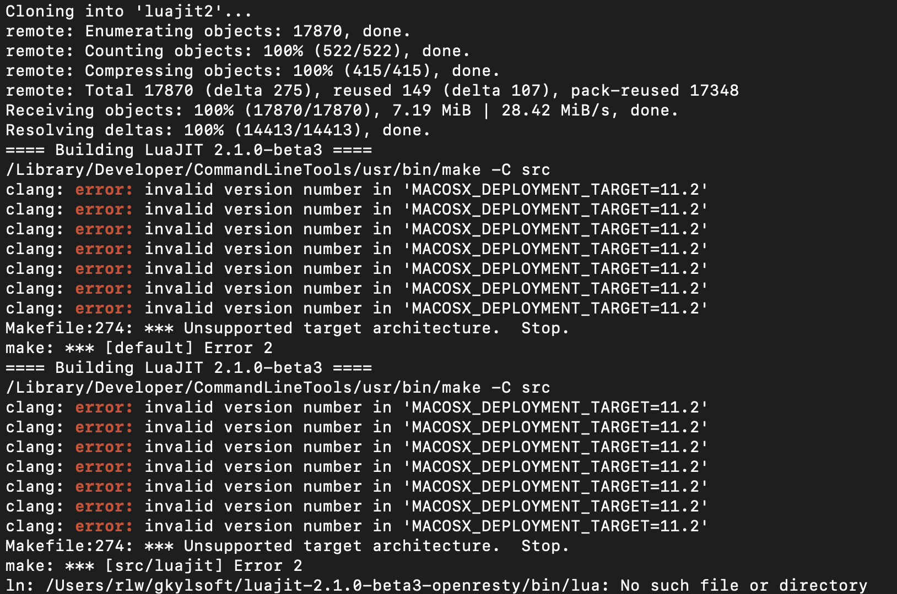
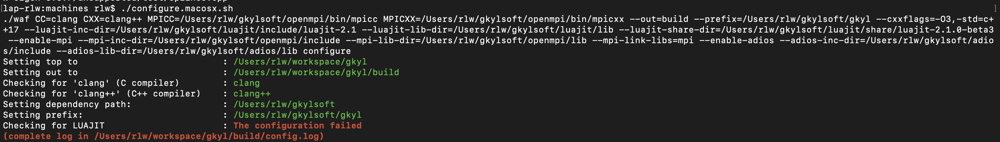

.. _gkyl_trouble:

Troubleshooting gkyl install
++++++++++++++++++++++++++++

As you build or run Gkeyll you may encounter some difficulties. 
This is natural when pushing the code in new directions, or using
it in new machines. In such cases you may find it helpful to
consider some of the following suggestions and lessons from past
experiences.

General useful comments
-----------------------

- The ``./waf build install`` command fails on some systems
  due to a combination of the size of certain kernels, and the
  default parallel compilation.
  **Suggestion:** try building with ``waf build install -j 1``.
  If this causes compilation to take too long, you can use ``waf -h``
  to see the default number of threads used, and then try something
  smaller than that but larger than 1.
- When installing on a cluster modules that you usually load for other
  projects, or modules the cluster loads by default, may interfere with
  the modules that you intend to use. To avoid this problem it is sometimes
  useful to use ``module purge`` in order to unload all modules, and then
  load just the modules you intend to use with Gkeyll. Managing different
  modules for different projects may require you to be careful and organized
  (e.g. using load/unload scripts or environments).

Installing on Mac OS Big Sur (version 11.x)
-------------------------------------------

Apple's Big Sur operating system (version 11.x) may encounter some issues when
installing gkyl. There are two issues we have witnessed. One is potential clang
errors because the latest Macs may have clang 12 (see the
:ref:`clang error section <gkyl_trouble_clang12>` below). Once you've made sure
you have clang/Xcode/CommandlineTools 11 (note that installing Xcode may not be
strictly necessary), the second potential error may first manifest as not being
able to install LuaJIT, so when running the `machines/mkdeps.macosx.sh` script
you may see (although it may just appear on the screen for a second before it
gets lost in thousands of messages)

Even if you didn't notice this message because it disappeared too quickly, you
may get the following error when running the `machines/configure.macosx.sh` script

A temporary hack to this problem may be as simple as going into `mkdeps.macosx.sh`
and editing the line that declares the environment variable ``MACOSX_DEPLOYMENT_TARGET``
to an earlier version. So for example, edit that line so it reads

.. code-block:: bash

   export MACOSX_DEPLOYMENT_TARGET=10.15.7

and run the mkdeps.macosx.sh and configure.macosx.sh scripts again.

.. _gkyl_trouble_clang12:

clang error when installing on a Mac
-----------------------------------

There seems to be a bug in ``clang`` version 12. When the build
fails on a Mac machine, for example due to a message like

.. code-block:: bash

  clang: error: unable to execute command: Illegal instruction: 4
  clang: error: clang frontend command failed due to signal (use -v to see invocation)
  Apple clang version 12.0.0 (clang-1200.0.32.27)
  Target: x86_64-apple-darwin19.6.0
  Thread model: posix
  InstalledDir: /Library/Developer/CommandLineTools/usr/bin
  clang: note: diagnostic msg: PLEASE submit a bug report to http://developer.apple.com/bugreporter/ and include the crash backtrace, preprocessed source, and associated run script.
  clang: note: diagnostic msg:
  ********************
  
  PLEASE ATTACH THE FOLLOWING FILES TO THE BUG REPORT:
  Preprocessed source(s) and associated run script(s) are located at:
  clang: note: diagnostic msg: /var/folders/ww/5dw2lrj16w99gnxkrw4hj9300000gq/T/FemMatrices-486393.cpp
  clang: note: diagnostic msg: /var/folders/ww/5dw2lrj16w99gnxkrw4hj9300000gq/T/FemMatrices-486393.sh
  clang: note: diagnostic msg: Crash backtrace is located in
  clang: note: diagnostic msg: /Users/userName/Library/Logs/DiagnosticReports/clang_<YYYY-MM-DD-HHMMSS>_<hostname>.crash
  clang: note: diagnostic msg: (choose the .crash file that corresponds to your crash)
  clang: note: diagnostic msg:
  
  ********************
  
  Waf: Leaving directory `/Users/userName/Documents/gkeyll/code/gkyl/build'
  Build failed
   -> task in 'updater' failed with exit status 254 (run with -v to display more information)

it is good to double-check the ``clang`` version and potentially downgrade it
to the version 11. One way to do this is to install older versions of "Command Line Tools"
and/or Xcode. You may obtain these from `this site <https://developer.apple.com/download/more/?=for%20Xcode>`_,
by searching for "Command Line Tools" and downloading "Command Line Tools for Xcode 11.5" 
(requires an Apple developer account, but there may be instructions elsewhere on the 
internet on how to obtain this without such an account). You may also find a download for 
Xcode 11 in the same site. If installing older Command Line Tools and you do not wish to
keep the newer version, you can uninstalling by deleting the file ``/Library/Developer/CommandLineTools``. 

Installing clang 11 on Big Sur
..............................

You may find that when you try to execute the `.dmg` downloaded from the Apple developer's
site that it does not let you install Command Line Tools, perhaps due to an error like
your version of Mac OS is "too new". In this case we have found the following to be helpful:

1. Remove the old CLT folder, if there is one: ``sudo -rf /Library/Developer/CommandLineTools``.
2. Download Xcode 11: go to Apple developer site download the last stable Xcode 11 `.dmg` (e.g. Xcode 11.5) and install it. Make sure Xcode in the Applications folder has the correct version.
3. Install CLT through the terminal indicating which Xcode to use with ``sudo xcode-select -s /Applications/Xcode.app/ --install``.

After these steps you can check that ``clang --version`` is 11, and you can proceed with the
regular `gkyl` installation instructions.

Configuring gkyl with configure.[SYSTEM].sh script not finding dependency
-------------------------------------------------------------------------

- When running the ``configure.[SYSTEM].sh``, the ``waf`` build system
  is looking for the installations of ``gkyl``'s dependencies in the
  ``gkylsoft`` folder, wherever that may be (usually ``~/gkylsoft`` or
  ``$HOME/gkylsoft``).  If ``waf`` cannot find a dependency, the user
  will get the following error message

.. code-block:: bash

  bash$ ./machines/configure.macosx.sh
  ./waf CC=clang CXX=clang++ MPICC=/Users/junoravin/gkylsoft/openmpi/bin/mpicc MPICXX=/Users/junoravin/gkylsoft/openmpi/bin/mpicxx --out=build --prefix=/Users/junoravin/gkylsoft/gkyl --cxxflags=-O3,-std=c++17 --luajit-inc-dir=/Users/junoravin/gkylsoft/luajit/include/luajit-2.1 --luajit-lib-dir=/Users/junoravin/gkylsoft/luajit/lib --luajit-share-dir=/Users/junoravin/gkylsoft/luajit/share/luajit-2.1.0-beta3 --enable-mpi --mpi-inc-dir=/Users/junoravin/gkylsoft/openmpi/include --mpi-lib-dir=/Users/junoravin/gkylsoft/openmpi/lib --mpi-link-libs=mpi --enable-adios --adios-inc-dir=/Users/junoravin/gkylsoft/adios/include --adios-lib-dir=/Users/junoravin/gkylsoft/adios/lib configure
  Setting top to                           : /Users/junoravin/gkyl
  Setting out to                           : /Users/junoravin/gkyl/build
  Checking for 'clang' (C compiler)        : clang
  Checking for 'clang++' (C++ compiler)    : clang++
  Setting dependency path:                 : /Users/junoravin/gkylsoft
  Setting prefix:                          : /Users/junoravin/gkylsoft/gkyl
  Checking for LUAJIT                      : The configuration failed

This error indicates that ``waf`` cannot find LuaJIT. Possible reasons for this:
  
- LuaJIT (or another dependency) did not successfully install. 
  Check in the ``gkylsoft`` directory to see if all the required dependencies are present.
  After a successful build, inside in the ``gkylsoft`` direction one should see

.. code-block:: bash

  bash$ ls -lh
  total 0
  lrwxr-xr-x  1 junoravin  staff    38B Sep 16 00:51 adios -> /Users/junoravin/gkylsoft/adios-1.13.1
  drwxr-xr-x  7 junoravin  staff   224B Sep 17 14:30 adios-1.13.1
  drwxr-xr-x  4 junoravin  staff   128B Sep 17 14:30 eigen-3.3.7
  lrwxr-xr-x  1 junoravin  staff    37B Sep 16 00:51 eigen3 -> /Users/junoravin/gkylsoft/eigen-3.3.7
  drwxr-xr-x  4 junoravin  staff   128B Sep 16 01:26 gkyl
  lrwxr-xr-x  1 junoravin  staff    54B Sep 16 01:03 luajit -> /Users/junoravin/gkylsoft/luajit-2.1.0-beta3-openresty
  drwxr-xr-x  7 junoravin  staff   224B Sep 17 14:29 luajit-2.1.0-beta3-openresty
  lrwxr-xr-x  1 junoravin  staff    39B Sep 16 00:50 openmpi -> /Users/junoravin/gkylsoft/openmpi-3.1.2
  drwxr-xr-x  8 junoravin  staff   256B Sep 17 14:29 openmpi-3.1.2

- If a dependency is **NOT** present, including the symbolic link, return to the ``gkyl/machines`` directory.
  Open the previously run mkdeps.[SYSTEM].sh script and modify the script to only try building the missing dependency.
  To do so, see for example the ``mkdeps.macosx.sh`` script

.. code-block:: bash

  # if we are in machines directory, go up a directory
  if [ `dirname "$0"` == "." ] 
    then
      cd ..
  fi
  export GKYLSOFT='~/gkylsoft'
  cd install-deps
  # first build OpenMPI
  ./mkdeps.sh CC=clang CXX=clang++ --build-openmpi=no
  # now build rest of packages
  ./mkdeps.sh CC=clang CXX=clang++ MPICC=$GKYLSOFT/openmpi-3.1.2/bin/mpicc MPICXX=$GKYLSOFT/openmpi-3.1.2/bin/mpicxx --build-luajit=yes --build-adios=no --build-eigen=no

where we have specified to the system **NOT** to build openmpi, adios, and eigen by simply setting the ``--build-XX=no`` flag.

Build failure: perl: warning: Setting locale failed.
----------------------------------------------------

- When building ``gkyl`` on a cluster that the user has remotely logged into (for example, with ``ssh``),
  the user may get the following warning upon logging in:

.. code-block:: bash

  perl: warning: Setting locale failed.
  perl: warning: Please check that your locale settings:
  LANGUAGE = (unset),
  LC_ALL = (unset),
  LANG = "C.UTF-8"
  are supported and installed on your system.
  perl: warning: Falling back to the standard locale ("C").

This warning can prevent successful builds by leading to errors in parsing input strings.

- To fix this issue, on your *local* machine (in other words, the **host** machine) modify your ``.bashrc`` 
  (or other source such as ``.zshrc``) to include the following lines:

.. code:: bash

  export LANGUAGE=en_US.UTF-8
  export LANG=en_US.UTF-8
  export LC_ALL=en_US.UTF-8

then source this script and try logging into the cluster again. The perl warning should go away, and issues related to 
parsing input strings as part of the configure and build process should be solved.
