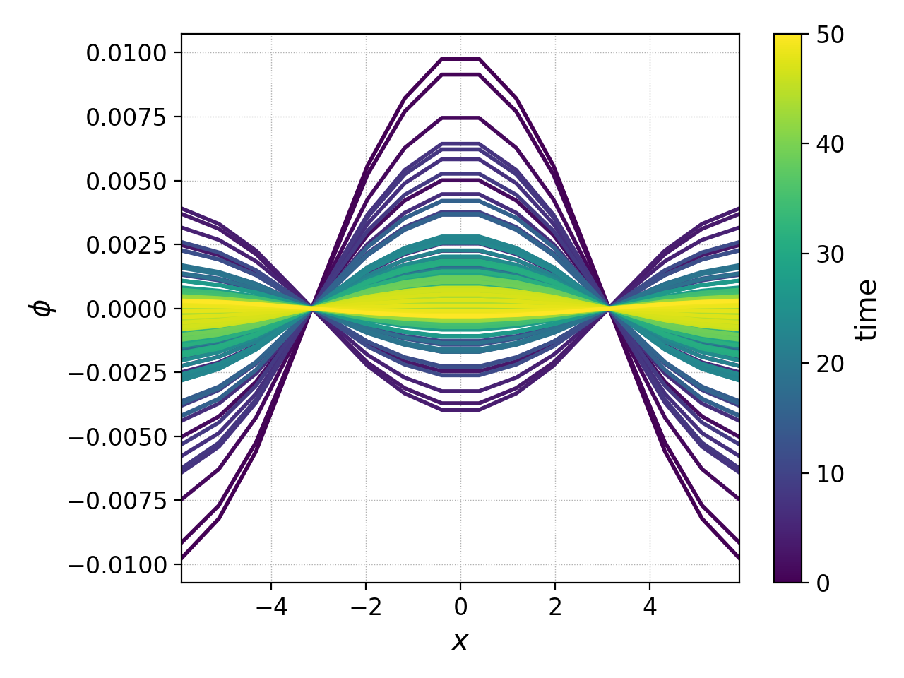

.. _pg_cmd_animate:

animate
=======

Create movies (animations) by stitching together figures created
by plotting multiple datasets, typically originating from a data
load with wildcard/regex.

Saving the animation to a file requires an ffmpeg installation.

.. raw:: html

   

   
<a>Command Docstrings</a>

   <iframe src="../../_static/postgkyl/commands/animate.html"></iframe>
   

    

Command line
^^^^^^^^^^^^

.. raw:: html

  

  
<a>Command help</a>

.. code-block:: bash
  :emphasize-lines: 1

  pgkyl animate -h
    Usage: pgkyl anim [OPTIONS]
    
      Animate the actively loaded dataset and show resulting plots in a loop.
      Typically, the datasets are loaded using wildcard/regex feature of the -f
      option to the main pgkyl executable. To save the animation ffmpeg needs to
      be installed.
    
    Options:
      -u, --use TEXT              Specify a tag to plot.
      -s, --squeeze               Squeeze the components into one panel.
      -b, --subplots              Make subplots from multiple datasets.
      --nsubplotrow INTEGER       Manually set the number of rows for subplots.
      --nsubplotcol INTEGER       Manually set the number of columns for subplots.
      --transpose                 Transpose axes.
      -c, --contour               Make contour plot.
      -q, --quiver                Make quiver plot.
      -l, --streamline            Make streamline plot.
      -g, --group [0|1]           Switch to group mode.
      -s, --scatter               Make scatter plot.
      --markersize FLOAT          Set marker size for scatter plots.
      --style TEXT                Specify Matplotlib style file (default:
                                  Postgkyl).
    
      -d, --diverging             Switch to diverging colormesh mode.
      --arg TEXT                  Additional plotting arguments, e.g., '*--'.
      -a, --fix-aspect            Enforce the same scaling on both axes.
      --logx                      Set x-axis to log scale.
      --logy                      Set y-axis to log scale.
      --logz                      Set values of 2D plot to log scale.
      --xscale FLOAT              Value to scale the x-axis (default: 1.0).
      --yscale FLOAT              Value to scale the y-axis (default: 1.0).
      --vmax FLOAT                Set maximal value of data for plots.
      --vmin FLOAT                Set minimal value of data for plots.
      -f, --float                 Choose min/max levels based on current frame
                                  (i.e., each frame uses a different color range).
    
      --xlim TEXT                 Set limits for the x-coordinate (lower,upper)
      --ylim TEXT                 Set limits for the y-coordinate (lower,upper).
      --legend / --no-legend      Show legend.
      --force-legend              Force legend even when plotting a single
                                  dataset.
    
      -x, --xlabel TEXT           Specify a x-axis label.
      -y, --ylabel TEXT           Specify a y-axis label.
      --clabel TEXT               Specify a label for colorbar.
      --title TEXT                Specify a title.
      -i, --interval INTEGER      Specify the animation interval.
      --save                      Save figure as PNG.
      --saveas TEXT               Name to save the plot as.
      --fps INTEGER               Specify frames per second for saving.
      --dpi INTEGER               DPI (resolution) for output.
      -e, --edgecolors TEXT       Set color for cell edges (default: None)
      --showgrid / --no-showgrid  Show grid-lines (default: True)
      --collected                 Animate a dataset that has been collected, i.e.
                                  a single dataset with time taken to be the first
                                  index.
    
      --hashtag                   Turns on the pgkyl hashtag!
      --show / --no-show          Turn showing of the plot ON and OFF (default:
                                  ON).
    
      -h, --help                  Show this message and exit.

.. raw:: html

  

   

Suppose we extend the simulation time of the
:doc:`gyrokinetic ion acoustic wave simulation<../input/gk-ionSound-1x2v-p1>`
to ``tEnd=50`` and the number of frames to ``nFrame=100``, and run it
with

.. code-block:: bash
  
  gkyl gk-ionSound-1x2v-p1.lua

.. note::

  This simulation took 582 seconds running with ``decompCuts=8`` (8 cores)
  on a 2020 MacBookPro.

and plot the electrostatic potential from all frames with

.. code-block:: bash

  pgkyl "gk-ionSound-1x2v-p1_phi_[0-9]*.bp" interp collect pl -x '$x$' -y '$\phi$' --group 1 --clabel 'time'

this produces the pretty picture below, showing the electrostatic potential
as a function of :math:`x` in each frame, with the color indicating the time
stamp of that frame.

This kind of plot can become impractical if there are many frames, or if
one would instead like to see a time-dependent movie of the evolution of
the potential. For that purpose we can create an animation of :math:`\phi(x,t)`
using the following command

.. code-block:: bash

  pgkyl "gk-ionSound-1x2v-p1_phi_[0-9]*.bp" interp anim -x '$x$' -y '$\phi$' --saveas 'gk-ionSound-1x2v-p1_phi.mp4'

.. note::

  In order to save the animation to an .mp4 file, simply append
  ``--saveas fileName.mp4`` to the end of the above command. 

and this will produce the animation below:

.. raw:: html

  

  <video controls height="300" width="450" loop autoplay muted>
    <source src="../../_static/gk-ionSound-1x2v-p1_phi.mp4" type="video/mp4">
  </video>
  

One can clearly see the amplitude of the wave decaying as Landau damping
ruins the fun.
