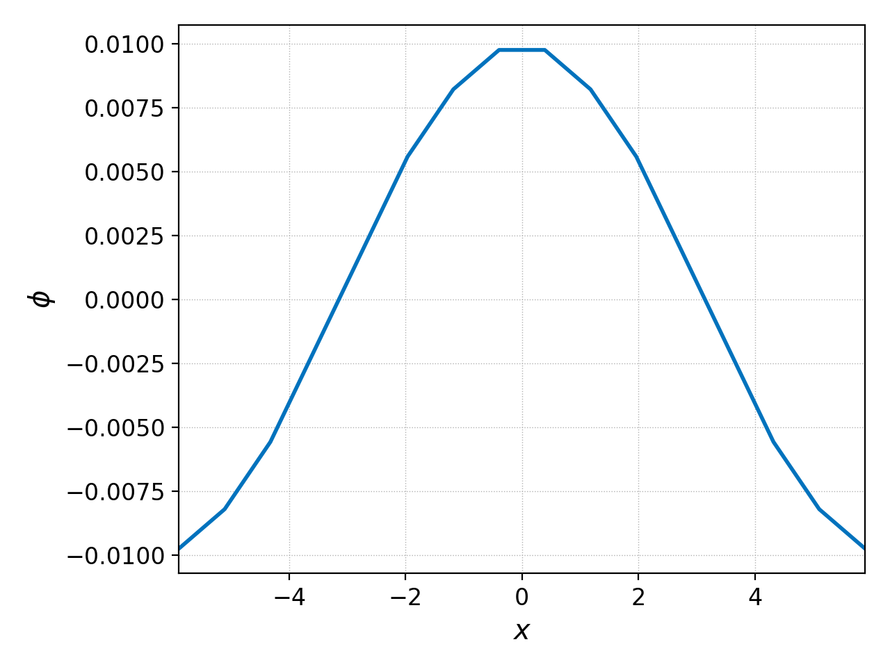
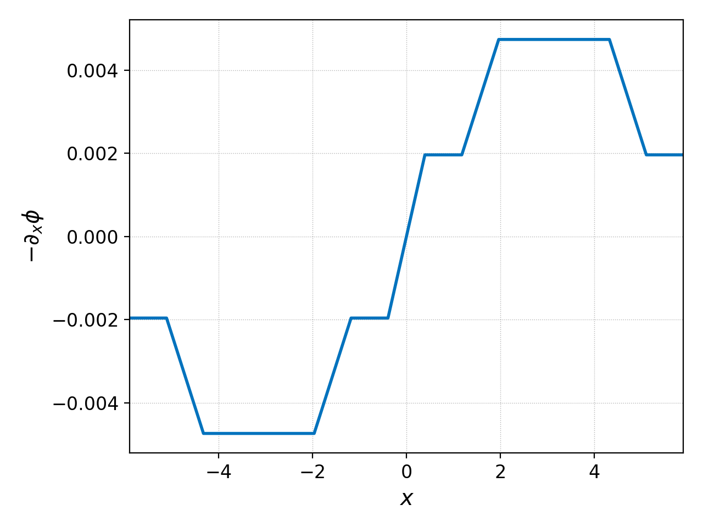
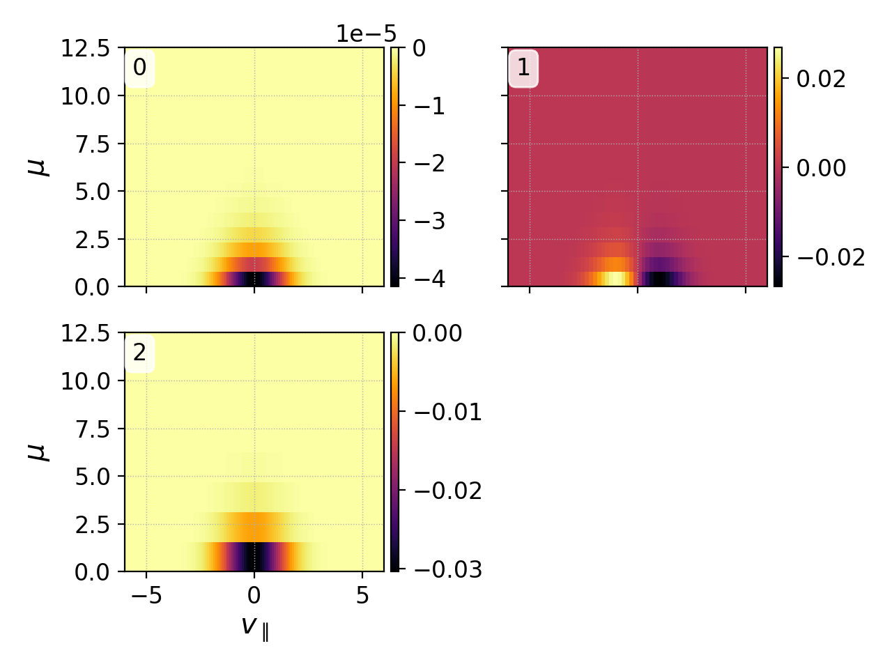

.. _pg_cmd_differentiate:

differentiate
=============

Compute the derivatives of a function along each direction.
This returns a dataset with as many components as there are
dimensions in the original dataset, i.e. it returns the gradient,
unless the ``-d`` flag is used to specify a direction.

This command takes the basis expansion in a cell, differentiates
it analytically in the desired directions, and then interpolates it
onto a finer mesh in the same fashion as the :ref:`pg_cmd_interpolate`
command.

Note that differentiation is also possible with the :ref:`pg_cmd_ev`
command and the ``grad`` operation.

.. raw:: html

   

   
<a>Command Docstrings</a>

   <iframe src="../../_static/postgkyl/commands/differentiate.html"></iframe>
   

    

Command line
^^^^^^^^^^^^

.. raw:: html

   

   
<a>Command help</a>

.. code-block:: bash
  :emphasize-lines: 1

  pgkyl differentiate -h
    Usage: pgkyl differentiate [OPTIONS]

      Interpolate a derivative of DG data on a uniform mesh

    Options:
      -b, --basistype [ms|ns|mo]  Specify DG basis
      -p, --polyorder INTEGER     Specify polynomial order
      -i, --interp INTEGER        Interpolation onto a general mesh of specified
                                  amount

      -d, --direction INTEGER     Direction of the derivative (default: calculate
                                  all)

      -r, --read BOOLEAN          Read from general interpolation file
      -t, --tag TEXT              Specify a 'tag' to apply to (default all tags).
      -o, --outtag TEXT           Optional tag for the resulting array
      -h, --help                  Show this message and exit.

.. raw:: html

   

    

Let's take a :doc:`gyrokinetic ion acoustic wave simulation<../input/gk-ionSound-1x2v-p1>`
as an example. We can examine the initial electrostatic potential generated
by the initial conditions with

.. code-block:: bash

  pgkyl gk-ionSound-1x2v-p1_phi_0.bp interp pl -x '$x$' -y '$\phi$'

giving the plot shown below on the left.

Suppose we wished to know what the initial electric field is, then we would
differentiate the potential and multiply it by -1 as follows

.. code-block:: bash

  pgkyl gk-ionSound-1x2v-p1_phi_0.bp diff -d 0 ev 'f[1] -1 *' pl -x '$x$' -y '$-\partial_x\phi$'

Note we we have abbreviated ``differentiate`` -> ``diff``, either is allowed.
This command produces the electric field above on the right. It is cellwise
constant because we use a piecewise linear basis function.

Now suppose you wish to examine the gradient of the ion distribution
function at :math:`t=0` and :math:`x=0`. This can be accomplished with the
following command

.. code-block:: bash

  pgkyl gk-ionSound-1x2v-p1_ion_0.bp diff sel --z0 0. pl -x '$v_\parallel$' -y '$\mu$'

in order to produce:

Starting with the top left and going clockwise, this plot provides the
gradient in :math:`f_i(x,v_\parallel,\mu)` along :math:`x`, :math:`v_\parallel`
and :math:`\mu`, all three evaluated at :math:`x=0`.
