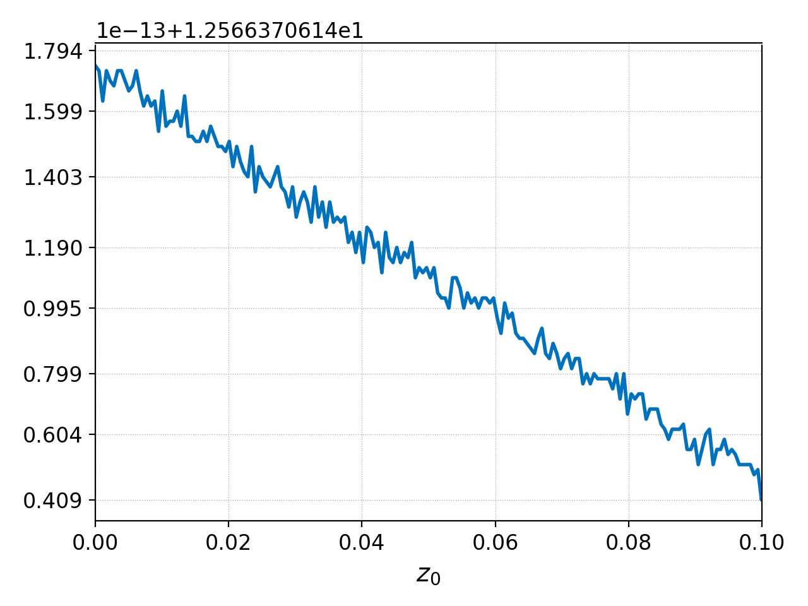
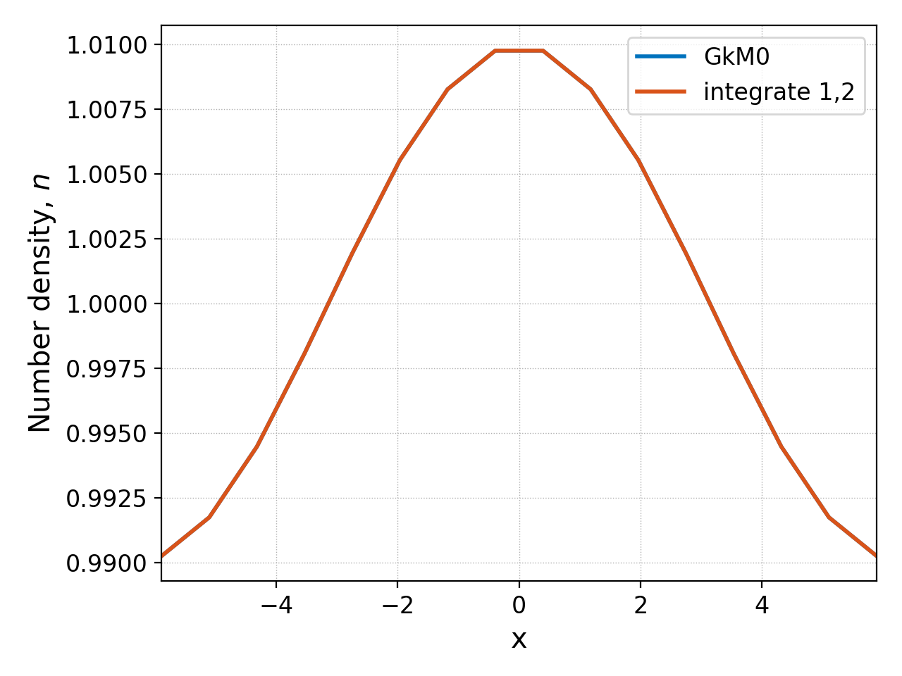
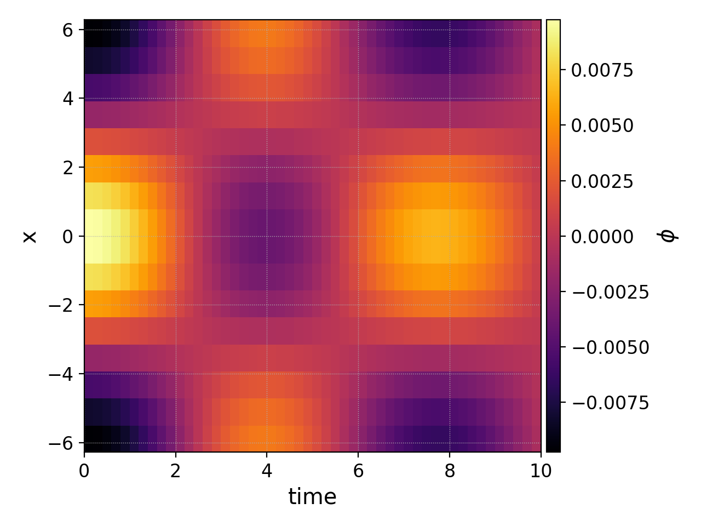
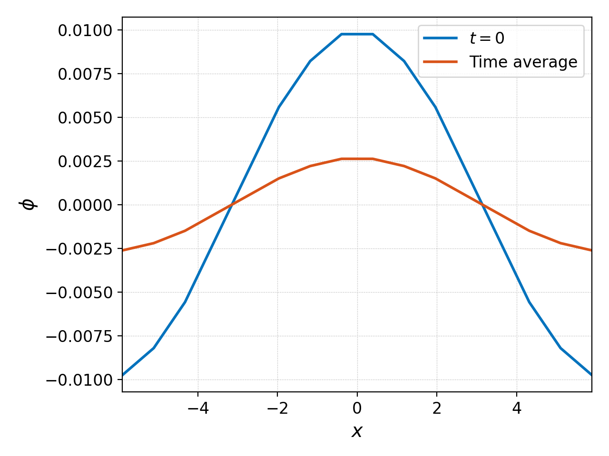

.. _pg_cmd_integrate:

integrate
=========

Integrate a dataset over specified direction(s).

.. raw:: html

   

   
<a>Command Docstrings</a>

   <iframe src="../../_static/postgkyl/commands/integrate.html"></iframe>
   

    

Command line
^^^^^^^^^^^^

.. raw:: html

   

   
<a>Command help</a>

.. code-block:: bash

   $ pgkyl integrate --help
     Usage: pgkyl integr [OPTIONS] AXIS
     
       Integrate data over a specified axis or axes
     
     Options:
       -u, --use TEXT  Specify the tag to integrate
       -t, --tag TEXT  Optional tag for the resulting array
       -h, --help      Show this message and exit.

.. raw:: html

   

    

Consider the :doc:`gyrokinetic simulation of an ion acoustic wave<../input/gk-ionSound-1x2v-p1>`
as an example. It outputs the integrated particle density over
time, which can plot as follows:

.. code-block:: bash

  pgkyl gk-ionSound-1x2v-p1_ion_intM0.bp pl

We can see from the values on the y-axis that the total number
of particles is 12.566. The number of particles should be conserved,
to machine precision. We can check this another way by integrating
the particle density along :math:`x` (the 0th dimension) at the end
of the simulation with ``pgkyl``:

.. code-block:: bash

  pgkyl gk-ionSound-1x2v-p1_ion_GkM0_1.bp interp integr 0 print

where we have abbreviated ``integrate`` with ``integr``, and we use
the print command to print the result of the integral to screen. The
output of this command is simply

.. code-block:: bash

  12.566370614359034

The integrate command can also be used to integrate higher
dimensional datasets in one or more directions. We could take the
ion distribution function and integrated along the :math:`v_\parallel`
and :math:`\mu` directions (1st and 2nd dimensions, respectively)
with

.. code-block:: bash

  pgkyl gk-ionSound-1x2v-p1_ion_0.bp gk-ionSound-1x2v-p1_ion_GkM0_0.bp interp \
    activate -i 0 integr 1,2 ev -l 'integrate 1,2' 'f[0] 6.283185 *' \
    activate -i1,2 pl -f0 -x 'x' -y 'Number density, $n$'

.. note::

  In this command we:

  - First load the ion distribution function (\*_ion_0.bp) and its number density (\*_ion_GkM0_0.bp) at :math:`t=0`.
  - Integrate the distribution function over velocity space with ``activate -i 0 integr 1,2``.
  - Multiply such integral by :math:`2\pi B_0/m_i` (:math:`B_0=m_i=1` here) with ``ev -l 'integrate 1,2' 'f[0] 6.283185 *'``.
  - Activate the number denstiy and integrated distribution function data sets and plot them with ``activate -i1,2 pl -f0``. 

and this should give approximately the same number density as the
``GkM0`` diagnostic outputted by the simulation, as shown below.

Another useful application of the integrate command is to integrate,
or average, over time (although note that the :ref:`pg_cmd_ev`
command has a ``avg`` operation that may make this easier). Usually
this requires collecting multiple frames into a single dataset with
the :ref:`pg_cmd_collect` command, and then integrating over the
0th dimension (time).

So if we increase the ``tEnd`` of the gyrokinetic ion sound wave
simulation to 10 and the number of frames to 50 we could
plot the electrostatic potential as a function of time and position
with

.. code-block:: bash

  pgkyl "gk-ionSound-1x2v-p1_phi_[0-9]*.bp" interp collect pl -x 'time' -y 'x' --clabel '$\phi$'

We can integrate this potential in time and plot it on top of the
initial potential with

.. code-block:: bash

  pgkyl gk-ionSound-1x2v-p1_phi_0.bp -l '$t=0$' -t phi0 \
    "gk-ionSound-1x2v-p1_phi_[0-9]*.bp" -t phis interp collect -u phis -t phiC \
    integrate -u phiC -t phiInt 0 ev -l 'Time average' -t phiAvg 'phiInt 10. /' \
    activate -t phi0,phiAvg pl -f0 -x '$x$' -y '$\phi$'

This command uses tags to select which dataset to perform an operation
on. The end result is the plot below

showing that the time averaged potential is lower amplitude due
to the collisionless Landau damping of the wave.
