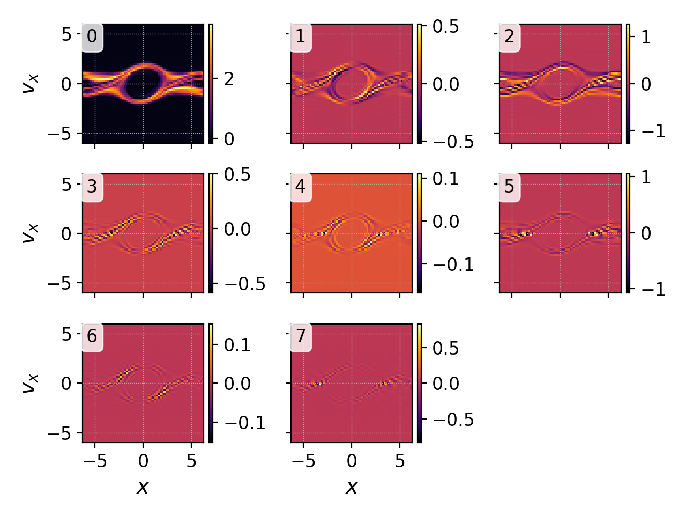
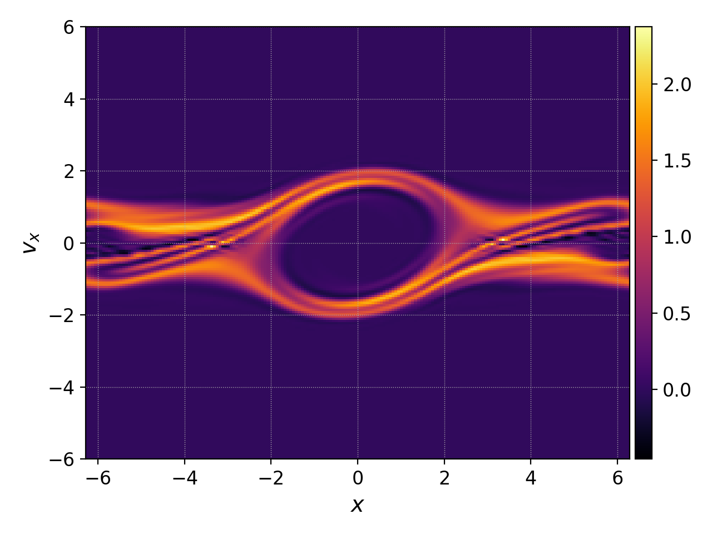
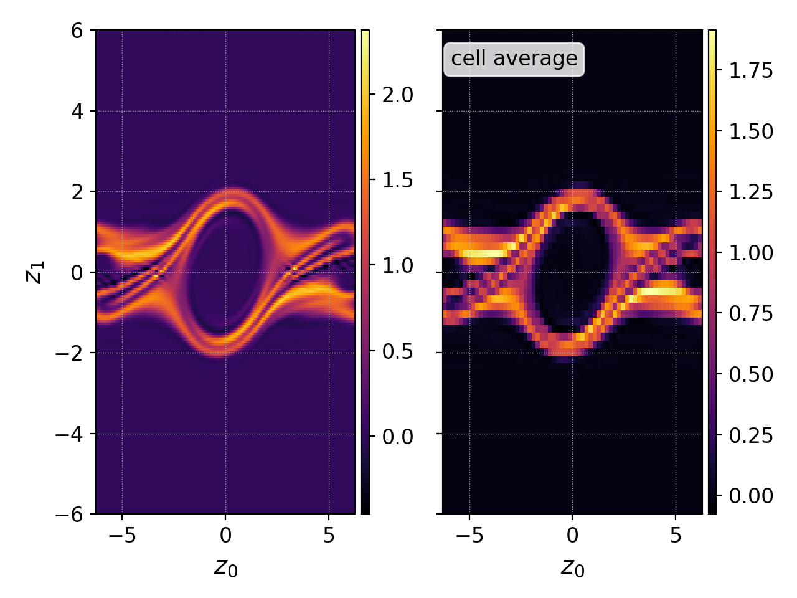
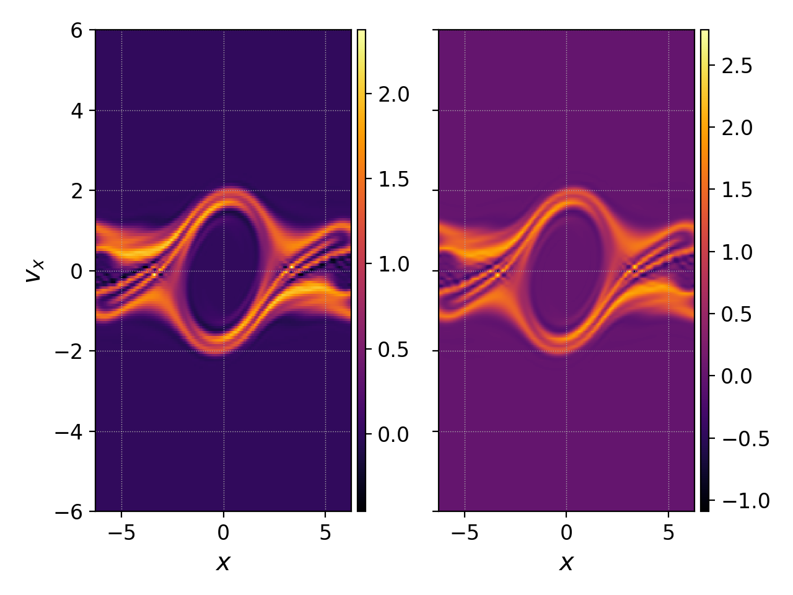

.. _pg_cmd_interpolate:

interpolate
===========

Gkeyll's simulation may employ higher-order methods with more
than one degree of freedom per cell, typically expansion
coefficients or nodal values. The `interpolate` command
interpolates this higher-order representation onto a finer mesh
with more points than the number of cells in the Gkeyll
simulation.

.. raw:: html

   

   
<a>Command Docstrings</a>

   <iframe src="../_static/postgkyl/commands/interpolate.html"></iframe>
   

    

Command line
^^^^^^^^^^^^

.. raw:: html

   

   
<a>Command help</a>

.. code-block:: bash
  :emphasize-lines: 1

  pgkyl interpolate --help
    Usage: pgkyl interp [OPTIONS]
    
      Interpolate DG data onto a uniform mesh.
    
    Options:
      -b, --basistype [ms|ns|mo|mt]  Specify DG basis.
      -p, --polyorder INTEGER        Specify polynomial order.
      -i, --interp INTEGER           Interpolation onto a general mesh of
                                     specified amount.
    
      -u, --use TEXT                 Specify a 'tag' to apply to (default all
                                     tags).
    
      -t, --tag TEXT                 Optional tag for the resulting array
      -r, --read BOOLEAN             Read from general interpolation file.
      -n, --new                      for testing purposes
      -h, --help                     Show this message and exit.

.. raw:: html

   

    

A Gkeyll simulation can have several degrees of freedom per
cell. If we simply invoke the :ref:`pg_cmd_plot` command
we would then obtain a plot of all the coefficients in each cell.
So for example, take the electron distribution function at the
end of a :doc:`two stream instability simulation<../input/two-stream>`
and plot it with

.. code-block:: bash

  pgkyl two-stream_elc_100.bp pl -x '$x$' -y '$v_x$'

we would obtain figure below on the left, with all 8 DG expansion
coefficients plotted in phase space. Most commonly we are interested
in plotting the actual function that the expansion coefficients
represent, rather than plotting such coefficients. We can do that
by interpolating onto a finer mesh with the ``interpolate`` command:

.. code-block:: bash

  pgkyl two-stream_elc_100.bp interp pl -x '$x$' -y '$v_x$'

which results in the figure below on the right.

  DG coefficients.

  Interpolated distribution function.

We can compare the cell average of the electron distribution
function with the interpolated distribution function with the
following command

.. code-block:: bash

  pgkyl two-stream_elc_100.bp -t fe interp -u fe -t fInterp sel -u fe -c0 -t c0 \
    ev -l 'cell average' -t cellAv 'c0 2 /' activ -t fInterp,cellAv pl -b

which divides the zeroth DG coefficient by 2 in order to obtain
the cell average (1r 2D piecewise quadratic basis),
and produces the following figure

Notice how the cell average (right) is naturally coarser grained,
and the interpolated function (left) offers a smoother plot.

By default the ``interpolate`` command interpolates onto a
uniform mesh that subdivides each cell in the simulation into
:math:`p+1` cells in each direction, where :math:`p` is the
polynomial order of the simulation. It is also possible to
interpolate onto finer meshes with the ``-i`` flag in order to
obtain smoother plots. However note that interpolating onto
finer meshes can also augment local maxima and/or minima. Below
we compare the final electron distribution function interpolated
onto a mesh with 3 subcells per cell in each direction (default
for :math:`p=2`) and interpolating onto a mesh with 8 subcells
per cell in each direction:

.. code-block:: bash

  pgkyl two-stream_elc_100.bp -t fe interp -t i3 interp -i 8 -u fe -t i8 activ -t i3,i8 pl -b -x '$x$' -y '$v_x$'

This example also shows the use of tags in order to tag datsets
and to instruct ``interpolate`` which datasets to operate on
(via the ``-u/--use`` flag). In order to request that
``interpolate`` operates on a given tagged dataset, one must pass
``-u`` followed by the dataset we wish to interpolate. And in
order to create a new dataset outof the interpolated data
one must use the ``-t`` flag followed by the name (tag) of the
new dataset. In the above example the first ``interpolate``
operates on the input data (no ``-u`` necessary because it
immediately precedes it and there is only one dataset at that point
in the chain) and creates a dataset tagged ``i3``. The second
``interpolate`` operates on the input data (``-u fe``) and creates
a dataset tagged ``i8``.

Script mode
^^^^^^^^^^^

``interpolate`` uses the  ``GInterpModal`` and ``GInterpNodal``
classes based on the DG mode.

.. list-table:: Initialization parameters for ``GInterpModal`` and ``GInterpNodal``
   :widths: 20, 60, 20
   :header-rows: 1

   * - Parameter
     - Description
     - Default
   * - gdata (GData)
     - A GData object to be used.
     - 
   * - polyOrder (int)
     - The polynomial order of the discontinuous Galerkin
       discretization.
     -
   * - basis (str)
     - The polynomial basis. Currently supported options are ``'ns'`` for
       nodal Serendipity, ``'ms'`` for modal Serendipity, and ``'mo'``
       for the maximal order basis.
     -

After the initialization, both ``GInterpModal`` and ``GInterpNodal``
can be used to interpolate data on a uniform grid and to calculate
derivatives

.. list-table:: Members of ``GInterpModal`` and ``GInterpNodal``
   :widths: 40, 60
   :header-rows: 1

   * - Member
     - Description
   * - interpolate(int component, bool stack) -> narray, narray
     - Interpolates the selected component (default is 0) of the DG
       data on a uniform grid
   * - derivative(int component, bool stack) -> narray, narray
     - Calculates the derivative of the DG data

When the ``stack`` parameter is set to ``true`` (it is ``false`` by
default), the grid and values are pushed to the ``GData`` stack rather
than returned.

An example of the usage:

.. code-block:: Python

   import postgkyl as pg
   data = pg.data.GData('bgk_neut_0.bp')
   interp = pg.data.GInterpModal(data, 2, 'ms')
   iGrid, iValues = interp.interpolate()

