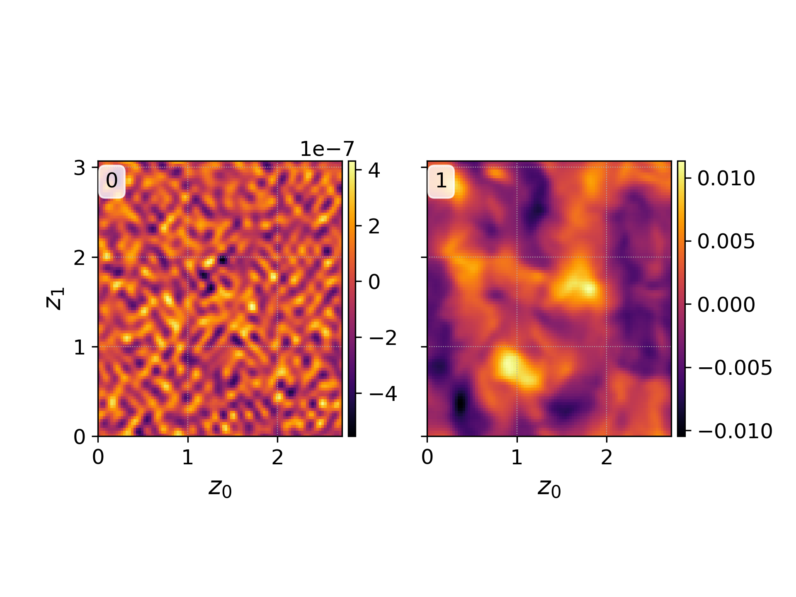
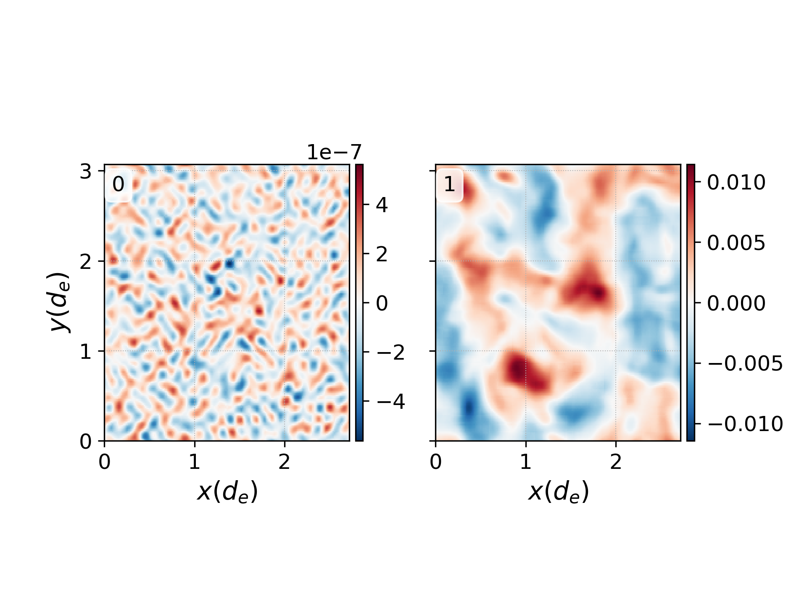
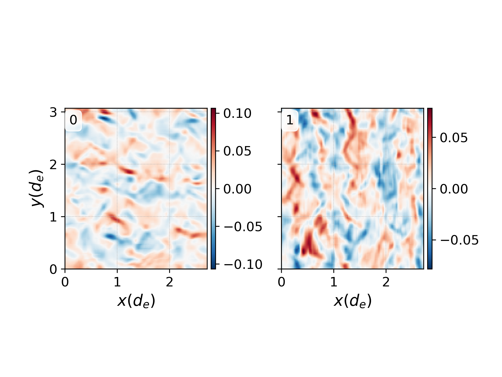
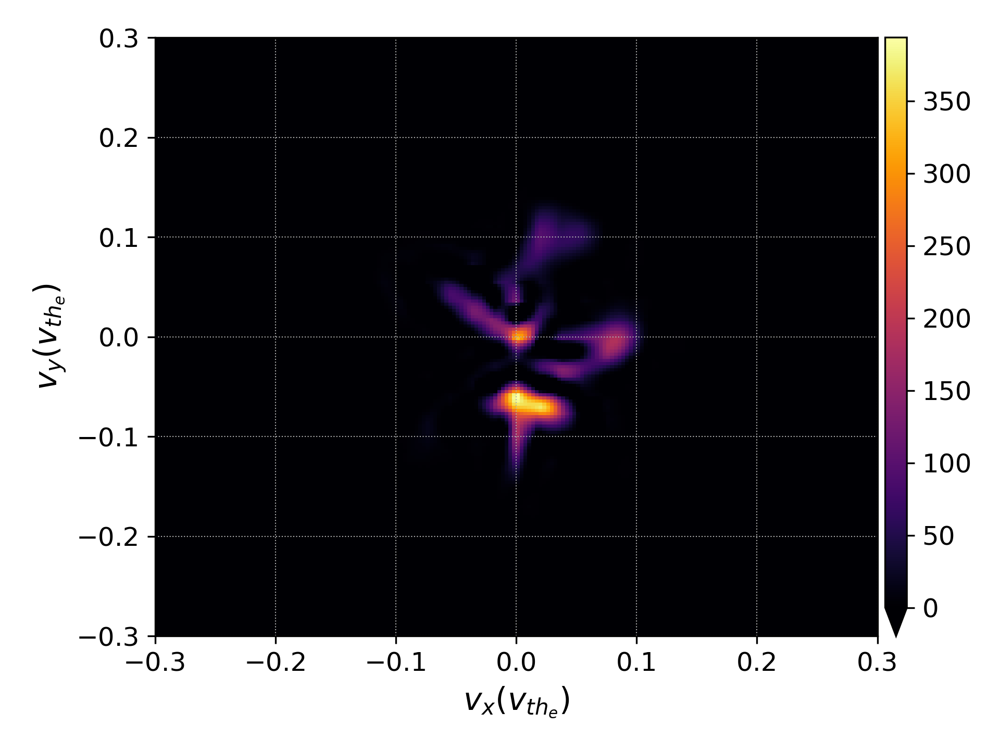
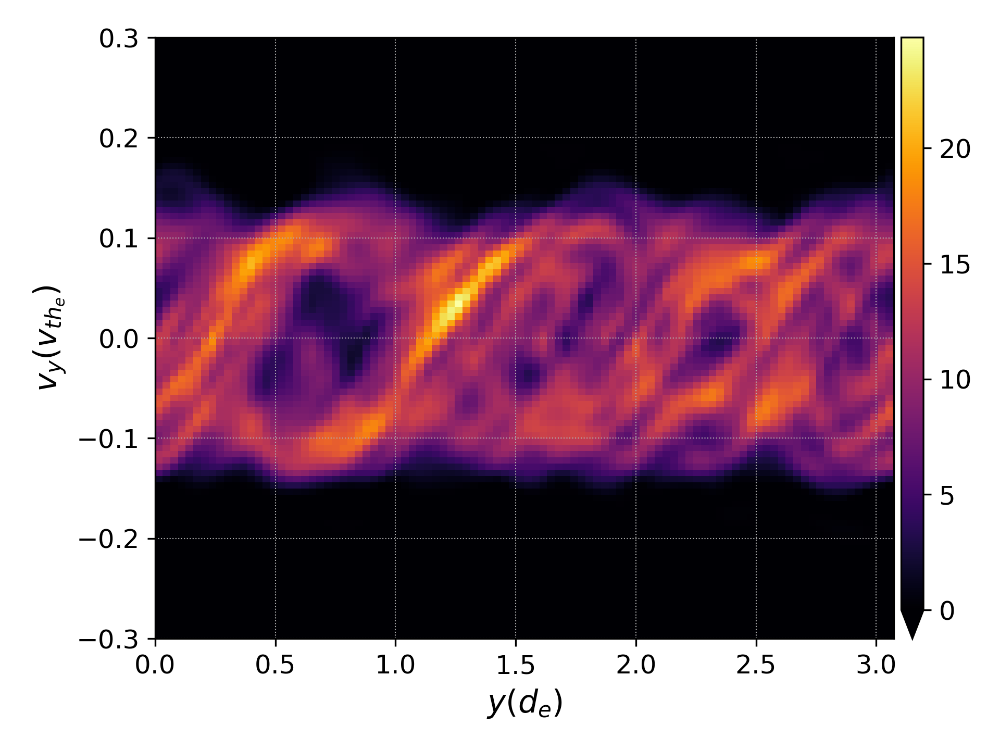
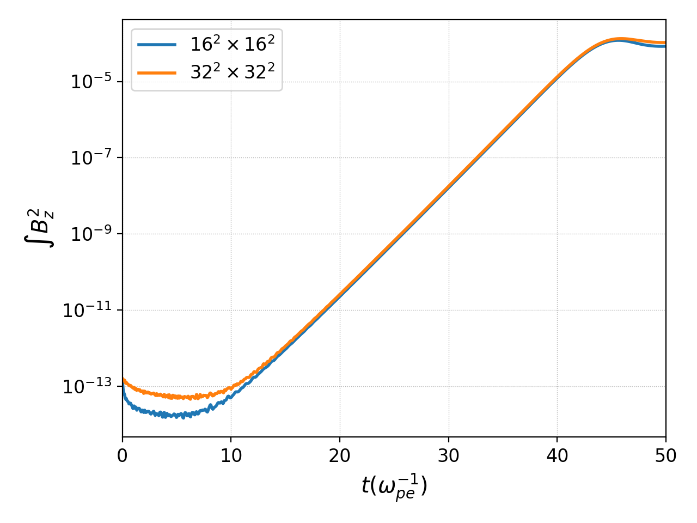

.. _qs_vlasov1:

Vlasov example
++++++++++++++

In this example, we extend the Vlasov-Maxwell input file shown in
:ref:`qs_intro` to simulate a more general kinetic plasma. Because the
Vlasov-Maxwell system of equations is widely applicable in plasma physics, this
example is intended to illustrate some of the functionality of the
Vlasov-Maxwell solver a user may desire for production science. For more
extensive documentation on all of the available options for Vlasov-Maxwell
simulations, we refer the reader to :ref:`app_vlasov`.

This simulation is based on the studies of [Skoutnev2019]_ and [Juno2020]_ and
concerns the evolution of instabilities driven by counter-streaming beams of
plasma. This example demonstrates the flexibility of the Vlasov-Maxwell solver
by showing how one extends Vlasov-Maxwell simulations to higher dimensionality,
in this case 2x2v. The input file for this example is also a standard
performance benchmark for Gkeyll and timings for this input file with varying
grid resolution can be found in the gkyl repo in the Benchmarks/ folder.

..
  contents::

Physics model and initial conditions
------------------------------------

This example solves the Vlasov-Maxwell system of equations

.. math::

  \frac{\partial f_s}{\partial t} &+ \mathbf{v}\cdot\nabla f_s + \frac{q_s}{m_s}
  \left(\mathbf{E}+\mathbf{v}\times\mathbf{B}\right)\cdot\nabla_{\mathbf{v}}f = 0, \\
  \frac{\partial\mathbf{B}}{\partial t} &+ \nabla\times\mathbf{E} = 0, \\
  \epsilon_0\mu_0\frac{\partial\mathbf{E}}{\partial t} &- \nabla\times\mathbf{B} = -\mu_0\mathbf{J},

in two spatial dimensions and two velocity dimensions (2x2v). For this example,
the ions are taken to be a stationary, neutralizing background, and therefore do
not contribute to the plasma current :math:`\mathbf{J}`. The electrons are
initialized as two equal density, equal temperature, counter-propagating,
Maxwellian beams

.. math::

  f_e (x, y, v_x, v_y) = \frac{m_e n_0 }{2 \pi T_e} \left [ \exp \left (- m_e \frac{(v_x)^2 + (v_y - u_d)^2}{2 T_e} \right ) + \exp \left (- m_e \frac{(v_x)^2 + (v_y + u_d)^2}{2 T_e} \right ) \right ].

The electromagnetic fields are initialized as a bath of fluctuations in the
electric and magnetic fields in the two configuration space dimensions,

.. math::

  B_z(t=0)=\sum_{n_x,n_y=-N,-N}^{N,N}\tilde B_{n_x,n_y}\sin \left (\frac{2\pi n_x x}{L_x}+\frac{2\pi n_y y}{L_y}+\tilde \phi_{n_x,n_y} \right ),

where :math:`N=16` and :math:`\tilde B_{n_x,n_y}` and :math:`\tilde
\phi_{n_x,n_y}` are random amplitudes and phases. The electric fields,
:math:`E_x, E_y` are initialized similarly. Note that the sum goes from
:math:`-N` to :math:`N` so as to initialize phases from 0 degrees to 180
degrees.

Input file
----------

The full Lua input file (found :doc:`here <inputFiles/vm-tsw-2x2v>`) has three
components: the **App dependencies**, the **Preamble**, and the **App**. In the
**App dependencies** section, we load the necessary components of Gkeyll to
perform a Vlasov-Maxwell simulation, as well as any additional functionality we
require:

.. code-block:: lua

  --------------------------------------------------------------------------------
  -- App dependencies
  --------------------------------------------------------------------------------
  -- Load the Vlasov-Maxwell App
  local Plasma = require("App.PlasmaOnCartGrid").VlasovMaxwell()
  -- Pseudo-random number generator from SciLua package for initial conditions.
  -- Specific rng is the mrg32k3a (multiple recursive generator) of Ecuyer99.
  local prng = require "sci.prng"
  local rng = prng.mrg32k3a()

The **Preamble** to set up the initial conditions is:

.. code-block:: lua

  --------------------------------------------------------------------------------
  -- Preamble
  --------------------------------------------------------------------------------
  -- Constants
  permitt = 1.0                               -- Permittivity of free space
  permeab = 1.0                               -- Permeability of free space
  lightSpeed = 1.0/math.sqrt(permitt*permeab) -- Speed of light
  chargeElc = -1.0                            -- Electron charge
  massElc = 1.0                               -- Electron mass

  -- Initial conditions
  -- 1 = Right-going beam; 2 = Left-going beam.
  nElc1 = 0.5
  nElc2 = 0.5

  ud = 0.1                                    -- Drift velocity of beams
  uxElc1 = 0.0
  uyElc1 = ud
  uxElc2 = 0.0
  uyElc2 = -ud

  R = 0.1                                     -- Ratio of thermal velocity to drift velocity
  TElc1 = massElc*(R*ud)^2
  TElc2 = massElc*(R*ud)^2
  vthElc1 = math.sqrt(TElc1/massElc)
  vthElc2 = math.sqrt(TElc2/massElc)

  k0_TS = 6.135907273413176                   -- Wavenumber of fastest growing two-stream mode
  theta = 90.0/180.0*math.pi                  -- 0 deg is pure Weibel, 90 deg is pure two-stream
  kx_TS = k0_TS*math.cos(theta)
  ky_TS = k0_TS*math.sin(theta)

  k0_Weibel = 2.31012970008316                -- Wavenumber of fastest growing Weibel mode
  theta = 0.0/180.0*math.pi                   -- 0 deg is pure Weibel, 90 deg is pure two-stream
  kx_Weibel = k0_Weibel*math.cos(theta)
  ky_Weibel = k0_Weibel*math.sin(theta)
  kx = k0_Weibel
  ky = k0_TS/3.0

  perturb_n = 1e-8
  -- Perturbing the first 16 wave modes with random amplitudes and phases.
  -- Note that loop goes from -N to N to sweep all possible phases.
  N=16
  P={}
  for i=-N,N,1 do
     P[i]={}
     for j=-N,N,1 do
        P[i][j]={}
        for k=1,6,1 do
          P[i][j][k]=rng:sample()
        end
     end
  end

  -- Domain size and number of cells
  Lx = 2*math.pi/kx
  Ly = 2*math.pi/ky
  Nx = 16
  Ny = 16
  vLimElc = 3*ud                              -- Maximum velocity in velocity space
  NvElc = 16

  -- Maxwellian in 2x2v
  local function maxwellian2D(n, vx, vy, ux, uy, vth)
     local v2 = (vx - ux)^2 + (vy - uy)^2
     return n/(2*math.pi*vth^2)*math.exp(-v2/(2*vth^2))
  end

The **Preamble** defines the constants in the normalization standard outlined in
:ref:`vlasovNorm` and sets the parameters and perturbations to the wave modes of
interest for the study. Note that because the dimensionality of the simulation
is now 2x2v, the normalization of the Maxwellian has correspondingly changed
from the 1x1v Langmuir wave simulation described in :ref:`qs_intro`.

The **App** can be further subdivided into a number of sections

.. code-block:: lua

  plasmaApp = Plasma.App {
     -----------------------------------------------------------------------------
     -- Common
     -----------------------------------------------------------------------------
     ...

     -----------------------------------------------------------------------------
     -- Species
     -----------------------------------------------------------------------------
     ...

     -----------------------------------------------------------------------------
     -- Fields
     -----------------------------------------------------------------------------
     ...
  }
  --------------------------------------------------------------------------------
  -- Run application
  --------------------------------------------------------------------------------
  plasmaApp:run()

The **Common** section of the **App** defines input parameters which will be
utilized by all solvers in the simulation. For example, the configuration space
extents and number of configuration space cells (:code:`lower, upper, cells`),
as well as what directions, if any, utilize periodic boundary conditions
(:code:`periodicDirs`), and how to parallelize the simulation
(:code:`decompCuts`).

.. code-block:: lua

  --------------------------------------------------------------------------------
  -- Common
  --------------------------------------------------------------------------------
  logToFile = true,

  tEnd = 50.0,                             -- End time
  nFrame = 1,                              -- Number of output frames
  lower = {0.0,0.0},                       -- Lower boundary of configuration space
  upper = {Lx,Ly},                         -- Upper boundary of configuration space
  cells = {Nx,Ny},                         -- Configuration space cells
  basis = "serendipity",                   -- One of "serendipity", "maximal-order", or "tensor"
  polyOrder = 2,                           -- Polynomial order
  timeStepper = "rk3s4",                   -- One of "rk2", "rk3", or "rk3s4"

  -- MPI decomposition for configuration space
  decompCuts = {1,1},                      -- Cuts in each configuration direction
  useShared = false,                       -- shared memory is no longer supported

  -- Boundary conditions for configuration space
  periodicDirs = {1,2},                    -- periodic directions (both x and y)

  -- Integrated moment flag, compute integrated quantities 1000 times in simulation
  calcIntQuantEvery = 0.001,

The **Species** section of the **App** defines the species-specific inputs for
the Vlasov-Maxwell simulation within a :code:`Plasma.Species` table. For
example, the velocity space extents and number of velocity space cells
(:code:`lower, upper, cells`), the function which prescribes the initial
condition, and the types of diagnostics. More discussion of diagnostic
capabilities can be found in :ref:`app_vlasov`.

.. code-block:: lua

  --------------------------------------------------------------------------------
  -- Electrons
  --------------------------------------------------------------------------------
  elc = Plasma.Species {
    charge = chargeElc, mass = massElc,
    -- Velocity space grid
    lower = {-vLimElc, -vLimElc},
    upper = {vLimElc, vLimElc},
    cells = {NvElc, NvElc},
    -- Initial conditions
    init = function (t, xn)
       local x, y, vx, vy = xn[1], xn[2], xn[3], xn[4]
       local fv = maxwellian2D(nElc1, vx, vy, uxElc1, uyElc1, vthElc1) +
          maxwellian2D(nElc2, vx, vy, uxElc2, uyElc2, vthElc2)
      return fv
    end,
    evolve = true,
    diagnostics = {"M0","M1i","M2ij","M3i","intM0","intM1i","intM2Flow","intM2Thermal"},
  },

Note that for this particular simulation the ions are a stationary, neutralizing
background that does not contribute to the plasma current, so we only require a
species table for the electrons.

The **Field** section if the final section of the **App** and specifies the
input parameters for the field equation, in this case Maxwell's equation, in the
:code:`Plasma.Field` table. For example, similar to the :code:`Plasma.Species`
table, the :code:`Plasma.Field` table contains the initial condition for the
electromagnetic field.

.. code-block:: lua

  --------------------------------------------------------------------------------
  -- Field solver
  --------------------------------------------------------------------------------
  field = Plasma.Field {
    epsilon0 = permitt, mu0 = permeab,
    init = function (t, xn)
       local x, y = xn[1], xn[2]
       local E_x, E_y, B_z = 0.0, 0.0, 0.0
       for i=-N,N,1 do
          for j=-N,N,1 do
             if i~=0 or j~=0 then
                E_x = E_x + perturb_n*P[i][j][1]*math.sin(i*kx*x+j*ky*y+2*math.pi*P[i][j][2])
                E_y = E_y + perturb_n*P[i][j][3]*math.sin(i*kx*x+j*ky*y+2*math.pi*P[i][j][4])
                B_z = B_z + perturb_n*P[i][j][5]*math.sin(i*kx*x+j*ky*y+2*math.pi*P[i][j][6])
             end
          end
       end
       return E_x, E_y, 0.0, 0.0, 0.0, B_z
    end,
    evolve = true,
  },

Running the simulation
----------------------

The input file :code:`vm-tsw-2x2v.lua` can be run using the gkyl executable

.. code-block:: bash

  ~/gkylsoft/gkyl/bin/gkyl vm-tsw-2x2v.lua

assuming :code:`gkyl` has been installed in the user's home directory.
When running this simulation, a user should see the following output

.. code-block:: bash

  Wed Sep 16 2020 11:38:54.000000000
  Gkyl built with a4430cbb5d93
  Gkyl built on Sep 16 2020 01:25:31
  Initializing Vlasov-Maxwell simulation ...
  Initializing completed in 1.39731 sec

  Starting main loop of Vlasov-Maxwell simulation ...
  Step 0 at time 0. Time step 0.0360652. Completed 0%
  0123456789 Step   139 at time 5.01307. Time step 0.0360652. Completed 10%
  01234

The full screen output can be found :doc:`here <inputFiles/vm-tsw-2x2v-log>`,
which includes performance details for the simulation. This example was run with
a single core of a 10th gen Intel i9 (Comet Lake) processor. Increasing the
resolution to :math:`32^2 \times 32^2` and now running the simulation using all
10 cores of the Intel i9 using

.. code-block:: bash

  ~/gkylsoft/openmpi/bin/mpirun -n 10 ~/gkylsoft/gkyl/bin/gkyl vm-tsw-2x2v.lua

we obtain the :doc:`following performance
<inputFiles/vm-tsw-2x2v-higher-res-log>` with :code:`use =true` (note, shared
memory is no longer supported) and the installed MPI from the Gkeyll build.

Postprocessing
--------------

The output of this simulation is the following set of files:

- Distribution functions: ``vm-tsw-2x2v_elc_#.bp``.
- Electromagnetic fields: ``vm-tsw-2x2v_field_#.bp``.
- Velocity moments: ``vm-tsw-2x2v_elc_M0_#.bp``, ``vm-tsw-2x2v_elc_M1i_#.bp``, ``vm-tsw-2x2v_elc_M2ij_#.bp``, and ``vm-tsw-2x2v_elc_M3i_#.bp``.
- Field energy: ``vm-tsw-2x2v_fieldEnergy.bp``.
- Volume integrated moments: ``vm-tsw-2x2v_elc_intM0.bp``,  ``vm-tsw-2x2v_elc_intM1i.bp``, ``vm-tsw-2x2v_elc_intM2Flow.bp``, and ``vm-tsw-2x2v_elc_intM2Thermal.bp``.

Snapshots (frames) are labeled by the number ``#`` at the end of the file name,
while volume integrated diagnostics that are computed as a time-series, such as
the field energy, are written out as a single file. Since :code:`nFrame=1` in
the input file, the only frames that are output are ``0``, corresponding to the
initial condition, and ``1``, corresponding to the end of the simulation.

Since this simulation has two configuration space dimensions, postgkyl creates
pcolor plots when run from the command line with :code:`pgkyl`. We can compare
the initial condition and final state of the magnetic field, :math:`B_z`, (of
the :math:`32^2 \times 32^2` simulation) in two separate figures with the
:code:`pgkyl` command:

.. code-block:: bash

  pgkyl vm-tsw-2x2v_field_0.bp vm-tsw-2x2v_field_1.bp interp sel --comp 5 plot -b --fix-aspect

  :math:`B_z` magnetic field at :math:`t=0` (left) and :math:`t=50 \omega_{pe}^{-1}`, the end of the simulation (right).

The default postgkyl colorbar is sequential and useful for visualizing data such
as distribution functions, which will vary from 0 (zero phase space density/no
particles) to some number (corresponding to a local increase in phase space
density). However, we can see that the colorbar for the magnetic field varies
between roughly equal positive and negative numbers, and thus a diverging
colormap may yield a more useful representation of the data. In addition, we can
utilize the flexibility of the :code:`interpolate` command to interpolate the
discontinuous Galerkin data onto an even finer mesh

.. code-block:: bash

  pgkyl vm-tsw-2x2v_field_0.bp vm-tsw-2x2v_field_1.bp interp -i 6 sel --comp 5 plot -b --fix-aspect --diverging --xlabel '$x (d_e) $' --ylabel '$y (d_e) $'

  :math:`B_z` magnetic field at :math:`t=0` (left) and :math:`t=50 \omega_{pe}^{-1}`, the end of the simulation (right), now with a diverging colorbar, finer interpolation, and labels.

where we have now added labels with the normalized units in :math:`x` and
:math:`y`. Note that the default interpolation level for polynomial order 2 is 3
(:code:`polyOrder` + 1).

We can likewise visualize diagnostic moments such as the first velocity moment
``elc_M1i``

.. code-block:: bash

  pgkyl vm-tsw-2x2v_elc_M1i_1.bp interp -i 6 plot --fix-aspect --diverging --xlabel '$x (d_e) $' --ylabel '$y (d_e) $'

  :math:`\mathrm{M}1_x` first velocity moment (left) and :math:`\mathrm{M}1_y`
  first velocity moment (right) at :math:`t=50 \omega_{pe}^{-1}`, the end of the
  simulation.

Note that ``elc_M1i`` has two components due to the fact that this simulation
has two velocity dimensions, and both components are visualized when this
:code:`pgkyl` command is utilized. The left plot is the :math:`v_x` velocity
moment and the right plot is the :math:`v_y` velocity moment. Further details on
the diagnostics available and their definitions can be found in
:ref:`app_vlasov`.

We can also visualize the distribution function from this simulation. However,
for this simulation the distribution function if four-dimensional, two
configuration space and two velocity space dimensions. Postgkyl offers a number
of options for down-selecting the data to be more amenable to visualizing. For
example, we can read-in a subset of the data and visualize the distribution
function in velocity space :math:`v_x-v_y` in the lower left corner of the
domain

.. code-block:: bash

  pgkyl vm-tsw-2x2v_elc_1.bp --z0 0 --z1 0 interp -i 6 sel --z0 0.0 --z1 0.0 plot --xlabel '$v_x (v_{th_e}) $' --ylabel '$v_y (v_{th_e}) $' --vmin 0.0

  Electron distribution function plotted at :math:`(x,y)=(0.0,0.0)` as a
  function of :math:`v_x-v_y` at :math:`t=50 \omega_{pe}^{-1}`, the end of the
  simulation.

Note that the immediate :code:`--z0 0 --z1 0` tells postgkyl to read in only the
first :math:`x` and :math:`y` configuration space grid cells (while still
reading in all of velocity space). Because we are then interpolating the data
onto a finer mesh, the data is still four dimensional so we pass the abbreviated
select command :code:`sel` to finally down-select to the lower-left corner of
the configuration space domain. These selective read-in commands are vital for
very large arrays where the cost in memory and CPU time can be quite large to
read-in and manipulate the data structure of interest.

Alternatively, if we do want to read-in the whole array, we can perform other
manipulations to the distribution function such we can still easily visualize
the data. For example, we can use the :code:`integrate` command to integrate the
distribution function over :math:`x` and :math:`v_x` to produce a :math:`y-v_y`
plot of the electron distribution function.

.. code-block:: bash

  pgkyl vm-tsw-2x2v_elc_1.bp interp integrate 0,2 plot --xlabel '$y (d_e) $' --ylabel '$v_y (v_{th_e}) $' --vmin 0.0

  Electron distribution function integrated in :math:`x` and :math:`v_x`,
  plotted as a function of :math:`y-v_y` at :math:`t=50 \omega_{pe}^{-1}`, the
  end of the simulation.

Finally, since we performed this simulation at two different resolutions, and
interesting diagnostic to look at is a comparison of integrated quantities
between the two simulations. For ease of plotting we have moved the data from
the two simulations to two different folders, :code:`res1` (:math:`16^2 \times
16^2`) and :code:`res2` (:math:`32^2 \times 32^2`). Here, we are being agnostic
on what a user might have named these two different simulations and labeling
them ourselves with postgkyl.

.. code-block:: bash

  pgkyl res1/*fieldEnergy.bp -l '$16^2 \times 16^2$' res2/*fieldEnergy.bp -l '$32^2 \times 32^2$' select --comp 5 plot --logy --xlabel '$t (\omega_{pe}^{-1})$' --ylabel '$\int B_z^2$' -f0

  Integrated magnetic field energy, :math:`|B_z|^2`, plotted as a function of
  time comparing the lower resolution calculation, :math:`16^2 \times 16^2`
  (blue), and higher resolution calculation, :math:`32^2 \times 32^2` (orange).

References
----------

.. [Skoutnev2019] Skoutnev, V., Hakim, A., Juno, J., & TenBarge,
  J. M. (2019). "Temperature-Dependent Saturation of Weibel-Type
  Instabilities in Counter-streaming Plasmas", *Astrophysical Journal
  Letters*, **872**, (2). https://doi.org/10.3847%2F2041-8213%2Fab0556

.. [Juno2020] Juno, J., Swisdak, M. M., TenBarge. J. M., Skoutnev, V., & Hakim, A.
  "Noise-induced magnetic field saturation in kinetic simulations", *Journal of Plasma Physics*,
  **86**, (4). https://doi.org/10.1017/S0022377820000707
